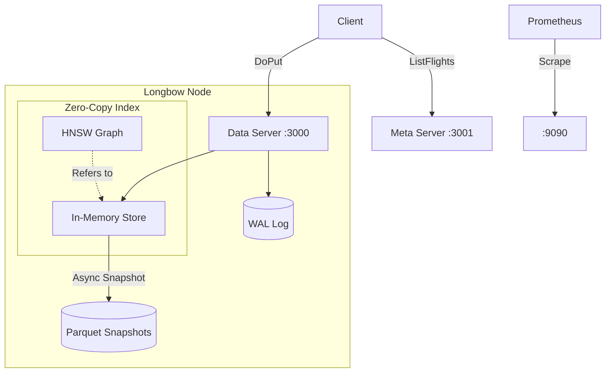

# Longbow

<!-- markdownlint-disable MD033 -->

<!-- markdownlint-enable MD033 -->

**Longbow** is a high-performance, in-memory vector store implementing the **Apache Arrow Flight** protocol.
It is designed for efficient, zero-copy transport of large datasets and vector embeddings between agents and services.

## Features

* **Protocol**: Apache Arrow Flight (over gRPC/HTTP2).
* **Durable**: WAL, with Apache Parquet format snapshots
* **Storage**: In-memory ephemeral storage for high-speed access.
* **Observability**: Structured JSON logging and Prometheus metrics.

## Architecture & Ports

To ensure high performance under load, Longbow splits traffic into two dedicated gRPC servers:

* **Data Server (Port 3000)**: Handles heavy I/O operations (DoGet, DoPut).
* **Meta Server (Port 3001)**: Handles lightweight metadata operations (ListFlights, GetFlightInfo).

**Why?**
Separating these concerns prevents long-running data transfer operations from blocking metadata requests. This ensures that clients can always discover streams and check status even when the system is under heavy write/read load.

## Observability & Metrics

Longbow exposes Prometheus metrics on a dedicated port to ensure observability without impacting the main Flight service.

* **Scrape Port**: 9090
* **Scrape Path**: /metrics

### Custom Metrics

| Metric Name | Type | Description |
| :--- | :--- | :--- |
| `longbow_flight_operations_total` | Counter | Total number of Flight operations (DoGet, DoPut, etc.) |
| `longbow_flight_duration_seconds` | Histogram | Latency distribution of Flight operations |
| `longbow_flight_bytes_processed_total` | Counter | Total bytes processed in Flight operations |
| `longbow_vector_index_size` | Gauge | Current number of vectors in the index |
| `longbow_average_vector_norm` | Gauge | Average L2 norm of vectors in the index |
| `longbow_index_build_latency_seconds` | Histogram | Latency of vector index build operations |
| `longbow_memory_fragmentation_ratio` | Gauge | Ratio of system memory reserved vs used |
| `longbow_wal_writes_total` | Counter | Total number of write operations to the WAL. |
| `longbow_wal_bytes_written_total` | Counter | Total bytes written to the WAL file. |
| `longbow_wal_replay_duration_seconds` | Histogram | Time taken to replay the WAL during startup. |
| `longbow_snapshot_operations_total` | Counter | Total number of snapshot attempts. |
| `longbow_snapshot_duration_seconds` | Histogram | Duration of the snapshot process. |
| `longbow_evictions_total` | Counter | Total number of evicted records. |

For a detailed explanation of each metric, see [Metrics Documentation](docs/metrics.md).

Standard Go runtime metrics are also exposed.

## Usage

### Running locally

```bash
go run cmd/longbow/main.go
```

### Docker

```bash
docker build -t longbow .
docker run -p 3000:3000 -p 3001:3001 -p 9090:9090 longbow
```

## Documentation
* [Persistence & Snapshots](docs/persistence.md)
* [Vector Search Architecture](docs/vectorsearch.md)
* [Troubleshooting Guide](docs/troubleshooting.md)
* [Metrics](docs/metrics.md)
