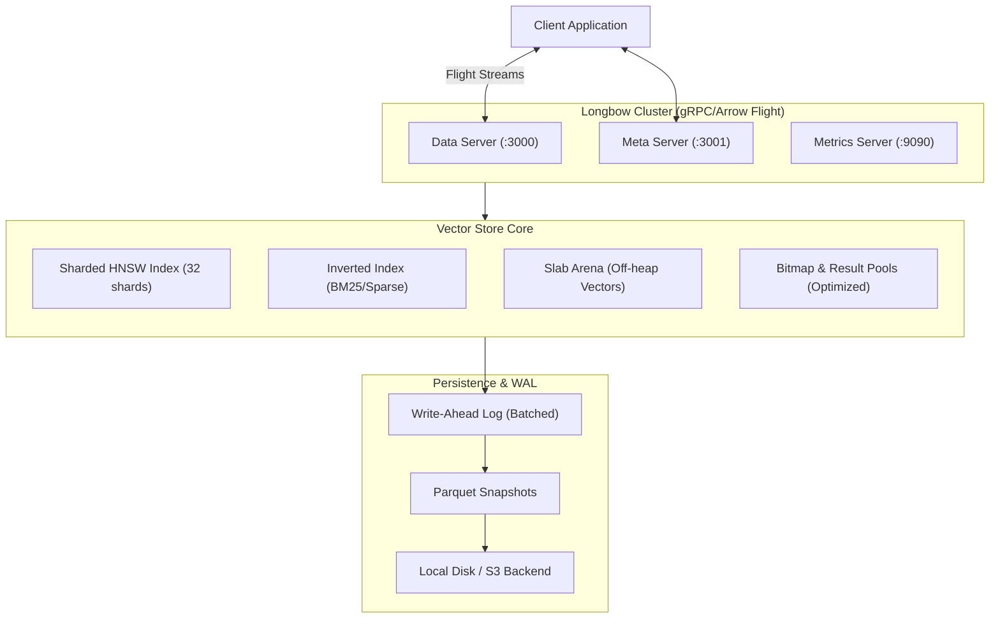

# Longbow Documentation

Longbow is a high-performance, in-memory vector store implementing the
Apache Arrow Flight protocol.

## Architecture



## Key Features

* **Apache Arrow Flight Protocol**: Zero-copy data transfer.
* **In-Memory Storage**: Fast read/write operations.
* **Prometheus Metrics**: Built-in observability.
* **Helm Deployment**: Easy installation on Kubernetes.
* **Persistence**: Optional persistent storage (WAL + Snapshots) for data durability.
* **Filtering**: Predicate pushdown for DoGet and Post-filtering for Vector Search.
* **Mesh Replication**: Foundation for multi-node sync using DoExchange.
* **Security**: Configurable security contexts for Pods and Containers.

## Navigation

* [Components](components.md)
* [Usage Guide](usage.md)
* [Helm Deployment Guide](helm.md)
* [Arrow Protocol Spec](arrow-protocol.md)

## Observability & Metrics

Longbow exposes Prometheus metrics on port `9090` at `/metrics`.

### Custom Metrics

* `longbow_flight_operations_total`: Total number of Flight operations (DoGet,
DoPut, etc.)
* `longbow_flight_duration_seconds`: Histogram of operation latencies
* `longbow_flight_bytes_processed_total`: Total bytes processed in operations

### Scrape Configuration

The Helm chart includes annotations for Prometheus scraping:

```yaml
podAnnotations:
 prometheus.io/scrape: "true"
 prometheus.io/port: "9090"
 prometheus.io/path: "/metrics"
```

## Status Badges


