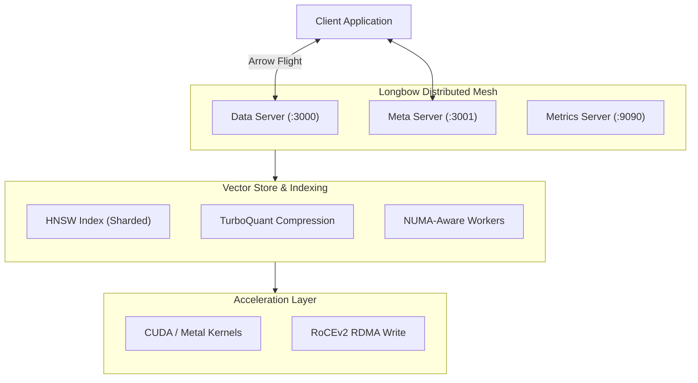

# Longbow Documentation

Longbow is a high-performance, distributed, and in-memory vector store implementing the Apache Arrow Flight protocol. It is engineered for low-latency similarity search, hybrid retrieval, and GraphRAG workloads at scale.

---

## 📖 Core Guides

### 1. [Quick Start & Usage](usage.md)
Get started with Longbow using Docker or Helm. Covers basic configuration, CLI usage, and client examples.

### 2. [Unified Search & Discovery](vectorsearch.md)
Comprehensive guide to search:
- **Metrics**: Euclidean, Cosine, Dot Product.
- **SQL Filtering**: CTEs and Subqueries.
- **Hybrid**: Dense + Sparse fusion (RRF).
- **Reranking**: ML-based Cross-Encoders.
- **GraphRAG**: Spreading activation and pathfinding.

### 3. [High-Performance Indexing](indexing.md)
Tuning for scale and speed:
- **Compression**: PQ, SQ8, BQ, and TurboQuant.
- **Adaptive**: Automated Flat-to-HNSW migration for zero-config scaling.
- **Hardware**: NUMA affinity and CPU pinning.
- **Memory**: GOGC Auto-tuning and heap management.
- **Scaling**: Auto-sharding and partitioned indices.

### 4. [Hardware Acceleration & GPU](gpu-acceleration.md)
Unleash hardware performance:
- **GPU**: CUDA (NVIDIA) and Metal (Apple Silicon).
- **Inference**: Wazero (WASM) and ONNX Runtimes.
- **Networking**: Zero-copy RDMA over RoCEv2.

### 5. [Storage & Durability](persistence.md)
Managing data lifecycle:
- **Persistence**: WAL, Snapshots, and S3 Offloading.
- **Evolution**: Schema versioning and additive changes.
- **Lifecycle**: TTL and LRU Eviction.
- **Temporal**: Time-travel search and version history.

---

## 🛠 Operation & Deployment

### 1. [Deployment & Operations](deployment.md)
Distributed cluster management:
- **Kubernetes**: Helm chart configuration and tuning.
- **Architecture**: Consistent Hashing and Mesh (Gossip).
- **Multitenancy**: Namespaces and isolation.
- **Traffic**: Rate limiting and priorities.

### 2. [Clients & SDKs](python_client.md)
Native support for:
- Python SDK (`pip install longbowclientsdk`).
- gRPC/Arrow Flight (Standard-compliant).
- [OpenAPI Specification](openapi.yaml).

### 3. [Diagnostics & Safety](troubleshooting.md)
Tools for reliability:
- **Metrics**: [Prometheus Reference](metrics.md).
- **Security**: [Best Practices](security.md).
- **Troubleshooting**: Common pitfalls and solutions.

---

## Architecture Diagram

```mermaid
graph TB
    Client["Client Application"]
    
    subgraph LB["Longbow Distributed Mesh"]
        direction TB
        DS["Data Server (:3000)"]
        MS["Meta Server (:3001)"]
        Metrics["Metrics Server (:9090)"]
    end

    subgraph Core["Vector Store & Indexing"]
        direction TB
        HNSW["HNSW Index (Sharded)"]
        TQ["TurboQuant Compression"]
        NUMA["NUMA-Aware Workers"]
    end

    subgraph Hardware["Acceleration Layer"]
        direction TB
        GPU["CUDA / Metal Kernels"]
        RDMA["RoCEv2 RDMA Write"]
    end

    Client <-->|"Arrow Flight"| DS
    Client <--> MS
    LB --> Core
    Core --> Hardware
```
