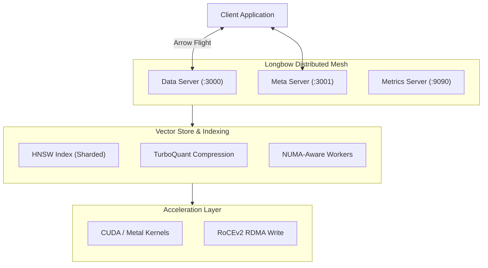

# Longbow Documentation

Longbow is a high-performance, distributed, and in-memory vector store implementing the Apache Arrow Flight protocol. It is engineered for low-latency similarity search, hybrid retrieval, and GraphRAG workloads at scale.

---

## Core Guides

### 1. [Quick Start & Deployment](deploy.md)

Get started with Longbow using Docker or Helm. Covers installation, environment configuration, CLI reference, limits, security, and troubleshooting.

### 2. [Unified Search & Discovery](vectorsearch.md)

Comprehensive guide to all 10 search modes:

- **Dense**: HNSW vector search with SIMD acceleration.
- **Hybrid**: Dense + Sparse fusion with Distributed Global RRF.
- **Filtered**: SQL-like boolean logic and metadata predicates.
- **GraphRAG**: Spreading Activation + Knowledge Graph traversal.
- **Temporal**: Point-in-time and range-based versioned search.
- **Geo-Spatial**: Haversine radius and bounding box queries.
- **TurboQuant**: Compressed vector search (4x-64x reduction).

### 3. [High-Performance Indexing](indexing.md)

Tuning for scale and speed:

- **Quantization**: PQ, SQ8, BQ, and **TurboQuant** (2/4/8-bit).
- **Adaptive**: Automated Flat-to-HNSW migration for zero-config scaling.
- **Learned Index**: Runtime k-NN classifier for optimal index selection.
- **Memory**: GOGC Auto-tuning and slab-arena management.

### 4. [Hardware Acceleration & ML Inference](wasm_onnx.md)

Unleash hardware performance:

- **GPU/TPU**: CUDA (NVIDIA), Metal (Apple Silicon), and Google TPU (Ironwood).
- **Inference**: ONNX Runtime (native acceleration) and WASM (Wazero sandboxed portability).
- **Networking**: Zero-copy RDMA over RoCEv2.

### 5. [Systems Architecture](architecture.md)

Deep dive into Longbow's design:

- **Distributed Mesh**: Gossip-based membership and Consistent Hashing.
- **Storage**: WAL, Snapshots, S3/GCS offloading, and tiered storage.
- **Data Lifecycle**: Tombstones, compaction, TTL, LRU eviction.
- **Hardware**: CUDA, Metal, TPU, SIMD acceleration matrix.

### 6. [API Reference](api.md)

Technical specification for the Arrow Flight endpoints:

- **Data Plane**: DoPut ingestion, DoGet search, DoExchange sync.
- **Control Plane**: Global search, admin operations, GraphRAG actions.
- **Python SDK**: Zero-copy client with native Pandas/NumPy integration.

### 7. [Native Tensor Calculus Engine](tensor_engine.md)

General-purpose tensor calculus and scientific computing engine:

- **Einstein Summation**: Multi-tensor contraction chains.
- **Tensor Calculus**: Christoffel symbols, Riemann curvature, Ricci tensors.
- **Hardware**: AVX2 SIMD and NVIDIA CUDA/cuBLAS kernels.

### 8. [EMLGo Mathematical Engine](emlgo.md)

High-performance math backend:

- **Build-Tag Gated**: Compiled only with `-tags emlgo`.
- **Hardware Assembly**: AVX2, AVX-512, and ARM NEON fastmath primitives.
- **Tensor Acceleration**: 1.66x faster hyperbolic functions.
- **A/B Benchmarks**: Full performance evaluation across 17 datatypes.

---

## Reference

### 9. [Agent Memory](agentmemory.md)

AI agent memory patterns: hybrid search, temporal awareness, geo-spatial queries, and session management.

### 10. [Features & Competitive Landscape](features.md)

Feature checklist and competitive analysis vs FAISS, Milvus, Qdrant, and Pinecone.

### 11. [GraphRAG](graphrag.md)

Graph RAG dual-path architecture: Knowledge Graph edges and Spreading Activation.

### 12. [HNSW Tuning](hnsw.md)

HNSW parameter tradeoffs, memory breakdown, and concurrency safety.

### 13. [Development Guide](development.md)

Contributing, architecture overview, benchmarking, and test infrastructure.

### 14. [Prometheus Metrics](metrics.md)

Complete metrics reference for monitoring system health.

---

## Architecture Overview

```mermaid
graph TB
    Client["Client Application"]
    
    subgraph LB["Longbow Distributed Mesh"]
        direction TB
        DS["Data Server (:3000)"]
        MS["Meta Server (:3001)"]
        Metrics["Metrics Server (:9090)"]
    end

    subgraph Core["Vector Store & Indexing"]
        direction TB
        HNSW["HNSW Index (Sharded)"]
        TQ["TurboQuant Compression"]
        NUMA["NUMA-Aware Workers"]
    end

    subgraph Hardware["Acceleration Layer"]
        direction TB
        GPU["CUDA / Metal Kernels"]
        RDMA["RoCEv2 RDMA Write"]
    end

    Client <-->|"Arrow Flight"| DS
    Client <--> MS
    LB --> Core
    Core --> Hardware
```
