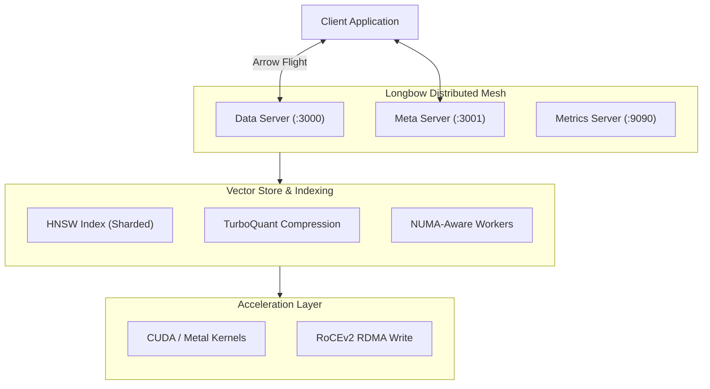

# Longbow Documentation

Longbow is a high-performance, distributed, and in-memory vector store implementing the Apache Arrow Flight protocol. It is engineered for low-latency similarity search, hybrid retrieval, and GraphRAG workloads at scale.

---

## 📖 Core Guides

### 1. [Quick Start & Deployment](deploy.md)
Get started with Longbow using Docker or Helm. Covers installation, environment configuration, distributed architecture, CLI management, and client usage.

### 2. [Unified Search & Discovery](vectorsearch.md)
Comprehensive guide to search:
- **Metrics**: Euclidean, Cosine, Dot Product.
- **SQL Filtering**: Compound boolean logic and nested fields.
- **Hybrid**: Dense + Sparse fusion (RRF).
- **Reranking**: ML-based Cross-Encoders.
- **GraphRAG**: [Internal Spreading Activation](graphrag.md) and pathfinding.

### 3. [High-Performance Indexing](indexing.md)
Tuning for scale and speed:
- **Compression**: PQ, SQ8, BQ, and **TurboQuant**.
- **Adaptive**: Automated Flat-to-HNSW migration for zero-config scaling.
- **Hardware**: NUMA affinity and CPU pinning.
- **Memory**: GOGC Auto-tuning and slab-arena management.

### 4. [Hardware Acceleration & ML](wasm_onnx.md)
Unleash hardware performance:
- **GPU/TPU**: CUDA (NVIDIA), Metal (Apple Silicon), and Google TPU (Ironwood) [Optimization Details](gpu.md).
- **Inference**: High-performance execution via WASM (Wazero) and ONNX Runtimes.
- **Networking**: Zero-copy RDMA over RoCEv2.

### 5. [Storage & Durability](persistence.md)
Managing data lifecycle:
- **Persistence**: WAL, Snapshots, and S3/GCS Offloading.
- **Temporal**: Time-travel search and version history.
- **Lifecycle**: TTL-based cleanup and LRU Eviction.

---

## 🛠 System Reference

### 1. [Systems Architecture](architecture.md)
Deep dive into Longbow's design:
- **Distributed Mesh**: Gossip-based membership and Consistent Hashing.
- **Store Internals**: SlabArena, sharded indexing, and zero-copy data paths.

### 2. [API Reference](api.md)
Technical specification for the gRPC/Arrow Flight endpoints, including administrative actions and telemetry.

### 3. [Diagnostics & Metrics](metrics.md)
Complete Prometheus reference for monitoring system health, TurboQuant throughput, and SIMD dispatch rates.

### 4. [Troubleshooting & Security](troubleshooting.md)
Common pitfalls, security best practices, and performance tuning strategies.

---

## Architecture Overview

```mermaid
graph TB
    Client["Client Application"]
    
    subgraph LB["Longbow Distributed Mesh"]
        direction TB
        DS["Data Server (:3000)"]
        MS["Meta Server (:3001)"]
        Metrics["Metrics Server (:9090)"]
    end

    subgraph Core["Vector Store & Indexing"]
        direction TB
        HNSW["HNSW Index (Sharded)"]
        TQ["TurboQuant Compression"]
        NUMA["NUMA-Aware Workers"]
    end

    subgraph Hardware["Acceleration Layer"]
        direction TB
        GPU["CUDA / Metal Kernels"]
        RDMA["RoCEv2 RDMA Write"]
    end

    Client <-->|"Arrow Flight"| DS
    Client <--> MS
    LB --> Core
    Core --> Hardware
```
