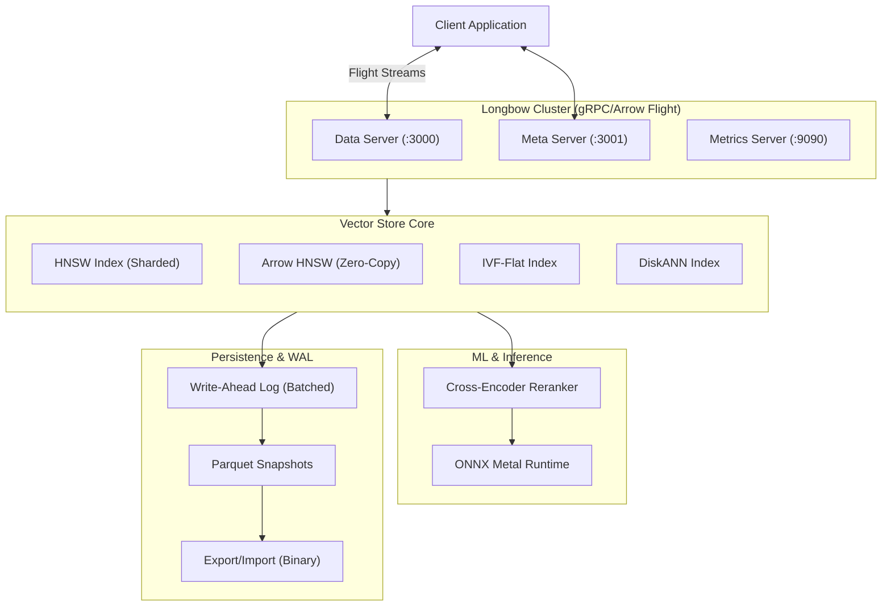

# Longbow Documentation

Longbow is a high-performance, in-memory vector store implementing the
Apache Arrow Flight protocol.

## Architecture

```mermaid
graph TB
    Client["Client Application"]
    
    subgraph LB["Longbow Cluster (gRPC/Arrow Flight)"]
        direction TB
        DS["Data Server (:3000)"]
        MS["Meta Server (:3001)"]
        Metrics["Metrics Server (:9090)"]
    end

    subgraph Core["Vector Store Core"]
        direction TB
        HNSW["HNSW Index (Sharded)"]
        ArrowHNSW["Arrow HNSW (Zero-Copy)"]
        IVF["IVF-Flat Index"]
        DiskAnn["DiskANN Index"]
    end

    subgraph ML["ML & Inference"]
        direction TB
        Reranker["Cross-Encoder Reranker"]
        ONNX["ONNX Metal Runtime"]
    end

    subgraph Durability["Persistence & WAL"]
        direction TB
        WAL["Write-Ahead Log (Batched)"]
        Snap["Parquet Snapshots"]
        Export["Export/Import (Binary)"]
    end

    Client <-->|"Flight Streams"| DS
    Client <--> MS
    LB --> Core
    Core --> Reranker
    Reranker --> ONNX
    Core --> WAL
    WAL --> Snap
    Snap --> Export
```

## Key Features

* **Zero-Copy Ingest**: Instantaneous bulk ingestion via direct Arrow-to-HNSW memory mapping.
* **Lock-Free Adjacency**: High-throughput graph updates for Layer 0 on multi-core systems.
* **Apache Arrow Flight Protocol**: Zero-copy data transfer.
* **Multiple Index Types**: HNSW, ArrowHNSW, IVF-Flat, DiskANN
* **Polymorphic Vector Support**: Native support for Float32, FP16, SQ8, PQ, BQ, and Int8.
* **High-Dimensionality**: Optimized for up to 3072 dimensions with cache-line padding and blocked SIMD.
* **In-Memory Storage**: Fast read/write operations.
* **ML-Enhanced Search**: Cross-encoder reranking with CPU, CUDA, and Metal support.
* **Native Apple Silicon**: Metal-based ONNX runtime for M1/M2/M3/M4 Macs.
* **Advanced SQL**: Support for Common Table Expressions (CTEs) and Subqueries.
* **Persistence**: Export/Import, WAL, and Parquet Snapshots.
* **Prometheus Metrics**: Built-in observability including ML inference metrics.
* **Helm Deployment**: Easy installation on Kubernetes.
* **Filtering**: Predicate pushdown for DoGet and SQL-based filtering for Vector Search.
* **Mesh Replication**: Multi-node sync using DoExchange.
* **Security**: Configurable security contexts for Pods and Containers.

## Navigation

### Getting Started
* [Usage Guide](usage.md) - Basic usage and examples
* [Configuration](configuration.md) - Configuration options
* [Helm Deployment](helm.md) - Kubernetes deployment

### Architecture
* [Architecture Overview](architecture.md) - System design
* [Components](components.md) - Core components
* [Distributed Architecture](distributed_architecture.md) - Multi-node setup

### Features
* [Vector Search](vectorsearch.md) - Search modes and filtering
* [Advanced SQL](sql.md) - CTEs and Subqueries
* [Recommendations](recommendations.md) - Hybrid recommendation engine
* [GraphRAG](graph_rag.md) - Graph-based re-ranking and knowledge graphs
* [TurboQuant](turboquant.md) - Extreme compression (6-8x memory reduction)
* [Reranking](rerank.md) - ML-enhanced reranking
* [ONNX Metal Runtime](onnx.md) - Native Apple Silicon ML inference
* [Persistence](persistence.md) - Data durability
* [GPU Acceleration](gpu-acceleration.md) - CUDA and Metal GPU support

### Operations
* [Metrics](metrics.md) - Prometheus metrics reference
* [Troubleshooting](troubleshooting.md) - Common issues and solutions
* [Security](security.md) - Security best practices
