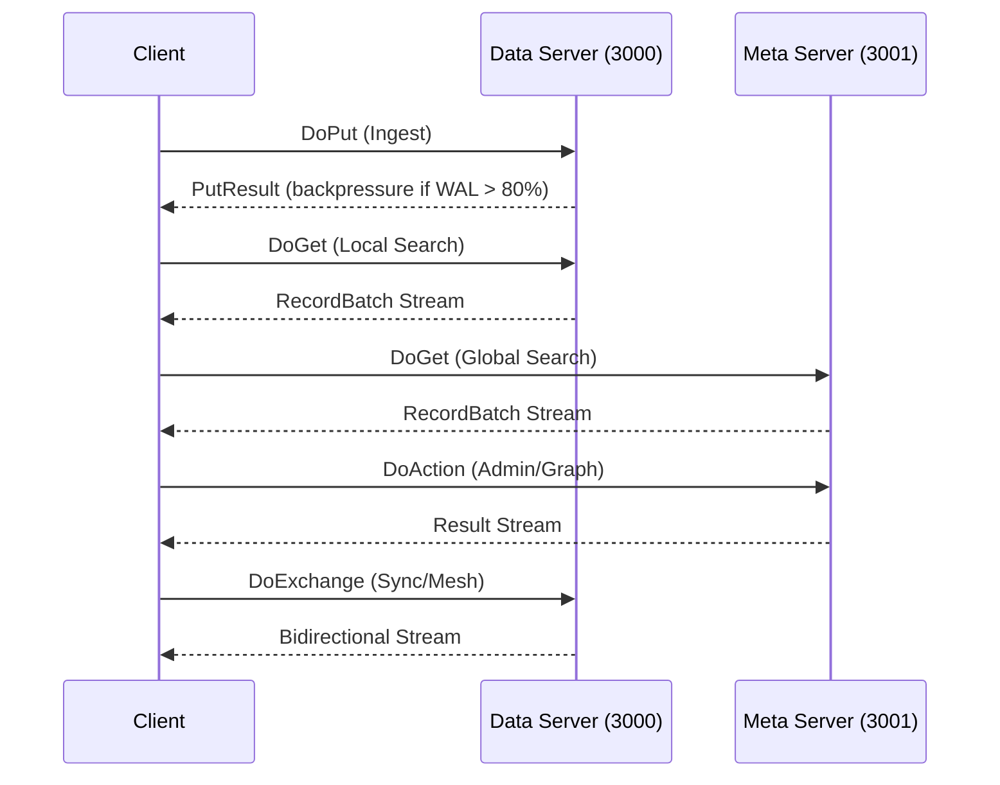

# Longbow API Reference

## Overview

Longbow provides **gRPC + Apache Arrow Flight only**. No REST/HTTP API for data operations.

- **Arrow Flight API** - Primary gRPC-based protocol for high-performance operations
- **Admin Actions** - Flight-based administrative operations
- **Prometheus Metrics** - HTTP metrics endpoint on port 9090

### Protocol Ports

| Port | Service | Protocol |
|------|---------|----------|
| 3000 | Data Server | gRPC/Arrow Flight |
| 3001 | Meta Server | gRPC/Arrow Flight |
| 9090 | Metrics | HTTP/Prometheus |

### Data vs Meta Server

- **Data Plane (Port 3000)**: Optimized for raw throughput and local node operations. Handles ingestion, bulk scans, and local search.
- **Meta/Query Plane (Port 3001)**: Optimized for coordination and global visibility. Handles global search, advanced analytics, management, and CDC/discovery.

> **Note:** `DoPut` (Ingestion) is **DISABLED** on the Meta/Query port to prevent control-plane saturation. All data ingestion MUST target Port 3000.

## Sequence Diagram



## Arrow Flight Protocol

Longbow implements the Apache Arrow Flight protocol version 18.

### Endpoints

| Endpoint | Method | Description |
|----------|--------|-------------|
| `DoPut` | RPC | Ingest vector data |
| `DoGet` | RPC | Execute vector search or bulk retrieval |
| `DoAction` | RPC | Administrative and graph operations |
| `DoExchange` | RPC | Streaming bidirectional communication |
| `ListFlights` | RPC | List available datasets |
| `GetFlightInfo` | RPC | Schema and metadata for a dataset path |

### Protocol Buffers

```protobuf
service FlightService {
    rpc DoPut(stream PutResult) returns (PutResult) {}
    rpc DoGet(Ticket) returns (stream RecordBatch) {}
    rpc DoAction(Action) returns (stream Result) {}
    rpc DoExchange(stream PutResult) returns (stream RecordBatch) {}
    rpc ListFlights(Criteria) returns (stream FlightInfo) {}
}

message Ticket {
    bytes data = 1;  // JSON-encoded ticket data
}

message Action {
    string type = 1;
    bytes body = 2;
}

message ArrowRecordBatch {
    bytes data = 1;  // IPC-serialized Arrow RecordBatch
}
```

### Ticket Format

```json
{
  "dataset": "dataset_name",
  "operation": "search|ingest|delete",
  "k": 10,
  "filter": "optional filter expression"
}
```

### ListFlights Filtering

Clients can filter results by providing a JSON-serialized `TicketQuery` in the `expression` field.

Supported Filters:

- `name`: Match by dataset name (operator: `contains`).
- `rows`: Match by row count (operators: `==`, `>`, `<=`).

### DoExchange Modes

- **VectorSearch**: High-performance bidirectional search.
- **sync**: Delta synchronization using WAL sequence numbers.
- **merkle_node**: Merkle tree navigation for data consistency checks.

## Data Plane

All data plane operations target **Port 3000**.

### DoPut - Ingestion

Stream Arrow RecordBatches to ingest data into a dataset.

- **Behavior**: Auto-creates dataset if missing. Supports batched writes, WAL logging, and async indexing.
- **Backpressure**: Signals `slow_down` metadata if WAL queue > 80%.

**Request:**

```protobuf
message ArrowRecordBatch {
    bytes data = 1;  // IPC-serialized Arrow RecordBatch
}
```

**Python Example:**

```python
import pyarrow.flight as pf

client = pf.connect("longbow-server:3000")

table = pa.table({
    "id": [1, 2, 3],
    "vector": [[0.1, 0.2], [0.3, 0.4], [0.5, 0.6]]
})

writer, reader = client.do_put(
    pf.descriptor("dataset_name"),
    table.schema
)
writer.write_table(table)
writer.close()
reader.done()
```

**CLI:**

```bash
python3 scripts/ops_test.py put --dataset my_dataset --rows 1000
```

### DoGet - Local Search / Bulk Retrieval

**Local Search (single-node vector/hybrid search):**

```python
import pyarrow.flight as pf
import numpy as np

client = pf.connect("longbow-server:3000")

query = np.array([0.15, 0.25], dtype=np.float32)
ticket = pf.Ticket(json.dumps({
    "dataset": "my_dataset",
    "k": 10
}))

reader = client.do_get(ticket, query)
results = reader.read_all()
```

**Bulk Retrieval (stream all records):**

- **Input**: Ticket containing JSON `{"name": "dataset_name", "filters": [...]}`.
- **Output**: Stream of Arrow RecordBatches.

```bash
python3 scripts/ops_test.py get --dataset my_dataset
```

### DoExchange - Bidirectional Stream

Used for synchronization and advanced bidirectional protocols (verification echo/fetch, delta sync, Merkle tree navigation).

```bash
python3 scripts/ops_test.py exchange
```

## Control Plane

All control plane operations target **Port 3001**.

### DoGet - Global Search

Performs distributed Vector or Hybrid search across the entire cluster (automatically handles scatter-gather).

**Input Ticket:**

```json
{
  "search": {
    "dataset": "name",
    "vector": [...],
    "text_query": "optional",
    "k": 10,
    "graph_alpha": 0.5,
    "graph_depth": 2
  }
}
```

**Output:** Arrow RecordBatch stream with `id` (uint64) and `score` (float32).

```bash
# Vector Search
python3 scripts/ops_test.py search --dataset my_dataset --k 5

# Hybrid Search
python3 scripts/ops_test.py search --dataset my_dataset --text-query "apple" --alpha 0.5
```

### DoAction - Administrative Operations

#### Cluster & Mesh

| Action | Parameters | Description | CLI Command |
|--------|------------|-------------|-------------|
| `cluster-status` | - | Get node identity and member list | `ops_test.py status` |
| `MeshIdentity` | - | Get local node identity | (Internal) |
| `MeshStatus` | - | Get mesh membership list | (Internal) |
| `DiscoveryStatus` | - | Get peer discovery diagnostics | (Internal) |

#### Dataset Operations

| Action | Parameters | Description | CLI Command |
|--------|------------|-------------|-------------|
| `create_dataset` | schema | Create new dataset | (SDK) |
| `delete-dataset` | `{"dataset": "name"}` | Permanently delete dataset | (Used in `validate` or `scripts/cleanup.py`) |
| `delete` | `{"dataset": "ds", "id": "123"}` | Soft-delete by Primary ID | `ops_test.py delete --dataset <name> --ids 1,2` |
| `delete-vector` | `{"dataset": "ds", "vector_id": 123}` | Soft-delete by Internal ID | (Internal) |
| `compact` | name | Force compaction | (SDK) |
| `ForceSnapshot` | - | Force database snapshot to disk | `ops_test.py snapshot` |
| `check_readiness` | `{"dataset": "ds"}` | Check if index is ready | (SDK) |
| `wait-for-indexing` | `{"dataset": "ds"}` | Block until indexing completes | (SDK) |

#### Soft Deletions & Tombstones

Longbow uses a **Tombstone** mechanism for efficient deletions without blocking high-speed indexing:

1. **Logical Deletion**: When an ID is deleted, a bit is set in the batch's bitset.
2. **Search Exclusion**: The search engine automatically skips any record marked with a tombstone.
3. **Primary ID Support**: `delete` action by Primary ID (string/int64) uses the PrimaryIndex for O(1) location lookup.
4. **Internal ID Support**: `delete-vector` action by Internal ID (uint32) is useful for graph and edge operations.

#### Namespace Management

| Action | Parameters | Description | CLI Command |
|--------|------------|-------------|-------------|
| `CreateNamespace` | `{"name": "ns"}` | Create a new namespace | `ops_test.py namespaces` |
| `DeleteNamespace` | `{"name": "ns"}` | Delete an entire namespace | `ops_test.py namespaces` |
| `ListNamespaces` | (empty) | List all namespaces | `ops_test.py namespaces` |
| `GetTotalNamespaceCount` | - | Count total namespaces | `ops_test.py namespaces` |
| `GetNamespaceDatasetCount` | - | Count datasets in a namespace | `ops_test.py namespaces` |

**Examples:**

```python
# Create namespace
action = pf.Action("CreateNamespace", b'{"name": "my_namespace"}')
client.do_action(action)

# List namespaces
action = pf.Action("ListNamespaces", b"")
for result in client.do_action(action):
    print(result)
```

#### Graph & Relationship API

| Action | Parameters | Description | CLI Command |
|--------|------------|-------------|-------------|
| `add-edge` | `{"dataset": "ds", "source_id": 1, "target_id": 2, "predicate": "related"}` | Add semantic edge (Subject->Predicate->Object) | `ops_test.py add-edge ...` |
| `traverse-graph` | `{"dataset": "ds", "start_id": 1, "max_depth": 3}` | Traverse graph from start node | `ops_test.py traverse ...` |
| `calculate-pagerank` | `{"dataset": "ds", "iterations": 20}` | Compute importance scores for nodes | `ops_test.py pagerank ...` |
| `detect-communities` | `{"dataset": "ds"}` | Group nodes into clusters based on topology | `ops_test.py communities ...` |
| `GetGraphStats` | - | Get graph statistics (nodes, edges) | `ops_test.py graph-stats ...` |

#### Search Actions

| Action | Parameters | Description | CLI Command |
|--------|------------|-------------|-------------|
| `VectorSearch` | JSON with `dataset`, `vector`, `k`, optional `filters` | Unary vector search (alternative to DoGet) | (Internal) |
| `VectorSearchByID` | `{"dataset": "...", "id": "...", "k": 10}` | Find similar vectors to a given ID | `ops_test.py similar --dataset <name> --id <ID>` |

**Examples:**

```python
# Get dataset details
action = pf.Action("get_dataset", b"dataset_name")
for result in client.do_action(action):
    print(result)

# Add edge
action = pf.Action("add-edge", json.dumps({
    "dataset": "ds",
    "source_id": 1,
    "target_id": 2,
    "predicate": "related"
}).encode())
client.do_action(action)

# Graph traversal
action = pf.Action("traverse-graph", json.dumps({
    "dataset": "ds",
    "start_id": 1,
    "max_depth": 3
}).encode())
for result in client.do_action(action):
    print(result)
```

### Backpressure Monitoring

The Data Server (`DoPut`) monitors the Write-Ahead Log (WAL) queue depth. If the queue exceeds **80% capacity**, the server applies backpressure:

1. Server logs a `wal_pressure` warning.
2. `DoPut` responses include metadata: `{"status": "slow_down", "reason": "wal_pressure"}`.

Clients (including the Python SDK) monitor this metadata and should implement backoff or throttling to avoid overloading the persistence layer.

## Prometheus Metrics

Longbow exposes Prometheus metrics on port 9090 (configurable via `METRICS_ADDR`).

### Key Metrics

| Metric | Type | Description |
|--------|------|-------------|
| `longbow_flight_ops_total` | Counter | Total Flight operations |
| `longbow_flight_duration_seconds` | Histogram | Operation latency |
| `longbow_search_duration_seconds` | Histogram | Search latency |
| `longbow_ingestion_records_total` | Counter | Ingested records |
| `longbow_memory_bytes` | Gauge | Current memory usage |
| `longbow_dataset_count` | Gauge | Number of datasets |
| `longbow_gpu_memory_bytes` | Gauge | GPU memory usage |
| `longbow_gc_pause_duration_seconds` | Histogram | GC pause times |

### Example Prometheus Queries

```promql
# Search latency percentiles
histogram_quantile(0.99, rate(longbow_search_duration_seconds_bucket[5m]))

# Operations per second
rate(longbow_flight_ops_total[1m])

# Memory utilization
longbow_memory_bytes / longbow_max_memory_bytes
```

## CLI Testing Tools

### `scripts/ops_test.py`

The primary functional CLI tool. Use this for:

- Manual testing of all features.
- CI/CD integration smoke tests (`validate` subcommand).
- Debugging specific operations.

```bash
# Run full smoke test suite
python3 scripts/ops_test.py validate

# Inspect cluster membership
python3 scripts/ops_test.py status

# Upload 1000 rows to 'my_dataset'
python3 scripts/ops_test.py put --dataset my_dataset --rows 1000

# Download 'my_dataset'
python3 scripts/ops_test.py get --dataset my_dataset

# Vector Search
python3 scripts/ops_test.py search --dataset my_dataset --k 5

# Hybrid Search
python3 scripts/ops_test.py search --dataset my_dataset --text-query "apple" --alpha 0.5

# Delete records
python3 scripts/ops_test.py delete --dataset my_dataset --ids 1,2

# Namespace management
python3 scripts/ops_test.py namespaces

# Graph operations
python3 scripts/ops_test.py add-edge ...
python3 scripts/ops_test.py traverse ...
python3 scripts/ops_test.py pagerank ...
python3 scripts/ops_test.py communities ...
python3 scripts/ops_test.py graph-stats ...

# Snapshot
python3 scripts/ops_test.py snapshot
```

### `scripts/perf_test.py`

The high-concurrency benchmarking tool. Use this for:

- Throughput/Latency testing.
- Load testing (Soak tests).
- Measuring ingestion speed.

```bash
# Run standard benchmark (10k rows, 128 dim)
python3 scripts/perf_test.py --rows 10000 --dim 128

# Run Hybrid Search benchmark
python3 scripts/perf_test.py --hybrid --search
```

## Client Libraries

### Python SDK (`longbow`)

```bash
pip install longbowclientsdk
```

**Version**: 0.1.9 | **Requires**: Python 3.9+ | **PEP 561 typed**

#### Quick Start

```python
from longbow import LongbowClient
import pandas as pd

# Context manager (recommended - auto-connects and closes)
with LongbowClient(uri="grpc://localhost:3000") as client:
    # Insert data
    df = pd.DataFrame({
        "id": ["1", "2"],
        "vector": [[0.1, 0.2], [0.3, 0.4]],
    })
    client.insert("my_dataset", df)

    # Search
    results = client.search("my_dataset", vector=[0.1, 0.2], k=5)
    print(results)  # Returns pandas.DataFrame
```

#### Constructor

```python
LongbowClient(
    uri: str = "grpc://localhost:3000",       # Data plane endpoint
    meta_uri: str = None,                       # Control plane endpoint (defaults to uri)
    api_key: str = None,                        # Bearer token for auth
    headers: dict = None,                       # Additional gRPC headers
)
```

#### Data Operations

| Method | Signature | Returns | Description |
|--------|-----------|---------|-------------|
| `insert` | `(dataset, data, batch_size=10000, timeout=180.0)` | `None` | Ingest Pandas DataFrame, list of dicts, or Arrow Table |
| `search` | `(dataset, vector, k=10, filters=None, projection=None, **kwargs)` | `DataFrame` | K-NN vector search with optional filtering |
| `geo_search` | `(dataset, center=None, radius_km=None, box=None, search_type="radius", k=10, filters=None)` | `DataFrame` | Geospatial radius/box/hybrid search |
| `search_by_id` | `(dataset, id, k=10)` | `dict` | Find similar vectors by primary ID |
| `recommend` | `(dataset, seed_ids, k=10, alpha=0.5, max_hops=2, decay=0.5)` | `DataFrame` | Hybrid vector-graph recommendation |
| `download_arrow` | `(dataset, filter=None)` | `pa.Table` | Zero-copy full dataset download |
| `download_stream` | `(dataset, filter=None)` | `Iterator[RecordBatch]` | Memory-efficient streaming download |

#### Management Operations

| Method | Signature | Returns | Description |
|--------|-----------|---------|-------------|
| `create_namespace` | `(name, dims=128, data_type="float32", force=False, **hnsw_config)` | `None` | Create namespace with HNSW config |
| `create_dataset` | `(name, dimensions, vector_type="float32", turboquant_bits=8, geo_enabled=False, disk_enabled=False, metric="cosine")` | `None` | Create dataset with full feature config |
| `delete_namespace` | `(dataset)` | `None` | Delete entire namespace |
| `drop_dataset` | `(dataset)` | `None` | Drop dataset permanently |
| `delete` | `(dataset, ids=None)` | `None` | Delete by IDs or entire namespace |
| `list_namespaces` | `()` | `List[str]` | List all namespaces |
| `list_datasets_in_namespace` | `(namespace="default")` | `List[str]` | List datasets in namespace |
| `get_info` | `(dataset)` | `dict` | Get schema, record count, byte size |
| `get_flight_info_metadata` | `(dataset)` | `dict` | Get schema and endpoint distribution |
| `snapshot` | `()` | `None` | Force database snapshot to disk |

#### Graph Operations

| Method | Signature | Returns | Description |
|--------|-----------|---------|-------------|
| `add_edge` | `(dataset, subject, predicate, object, weight=1.0)` | `None` | Add directed edge (SPOW) |
| `traverse` | `(dataset, start, max_hops=2, incoming=False, decay=0.0, weighted=True)` | `List[dict]` | BFS graph traversal |
| `get_graph_stats` | `(dataset)` | `dict` | Nodes, edges, degree metrics |
| `calculate_pagerank` | `(dataset, damping_factor=0.85, max_iterations=20, tolerance=1e-4)` | `Dict[str, float]` | PageRank centrality scores |
| `detect_communities` | `(dataset, max_iterations=10)` | `dict` | Label propagation clustering |
| `graph_rag_expand` | `(dataset, node_ids)` | `Dict[int, List[int]]` | Distributed neighbor expansion |

#### Temporal Operations

| Method | Signature | Returns | Description |
|--------|-----------|---------|-------------|
| `temporal_search` | `(search_type, timestamp=None, start_time=None, end_time=None, window_size=None, duration=None, k=10, dataset=None)` | `List[dict]` | As-of, range, or sliding window search |
| `temporal_version_history` | `(vector_id, dataset=None)` | `List[dict]` | Version history for a vector |
| `temporal_aggregation` | `(aggregation_type, start_time, end_time, interval=None, dataset=None)` | `dict` | Count/min/max/mean over time buckets |

#### Complex Vector Support

The SDK natively handles complex vectors (complex64/complex128) for signal processing and physics simulations:

```python
import numpy as np

# NumPy complex arrays are auto-flattened to interleaved [re, im, re, im...]
query = np.array([1+2j, 3+4j], dtype=np.complex64)
results = client.search("my_dataset", vector=query, k=5)

# Python lists of complex numbers also work
results = client.search("my_dataset", vector=[1+2j, 3+4j], k=5)
```

#### Search Parameters

The `search()` method accepts these `**kwargs`:

| Parameter | Type | Default | Description |
|-----------|------|---------|-------------|
| `alpha` | `float` | `None` | Hybrid blend weight (1.0 = pure vector, 0.0 = pure graph) |
| `text_query` | `str` | `None` | BM25 keyword query for hybrid search |
| `include_vectors` | `bool` | `None` | Return original vectors in results |
| `ef_search_pid` | `bool` | `False` | Enable PID-tuned search depth |

#### Exceptions

```python
from longbow.exceptions import (
    LongbowError,              # Base exception
    LongbowConnectionError,    # Connection failures
    LongbowAuthenticationError,# Auth failures
    LongbowQueryError,         # Query/server errors
    LongbowNotFoundError,      # Dataset/namespace not found
)
```

#### Models (Pydantic)

```python
from longbow.models import Vector, SearchResult, IndexStats, NamespaceInfo

# Vector(id=1, values=[0.1, 0.2], metadata={}, timestamp=None)
# SearchResult(id=1, score=0.95, values=None, metadata=None)
# IndexStats(name="ds", dimension=128, count=1000, ...)
# NamespaceInfo(name="ns", status="active", vector_count=1000, ...)
```

#### Context Manager & Cleanup

```python
# Recommended: context manager auto-connects and cleans up
with LongbowClient() as client:
    client.insert("ds", data)
    results = client.search("ds", vector, k=5)

# Manual lifecycle
client = LongbowClient(uri="grpc://localhost:3000")
client.connect()
try:
    client.insert("ds", data)
finally:
    client.close()
```

#### Authentication

```python
client = LongbowClient(
    uri="grpc://secure-server:3000",
    api_key="your-api-key-here",
)
# Bearer token is automatically added to all gRPC calls
```

#### Features

- **Complex Vectors**: Native complex64/complex128 support with automatic interleaving
- **Zero-Copy Downloads**: `download_arrow()` returns Arrow Tables without serialization
- **Streaming**: `download_stream()` for memory-efficient large dataset retrieval
- **Geospatial Search**: Radius, bounding box, and hybrid geo-vector search
- **Graph RAG**: Full graph traversal, PageRank, community detection, and distributed expansion
- **Temporal Versioning**: As-of, range, and sliding window queries over versioned vectors
- **Autonomous efSearch**: PID-tuned search depth for automatic recall optimization
- **Hybrid Search**: Vector + BM25 keyword + metadata filtering in a single query
- **PEP 561 Typed**: `py.typed` marker for IDE autocomplete and type checking

### Go

```go
import "github.com/23skdu/longbow/longbowclientsdk"

client, _ := longbow.Dial("localhost:3000")

// Create dataset
client.CreateDataset("my_dataset", 128)

// Add vectors
ids := []int64{1, 2, 3}
vectors := [][]float32{{0.1, 0.2}, {0.3, 0.4}, {0.5, 0.6}}
client.AddRecords("my_dataset", ids, vectors)

// Search
results := client.Search("my_dataset", []float32{0.15, 0.25}, 10)
```

## Environment Variables

| Variable | Default | Description |
|----------|---------|-------------|
| `LISTEN_ADDR` | `0.0.0.0:3000` | gRPC/Flight server |
| `META_ADDR` | `0.0.0.0:3001` | Meta server |
| `METRICS_ADDR` | `0.0.0.0:9090` | Prometheus metrics |
| `DATA_PATH` | `./data` | Data directory |
| `MAX_MEMORY` | `1073741824` | Max memory (bytes) |
| `LONGBOW_PQ_INGEST` | `0` | Enable PQ compression during ingest (1=enabled) |
| `LONGBOW_GPU_ENABLED` | `false` | Enable GPU acceleration |
| `LONGBOW_LOW_MEM` | `0` | Enable low memory mode for 512MB devices |
