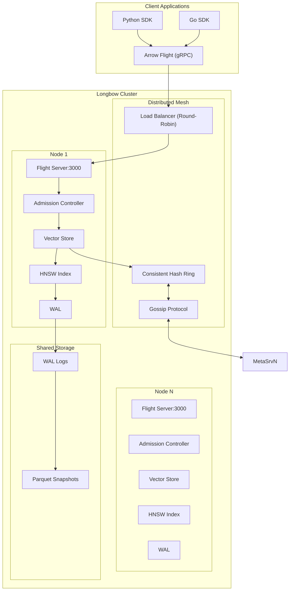
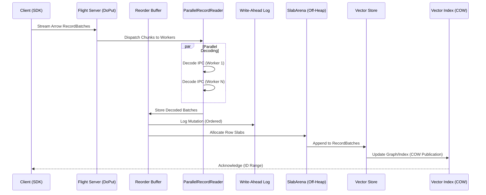
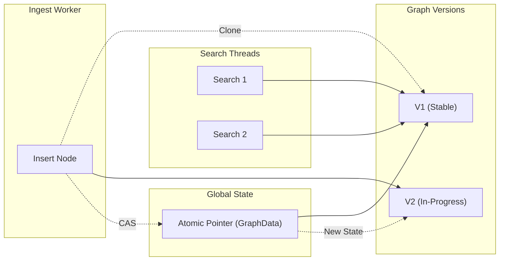
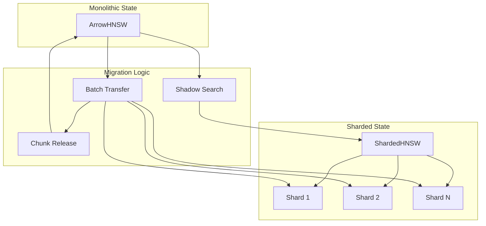
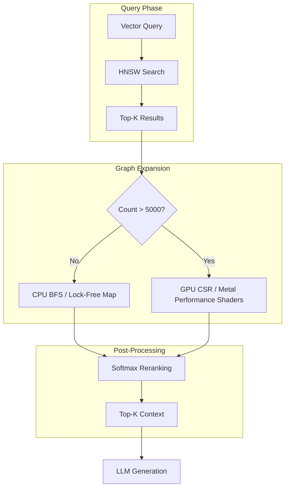

# Longbow Systems Architecture

Longbow is a distributed, high-performance vector engine designed for low-latency retrieval and high-throughput ingestion. It leverages a hybrid storage engine, modern hardware optimizations, and a resilient distributed mesh.

---

## 1. System Overview

Longbow follows a "Dynamo-style" decentralized architecture where nodes coordinate via a gossip protocol and data is partitioned using consistent hashing.

### High-Level Architecture Diagram



---

## 2. Ingest Pipeline

Longbow features a high-concurrency ingestion pipeline optimized for zero-copy data flow from gRPC streams to off-heap storage.

### 2.1 Parallel Ingestion Flow

The ingestion process utilizes a producer-consumer model with a reorder buffer to maintain strict sequence order while allowing parallel decoding.



- **ParallelRecordReader**: Distributes Arrow IPC decoding across multiple CPU cores.
- **Reorder Buffer**: Ensures that batches are committed to the WAL and storage in the exact order they were sent by the client, even if decoding happens out of order.
- **Double-Buffering WAL**: Uses a swap-buffer strategy for zero-allocation logging, minimizing I/O stalls.

---

## 3. Storage & Memory Architecture

### 3.1 Off-Heap Management (SlabPool)

To bypass Go's Garbage Collector (GC) overhead during large-scale ingestion, Longbow manages its own memory:

- **SlabArena**: Allocates memory in 1MB contiguous slabs.
- **SlabPool**: A global pool of slabs that can be reclaimed using `Munmap` to return memory to the OS, preventing virtual memory fragmentation.
- **NUMA-Aware Allocation**: Memory is allocated on the same NUMA node as the processing thread to minimize cross-socket latency.

### 3.2 Atomic COW Publication

Longbow uses a Copy-On-Write (COW) strategy for the primary index structure (`GraphData`).



### 3.3 RCU ChunkedLocationStore

`ChunkedLocationStore` maps every `VectorID` to a `Location` (batch + row offset). Prior to v0.2.0, it held a global `sync.RWMutex` that serialized all ingestion writes.

The v0.2.x rewrite uses two complementary techniques:
- **Lock-free reads**: The chunk slice is published via `atomic.Pointer`. Readers load the pointer and iterate without acquiring any lock.
- **Sharded reverse index**: The reverse index is split into 64 independent shards.
- **Atomic ID reservation**: `Append` and `BatchAppend` use `atomic.Uint32.Add` to atomically claim a contiguous range of IDs.

---

## 4. Distance & SIMD Engine

Vector distance calculations are optimized for modern hardware using hand-written assembly and specialized kernels.

### 4.1 SIMD Acceleration

- **AVX2/AVX-512**: Featuring optimized `brayCurtisAVX2Kernel` and activation kernels (`exp`, `softmax`).
- **NEON**: For ARM64 systems (Apple Silicon, AWS Graviton).
- **TPU Kernels**: Specialized F16/Complex kernels for Google TPU.
- **TurboQuant**: SIMD-accelerated bit-packing for 3-8x throughput in quantized search.

### 4.2 AVX-512 Activation Kernels (exp, softmax)

GraphRAG re-scoring and temporal search modes apply `softmax` and `exp` to score vectors, accelerated by a 5-term minimax polynomial approximation in AVX-512.

```
exp(x) ≈ 2^f * 2^n
  where z = x * log2(e)
        n = floor(z + 0.5)         -- via VRNDSCALEPS
        f = z - n                  -- fractional part
        2^f ≈ c0 + f(c1 + f(c2 + f(c3 + f(c4 + f·c5))))
        2^n = (n + 127) << 23      -- IEEE 754 exponent trick
```

---

## 5. Sharding & Scalability

Longbow scales from a single node to massive clusters through transparent auto-sharding.

### 5.1 Auto-Sharding & Migration

When a dataset exceeds the `ShardThreshold` (default 100k), the system triggers a background migration.



- **Shadow Search**: Queries are executed against both the monolithic index and the new shards during migration, with results merged by distance.
- **Incremental Release**: Memory is reclaimed from the monolithic index chunk-by-chunk as soon as they are successfully migrated to shards.

---

## 6. GraphRAG & Graph Rendering

Longbow integrates a high-performance **GraphStore** that enables Retrieval-Augmented Generation (RAG) through complex knowledge graph traversal.

### 6.1 Adaptive Expansion Pipeline

The graph engine supports adaptive dispatch between CPU and GPU based on workload size.



- **CSR (Compressed Sparse Row)**: Used on the GPU for efficient parallel traversal of large graphs.
- **Lock-Free Edge Map**: Used on the CPU for high-concurrency small-scale expansions.

---

## 7. Reliability & Load Balancing

### 7.1 Load-Aware Routing

Nodes broadcast `LoadHints` (CPU, memory, queue depth) via the gossip protocol.

- **Dynamic Weighting**: Clients use these hints to steer traffic away from hot nodes.
- **Admission Control**: Each node monitors its own health and rejects requests if memory pressure or CPU load exceeds safety thresholds.

### 7.2 gRPC Retry Protocol (`pkg/retry`)

Implements **Exponential Backoff with Jitter** for transient failure recovery. It identifies retryable codes (`Unavailable`, `DeadlineExceeded`, etc.) and ensures that total request time never exceeds the parent context deadline.

### 7.3 Fault Tolerance

- **Gossip Protocol**: Rapidly detects node failures and updates the hash ring.
- **WAL Replication**: (Optional) Logs can be streamed to replicas for high availability.
