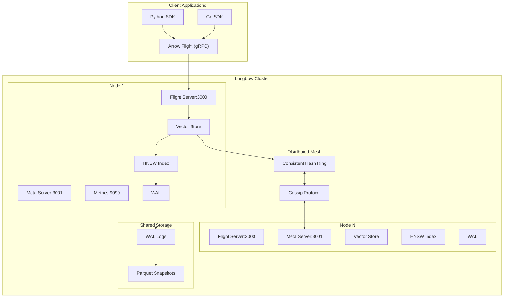
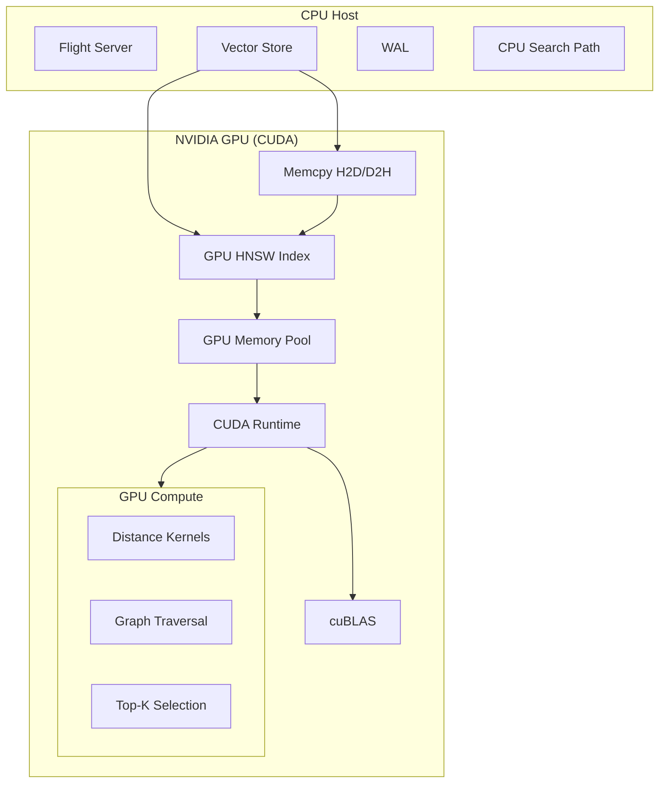
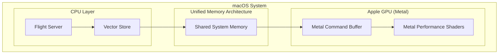
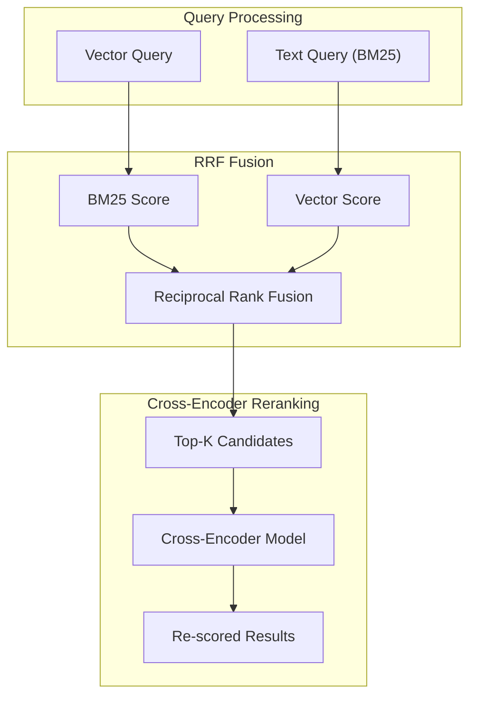

# Longbow Systems Architecture

Longbow is a distributed, high-performance vector engine designed for low-latency retrieval and high-throughput ingestion. It leverages a hybrid storage engine, modern hardware optimizations, and a resilient distributed mesh.

---

## 1. System Overview

Longbow follows a "Dynamo-style" decentralized architecture where nodes coordinate via a gossip protocol and data is partitioned using consistent hashing.

### High-Level Architecture Diagram



---

## 2. Core Components

### Flight Servers

Longbow separates data and control traffic to prevent head-of-line blocking:

- **Data Server (Port 3000)**: Implements Arrow Flight for `DoPut` (ingestion) and `DoGet` (search).
- **Meta Server (Port 3001)**: Handles `ListFlights` and `DoAction` for cluster management.

### In-Memory Vector Store

- **SlabArena**: Off-heap memory management using 1MB slabs to eliminate Go GC overhead.
- **Atomic COW (Copy-On-Write)**: Structural updates (e.g., index growth, metadata resizing) utilize a strict COW pattern. Modifications are applied to private clones before being atomically published, ensuring zero-lock read stability even during high-concurrency ingestion.
- **Auto-Sharding Index**: Dynamically transitions from a flat index to a lock-striped **ShardedHNSW** index as datasets grow.
- **Leveled Compaction**: Incremental merging of Arrow RecordBatches to maintain read performance without full index rebuilds.

### Distance & SIMD Engine

Vector distance calculations are optimized for modern CPU architectures:

- **AVX2/AVX-512**: For x86_64 systems.
- **NEON**: For ARM64 systems.
- **TurboQuant**: SIMD-accelerated bit-packing for extreme throughput.

---

## 3. Storage & Persistence

### Write-Ahead Log (WAL)

Every mutation is logged to a CRC32-protected WAL.

- **Double-Buffering**: Uses a swap-buffer strategy for zero-allocation logging.
- **Async Flush**: Ingestion continues while the WAL is periodically synced to disk.

### Snapshotting

Full index states are persisted as Parquet files. Snapshotting is triggered by WAL size limits or time intervals, and utilizes zero-copy Arrow-to-Parquet conversion.

---

## 4. Hardware Acceleration

### NVIDIA CUDA Architecture

Supports GPU-accelerated HNSW traversal and distance kernels.



### Apple Metal Architecture

Leverages Unified Memory on Apple Silicon for zero-copy CPU/GPU sharing.



### Google TPU Architecture

Utilizes the HBM (High Bandwidth Memory) and VMEM scratchpad for massive vector operations.

- **Backend**: `BackendTPU` (Ironwood).
- **Optimization**: Optimized for petabyte-scale retrieval in GCP environments.

---

## 5. Advanced Search Features

### Hybrid Search & Reranking

Combines dense HNSW search with sparse BM25 indexing using Reciprocal Rank Fusion (RRF).



### Geospatial & Temporal Search

- **Quadtree Indexing**: For efficient spatial range and radius queries.
- **Temporal Versioning**: Maintains historical versions of vectors with TTL-based retention.

### GraphStore & GraphRAG

Longbow integrates a high-performance **GraphStore** that operates alongside the vector store to enable GraphRAG (Retrieval-Augmented Generation) and complex knowledge graph traversal. The architecture treats the vector index (HNSW) and the knowledge graph as two views of the same underlying data.

- **Unified GraphData Structure**: Both semantic HNSW connections and explicit domain-specific relationships (e.g., "mentions", "belongs_to") are stored in a unified `GraphData` structure. This enables high-locality traversals that hop between semantic similarity and structural links.
- **Atomic Ingestion Pipeline**: Mutations follow a strict Copy-On-Write (COW) flow:
    1. **Private Workspace**: Structural updates are prepared in a private clone of the `GraphData`.
    2. **Linear Publication**: Once all connections (both vector and relational) are established, the `GraphData` pointer is atomically updated in the `ArrowHNSW` index.
    3. **Visibility Consistency**: This ensures that a single search request sees a perfectly consistent snapshot of both the vector space and the relationship graph, preventing "ghost" nodes or broken edges.
- **Search Context Isolation**: Each query utilizes a `SearchContext` which pins a specific atomic pointer to `GraphData`. This provides a stable, immutable view for the duration of complex multi-hop traversals, even if background ingestion continues to publish new graph versions.
- **Hybrid Traversal (Knowledge Graph + Semantic)**: Enables queries like "Find the 5 most similar documents to *User Query* that are also within 2 hops of *Entity A* in the knowledge graph".

---

## 6. Multi-Tenancy & Data Lifecycle

### Namespaces

Longbow provides logical isolation through **Namespaces**.

- **Isolation**: Each namespace has its own set of datasets, quotas, and metadata.
- **Recursive Cleanup**: Deleting a namespace automatically drops all contained datasets and releases associated memory and disk resources.
- **Quota Management**: Support for per-namespace limits on total vectors, dimensions, and storage bytes.

### Data Mutation & Deletion Lifecycle

Longbow implements an **LSM-tree inspired mutation model** for vector data, prioritizing high-ingestion throughput and search stability.

#### 1. The Tombstone Strategy (Soft Delete)

To avoid expensive real-time index re-balancing, Longbow uses a bitset-based soft deletion mechanism:

- **Mutation**: When `Delete` is called for an ID, the `PrimaryIndex` is consulted to find the `RecordBatch` index and `RowOffset`.
- **Bitset Mapping**: A bit is flipped in the `Tombstone` bitset corresponding to that batch.
- **Masked Search**: During the search phase, distance kernels apply the tombstone bitset as a mask, effectively ignoring deleted vectors with zero overhead on the traversal logic.

#### 2. Identity & Updates

- **Deterministic IDs**: If a vector is ingested with an existing ID, the system performs an atomic "Tombstone-then-Insert" operation.
- **Version Tracking**: The WAL ensures that even if a node crashes between tombstoning and inserting, the final state remains consistent upon replay.

#### 3. Fragmentation-Aware Compaction

Background hygiene is managed by the **Compaction Worker**:

- **Tracking**: Each `Dataset` maintains a fragmentation score based on the density of active vs. tombstoned rows.
- **Merging**: When fragmentation exceeds the configured threshold (default 20%), the worker:
    1. Snapshots the fragmented batches.
    2. Physically "squashes" the data into new, dense `RecordBatches`.
    3. Atomically swaps the `Dataset.Records` pointer.
    4. Re-maps the `PrimaryIndex` to the new physical locations.
    5. Triggers a `RemapLocations` call on the underlying `Index` (HNSW/DiskANN) to update its internal graph pointers.

#### 4. Resource Reclamation

- **Memory**: Once a batch is released, the `SlabArena` reclaims the underlying slabs for future allocations.
- **Disk**: Compaction triggers WAL truncation. Once a `Snapshot` is persisted containing the compacted state, all preceding WAL segments are safely deleted.

---

## 7. Performance Optimizations

### 7.1 RCU ChunkedLocationStore

`ChunkedLocationStore` maps every `VectorID` to a `Location` (batch + row offset) and maintains a reverse index (location → ID). Prior to this change it held a global `sync.RWMutex` that serialized all ingestion writes through a single critical section.

The rewrite uses two complementary techniques:

- **Lock-free reads**: The chunk slice is published via `atomic.Pointer[[]*locationChunk]`. Readers load the pointer and iterate without acquiring any lock. Readers and writers never block each other.
- **Sharded reverse index**: Instead of one global `map[uint64]VectorID`, the reverse index is split into 64 independent shards (each with its own `sync.RWMutex`). The shard is selected by `packedLocation % 64`, so 64 parallel ingestion goroutines contend on different shards.
- **Atomic ID reservation**: `Append` and `BatchAppend` use `atomic.Uint32.Add` to atomically claim a contiguous range of IDs before acquiring the growth lock. The growth lock is held only while allocating new `locationChunk` objects — a very infrequent operation.

```
Before:  global RWMutex → serialized ingestion (~25% regression under load)
After:   atomic.Add (ID reservation) + per-shard lock (reverse map only)
         chunk reads: fully lock-free
```

### 7.2 Adaptive GPU Dispatch

Graph-RAG expansion via `RankWithGraphGPU` incurs a fixed GPU kernel launch overhead of ~50–200 µs regardless of workload size. For small result sets (e.g., reranking 10–20 seed nodes) this latency dominates and the GPU provides no speedup.

**Threshold logic** (`graph_store.go`):

```go
const GPUWorkloadThreshold = 128 // nodes

func (gs *GraphStore) RankWithGraphGPU(...) {
    if len(results) < GPUWorkloadThreshold {
        return gs.RankWithGraph(results, alpha, depth), nil // CPU path
    }
    // GPU path ...
}
```

| Workload Size | Path | Rationale |
|---|---|---|
| < 128 results | CPU (`RankWithGraph`) | Launch overhead dominates; CPU is faster |
| ≥ 128 results | GPU (`RankWithGraphGPU`) | Parallelism justifies the fixed overhead |

The threshold value of 128 is derived from empirical benchmarks on RTX 3090 hardware. It can be tuned by changing the `GPUWorkloadThreshold` constant in `internal/store/graph_store.go`.

### 7.3 AVX-512 Activation Kernels (exp, softmax)

GraphRAG re-scoring and temporal search modes apply `softmax` and `exp` to score vectors. These operations are now accelerated by hand-written AVX-512 assembly on x86-64.

**Algorithm** (`internal/simd/simd_amd64.s`):

Both kernels use a 5-term minimax polynomial for `2^f` combined with an integer exponent-field trick for `2^n`:

```
exp(x) ≈ 2^f * 2^n
  where z = x * log2(e)
        n = floor(z + 0.5)         -- via VRNDSCALEPS
        f = z - n                  -- fractional part
        2^f ≈ c0 + f(c1 + f(c2 + f(c3 + f(c4 + f·c5))))
        2^n = (n + 127) << 23      -- IEEE 754 exponent trick, FCVTPS2DQ + VPSLLD
```

**Softmax** follows the numerically-stable variant: subtract max before exp, then normalize by the sum.

Both kernels process 16 `float32` elements per cycle using AVX-512 ZMM registers, with masked-load/store for arbitrary-length tails.

| Architecture | `exp` dispatch | `softmax` dispatch |
|---|---|---|
| amd64 (AVX-512) | `expAVX512Kernel` (asm) | `softmaxAVX512Kernel` (asm) |
| arm64 (NEON) | `expGeneric` (Go, pending validated WORD opcodes) | `softmaxGeneric` (Go) |
| other | `expGeneric` | `softmaxGeneric` |

> **Observability**: kernel calls and latency are tracked via
> `longbow_simd_activation_kernel_calls_total` and
> `longbow_simd_activation_kernel_duration_seconds` (see `docs/metrics.md §8`).
