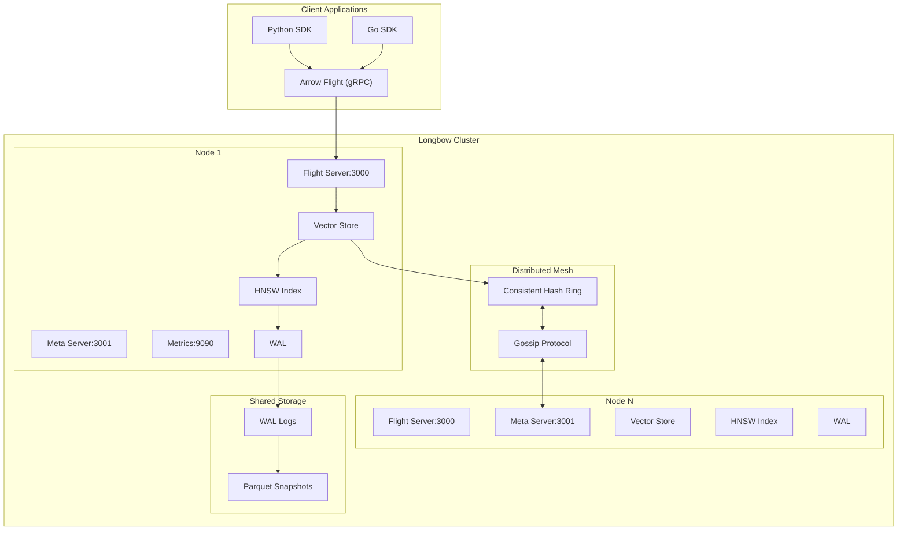
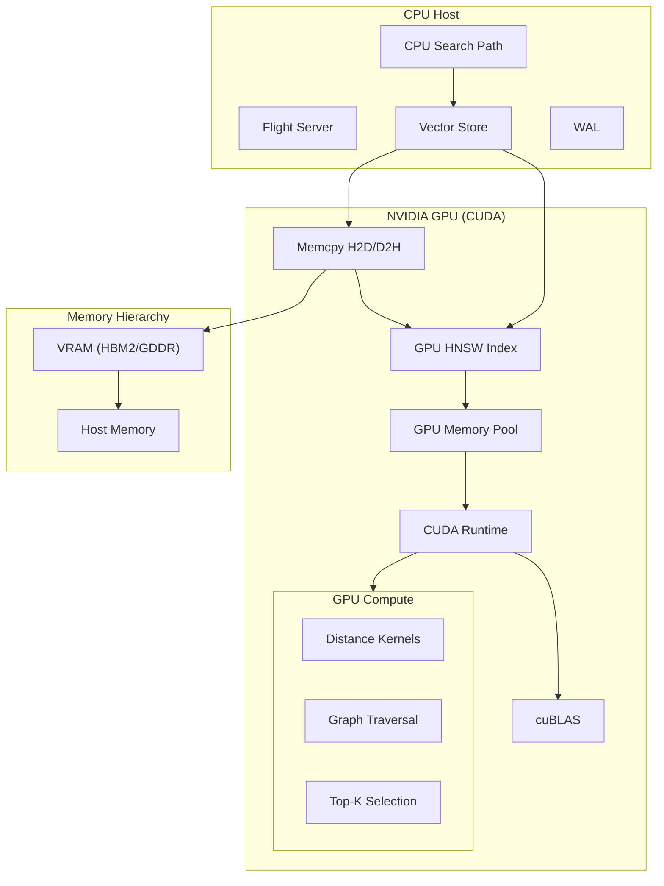
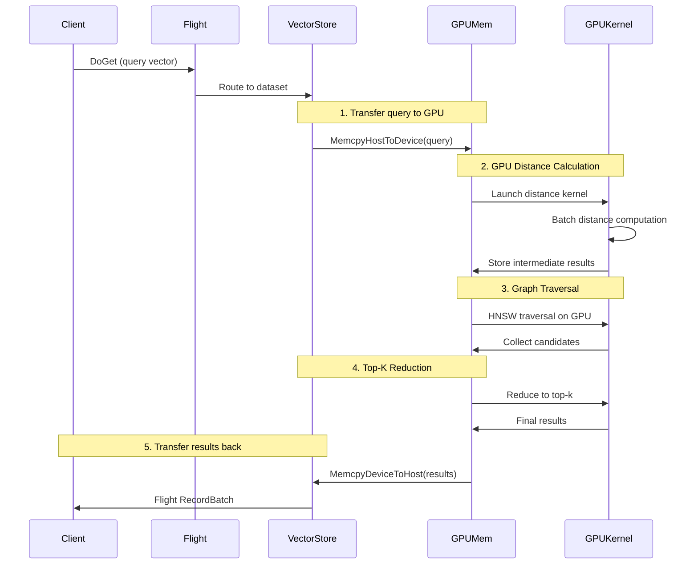
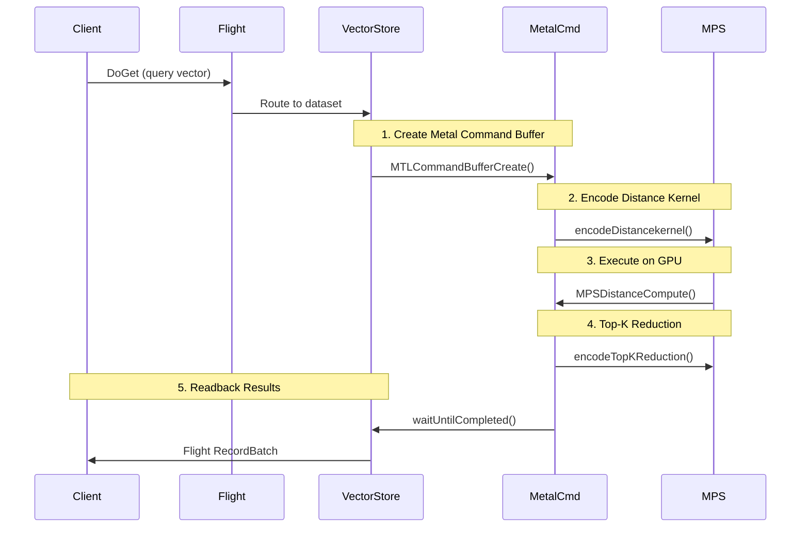
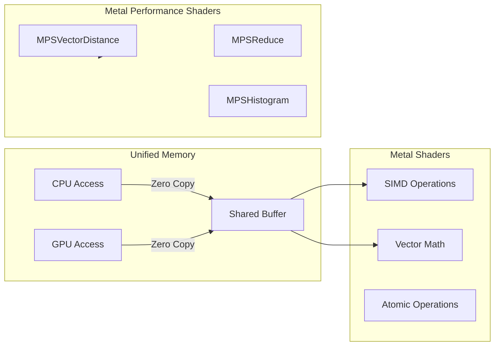
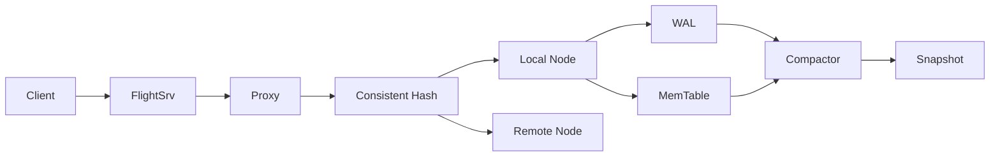

# Longbow Systems Architecture

## Overview

Longbow is a distributed, high-performance vector database designed for low-latency retrieval and high-throughput ingestion. It leverages a hybrid storage engine, modern hardware optimizations, and a resilient distributed mesh.

## System Architecture Diagram



## Core Components

### 1. Vector Engine

- **Hybrid Indexing**:
  - **Dense**: HNSW (Hierarchical Navigable Small World) for approximate nearest neighbor search.
  - **Sparse**: Inverted Index (BM25/Sparse) for keyword matching.
  - **Auto-Sharding**: Transparently upgrades standard indices to **ShardedHNSW** (lock-striped) when thresholds are met.
- **Interim Sharding**: Uses a temporary sharded index during migration to eliminate double-indexing overhead.
- **Zero-Copy**: Utilizes Apache Arrow for zero-copy data representation, minimizing serialization overhead.
- **Concurrency**: Concurrent HNSW with fine-grained locking per node/level to maximize throughput.
- **SIMD**: Optimized for modern CPU architectures with SIMD instructions (AVX2/AVX-512).

### 2. Storage Layer

- **WAL-Backed Engine**: Log-structured storage with an in-memory primary store and background record-batch compaction.
- **Durability**: Periodic checkpoints and snapshots ensure data durability.

---

## GPU Architecture: NVIDIA CUDA



### CUDA Data Flow



### CUDA Configuration

```bash
# Enable GPU support
GPU_ENABLED=true
GPU_DEVICE_ID=0

# Memory configuration
GPU_MEMORY_LIMIT=8589934592  # 8GB

# Hybrid search (GPU + CPU refinement)
HYBRID_SEARCH_ENABLED=true
HYBRID_ALPHA=0.5  # Balance GPU/CPU work
```

### CUDA Memory Layout

```
┌─────────────────────────────────────────┐
│           GPU Memory (VRAM)             │
├─────────────────────────────────────────┤
│  ┌─────────────────────────────────────┐│
│  │  GPU HNSW Graph                     ││
│  │  - Node positions (float32)         ││
│  │  - Edge lists (int32)               ││
│  │  - Level offsets                    ││
│  └─────────────────────────────────────┘│
│  ┌─────────────────────────────────────┐│
│  │  Distance Buffers                   ││
│  │  - Query vector (shared)            ││
│  │  - Batch distances                  ││
│  │  - Top-K heap                       ││
│  └─────────────────────────────────────┘│
│  ┌─────────────────────────────────────┐│
│  │  CUDA Events/Synchronization        ││
│  └─────────────────────────────────────┘│
└─────────────────────────────────────────┘
```

---

## GPU Architecture: Apple Metal

```mermaid
graph TB
    subgraph Mac["macOS System"]
        subgraph CPU["CPU Layer"]
            FlightSrv["Flight Server"]
            VectorStore["Vector Store"]
            WAL["WAL"]
        end

        subgraph Unified["Unified Memory Architecture"]
            CPUAlloc["CPU Allocations"]
            GPUAlloc["GPU Allocations"]
            SharedMem["Shared System Memory"]
        end

        subgraph GPU["Apple GPU (Metal)"]
            MetalCmd["Metal Command Buffer"]
            MetalLib["Metal Shaders"]
            
            subgraph MPS["Metal Performance Shaders"]
                MPSDistance["MPSDistance"]
                MPSReduce["MPSReduce"]
                MPSSort["MPSSort"
            end
            
            subgraph GPUCompute["GPU Kernels"]
                SIMD["SIMD Grid"]
                Threadgroups["Threadgroups"]
            end
        end
    end

    FlightSrv --> VectorStore
    VectorStore --> GPUAlloc
    GPUAlloc --> MetalCmd
    MetalCmd --> MetalLib
    MetalLib --> MPS
    MPS --> GPUCompute
```

### Metal Data Flow



### Metal Optimization Features



### Metal Configuration

```bash
# Metal is auto-detected on Apple Silicon
GPU_ENABLED=true
GPU_DEVICE_ID=0

# Metal-specific optimizations
# - Unified memory eliminates explicit copies
# - MPS provides optimized kernels
# - Compute shaders for custom operations
```

### Metal Memory Model

```
┌─────────────────────────────────────────┐
│       Unified Memory Architecture       │
├─────────────────────────────────────────┤
│  ┌─────────────────────────────────────┐│
│  │  Shared Buffer (CPU/GPU accessible) ││
│  │  - No explicit memcpy needed        ││
│  │  - Memory coherence automatic       ││
│  └─────────────────────────────────────┘│
│  ┌─────────────────────────────────────┐│
│  │  Metal Resource Buffers             ││
│  │  - MTLBuffer with storage mode      ││
│  │  - Shared: CPU + GPU access         ││
│  │  - Private: GPU only                ││
│  └─────────────────────────────────────┘│
└─────────────────────────────────────────┘
```

---

## Data Flow

### Ingestion (DoPut)



### Retrieval (DoGet)


---

## GPU Selection Matrix

| Feature | CPU | NVIDIA CUDA | Apple Metal |
|---------|-----|-------------|-------------|
| **HNSW Search** | AVX2/AVX-512 | cuBLAS + Custom | MPS + Shaders |
| **Distance Metrics** | SIMD kernels | GPU kernels | MPSDistance |
| **Memory Model** | System RAM | VRAM (separate) | Unified Memory |
| **Hybrid Search** | N/A | GPU + CPU fallback | GPU + CPU fallback |
| **Unified Memory** | N/A | requires explicit copy | Automatic |
| **Tensor Cores** | No | FP16/INT8 support | No (Apple Silicon) |
| **Max Dimensions** | 3072 | 4096+ | 3072 |

---

## Configuration

See [Configuration Guide](configuration.md) for details on:

- `LONGBOW_STORAGE_USE_IOURING`
- `LONGBOW_GOSSIP_ENABLED`
- `LONGBOW_GPU_ENABLED`
- `LONGBOW_HYBRID_SEARCH_ENABLED`
