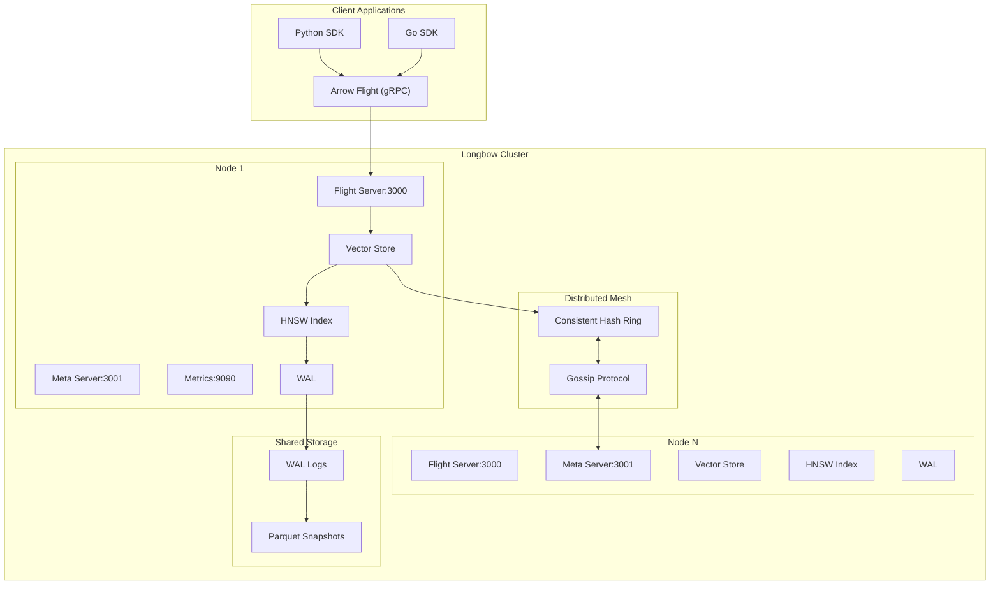
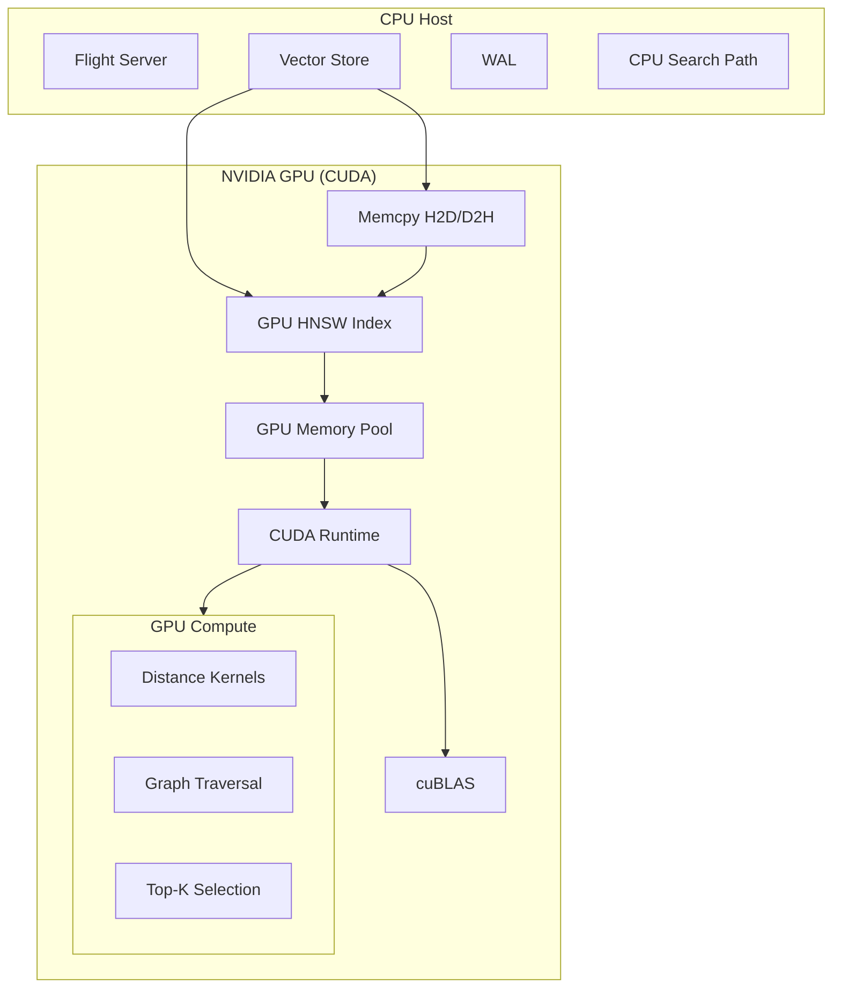
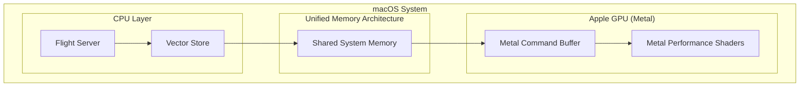
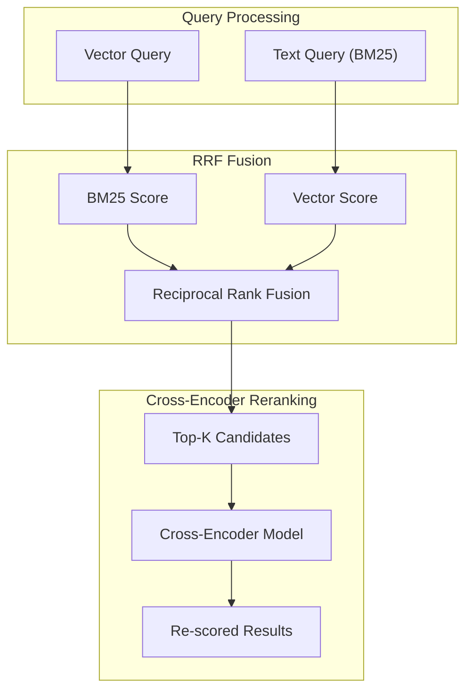

# Longbow Systems Architecture

Longbow is a distributed, high-performance vector database designed for low-latency retrieval and high-throughput ingestion. It leverages a hybrid storage engine, modern hardware optimizations, and a resilient distributed mesh.

---

## 1. System Overview

Longbow follows a "Dynamo-style" decentralized architecture where nodes coordinate via a gossip protocol and data is partitioned using consistent hashing.

### High-Level Architecture Diagram

---

## 2. Core Components

### Flight Servers
Longbow separates data and control traffic to prevent head-of-line blocking:
- **Data Server (Port 3000)**: Implements Arrow Flight for `DoPut` (ingestion) and `DoGet` (search).
- **Meta Server (Port 3001)**: Handles `ListFlights` and `DoAction` for cluster management.

### In-Memory Vector Store
- **SlabArena**: Off-heap memory management using 1MB slabs to eliminate Go GC overhead.
- **Auto-Sharding Index**: Dynamically transitions from a flat index to a lock-striped **ShardedHNSW** index as datasets grow.
- **Leveled Compaction**: Incremental merging of Arrow RecordBatches to maintain read performance without full index rebuilds.

### Distance & SIMD Engine
Vector distance calculations are optimized for modern CPU architectures:
- **AVX2/AVX-512**: For x86_64 systems.
- **NEON**: For ARM64 systems.
- **TurboQuant**: SIMD-accelerated bit-packing for extreme throughput.

---

## 3. Storage & Persistence

### Write-Ahead Log (WAL)
Every mutation is logged to a CRC32-protected WAL.
- **Double-Buffering**: Uses a swap-buffer strategy for zero-allocation logging.
- **Async Flush**: Ingestion continues while the WAL is periodically synced to disk.

### Snapshotting
Full index states are persisted as Parquet files. Snapshotting is triggered by WAL size limits or time intervals, and utilizes zero-copy Arrow-to-Parquet conversion.

---

## 4. Hardware Acceleration

### NVIDIA CUDA Architecture
Supports GPU-accelerated HNSW traversal and distance kernels.

### Apple Metal Architecture
Leverages Unified Memory on Apple Silicon for zero-copy CPU/GPU sharing.

### Google TPU Architecture
Utilizes the HBM (High Bandwidth Memory) and VMEM scratchpad for massive vector operations.
- **Backend**: `BackendTPU` (Ironwood).
- **Optimization**: Optimized for petabyte-scale retrieval in GCP environments.

---

## 5. Advanced Search Features

### Hybrid Search & Reranking
Combines dense HNSW search with sparse BM25 indexing using Reciprocal Rank Fusion (RRF).

### Geospatial & Temporal Search
- **Quadtree Indexing**: For efficient spatial range and radius queries.
- **Temporal Versioning**: Maintains historical versions of vectors with TTL-based retention.
