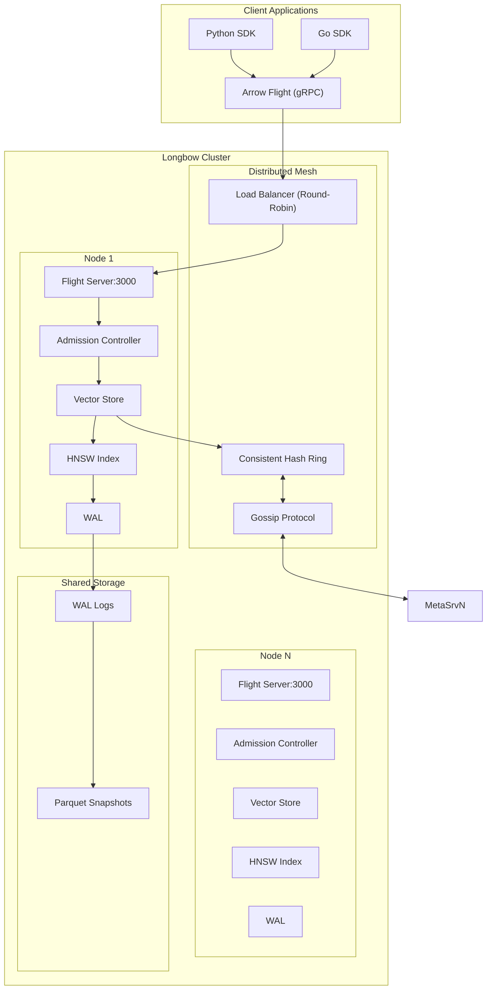
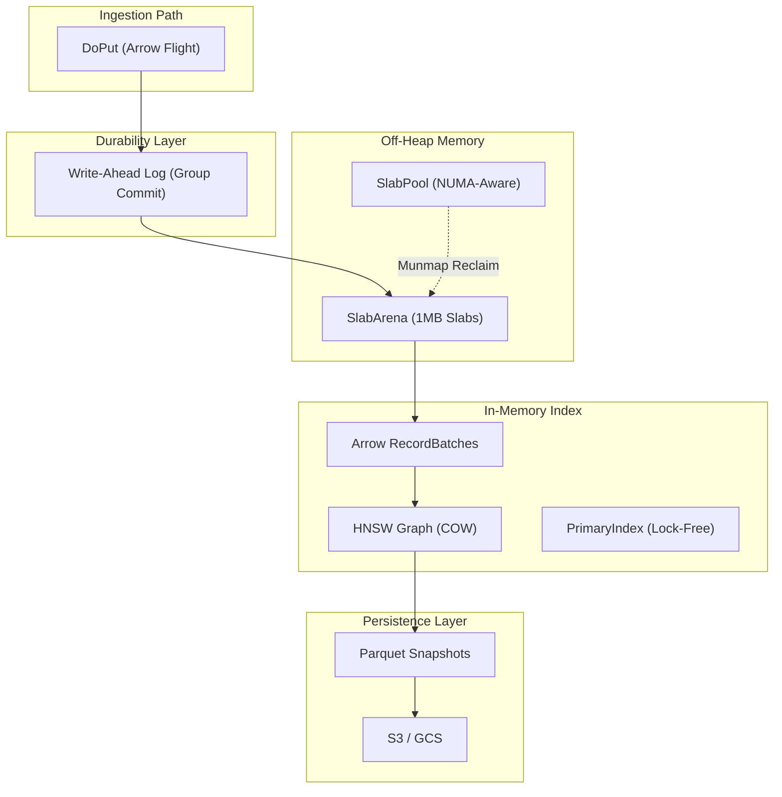
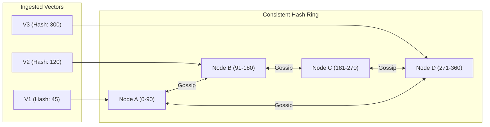
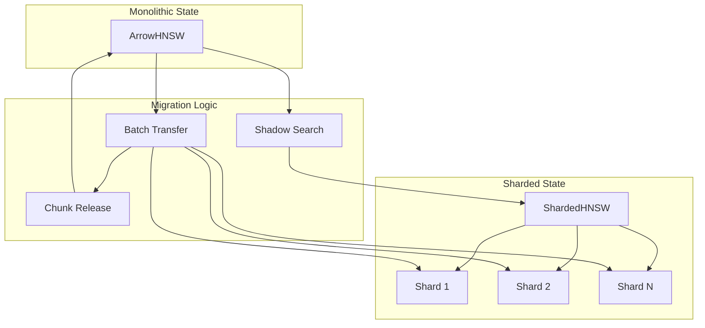
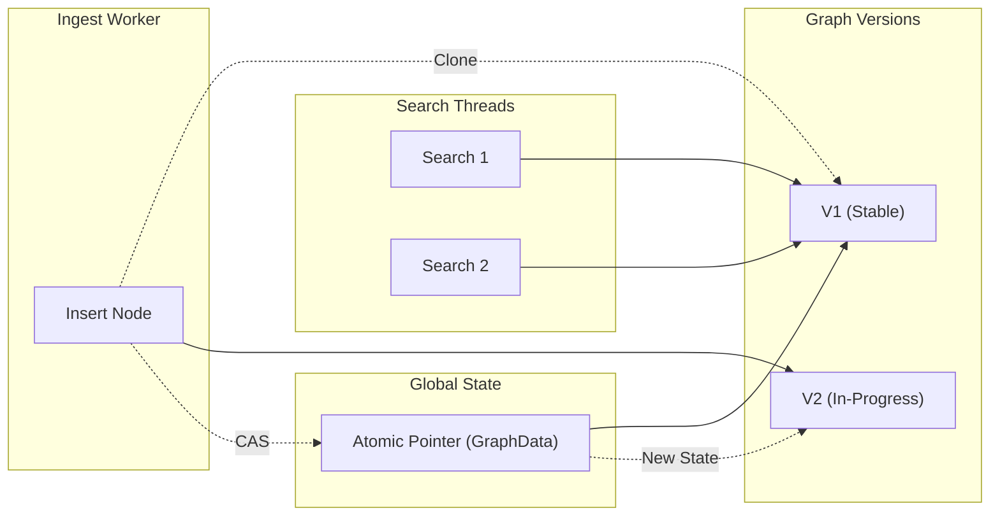
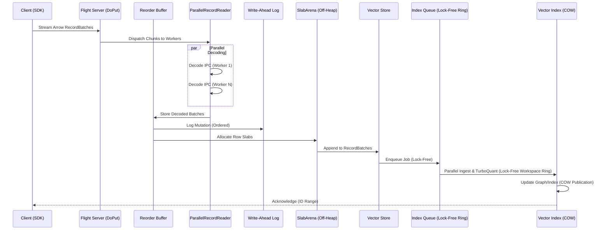
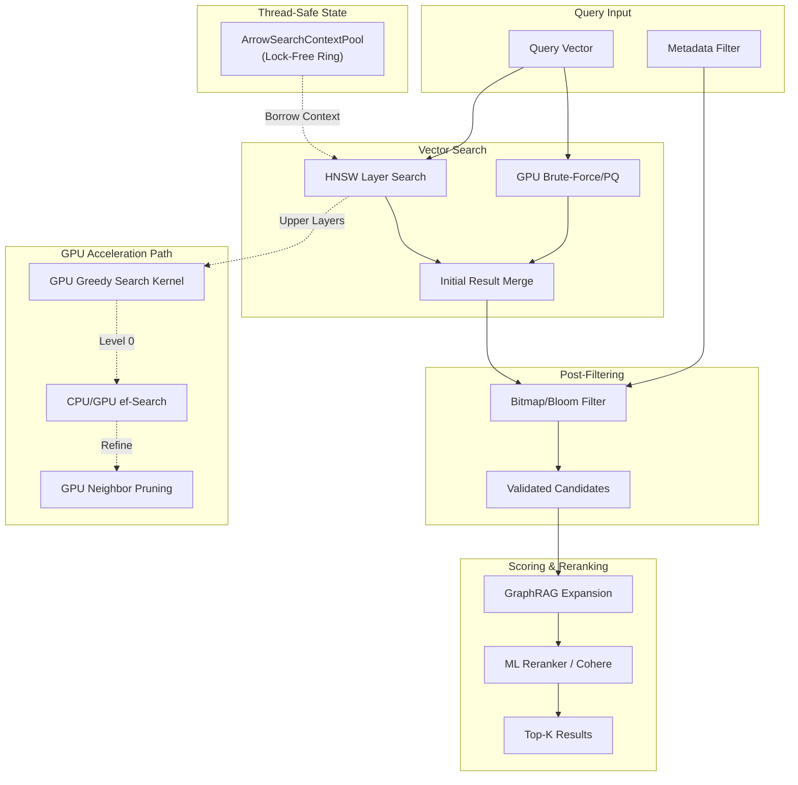
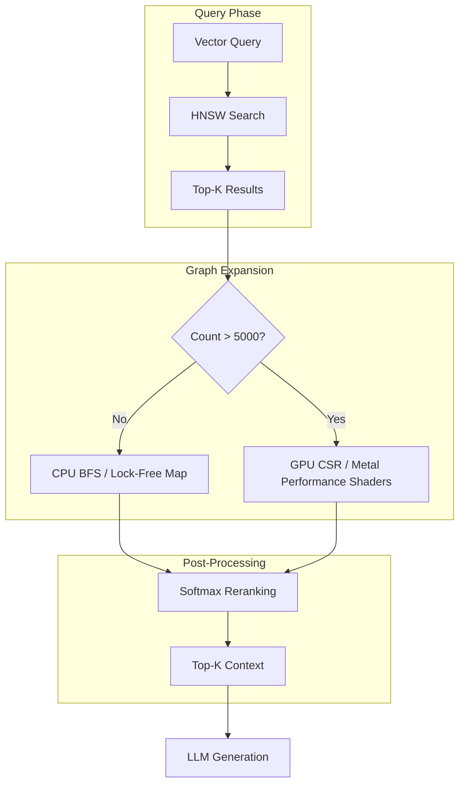

# Longbow Systems Architecture

Longbow is a distributed, high-performance vector engine designed for low-latency retrieval and high-throughput ingestion. It leverages a hybrid storage engine, modern hardware optimizations, and a resilient distributed mesh.

---

## 1. System Overview

Longbow follows a "Dynamo-style" decentralized architecture where nodes coordinate via a gossip protocol and data is partitioned using consistent hashing.

### High-Level Architecture Diagram



### Storage Layer Hierarchy



---

## 2. Distributed Mesh

### 2.1 Consistent Hashing & Data Partitioning

Data is partitioned across nodes using a consistent hash ring, ensuring minimal data movement when nodes join or leave the cluster.



### 2.2 Auto-Sharding & Migration

When a dataset exceeds the `ShardThreshold` (default 100k), the system triggers a background migration.



- **Shadow Search**: Queries are executed against both the monolithic index and the new shards during migration, with results merged by distance.
- **Incremental Release**: Memory is reclaimed from the monolithic index chunk-by-chunk as soon as they are successfully migrated to shards.

### 2.3 Load-Aware Routing

Nodes broadcast `LoadHints` (CPU, memory, queue depth) via the gossip protocol.

- **Dynamic Weighting**: Clients use these hints to steer traffic away from hot nodes.
- **Admission Control**: Each node monitors its own health and rejects requests if memory pressure or CPU load exceeds safety thresholds.

### 2.4 gRPC Retry Protocol (`pkg/retry`)

Implements **Exponential Backoff with Jitter** for transient failure recovery. It identifies retryable codes (`Unavailable`, `DeadlineExceeded`, etc.) and ensures that total request time never exceeds the parent context deadline.

### 2.5 Fault Tolerance

- **Gossip Protocol**: Rapidly detects node failures and updates the hash ring.
- **WAL Replication**: (Optional) Logs can be streamed to replicas for high availability.

---

## 3. Storage & Durability

### 3.1 Write-Ahead Log (WAL)

- **Mechanism**: Every `DoPut` is synchronously written to a batched WAL before being acknowledged. The system employs a `BufferedWAL` utilizing a high-throughput **group commit** algorithm via a list of `syncWaiter` primitives.
- **Zero-Allocation**: A double-buffering and `patchableBuffer` strategy ensures that mutations can be aggressively formatted and pushed to disk without incurring Go runtime allocations or GC pressure.
- **Performance**: High-throughput asynchronous persistence using platform-specific backends (`io_uring` on Linux, `O_DIRECT` equivalents on macOS).
- **Recovery**: On startup, Longbow replays the WAL to reconstruct the in-memory HNSW index and Arrow buffers flawlessly.

### 3.2 High Availability & Replication (v0.2.1+)

- **Quorum-based Replication**: When running in a cluster (via Gossip), Longbow performs **synchronous WAL replication** to peer nodes.
- **Durability Guarantee**: A write is only acknowledged to the client after it has been persisted locally AND replicated to a quorum ($N/2 + 1$) of nodes.
- **Failover**: If a primary node fails, follower nodes have a consistent copy of the WAL up to the last acknowledged write, enabling rapid failover with zero data loss.
- **Observability**: Monitor replication health via `longbow_wal_replication_latency_seconds`.

### 3.3 Snapshots (Parquet & Arrow)

- **Format**: Data is periodically flushed to Apache Parquet files, providing a columnar, compressed representation of the dataset.
- **Cloud-Native**: Snapshots can be offloaded to **S3-compatible storage** and **Google Cloud Storage (GCS)** for long-term retention and cross-region recovery.

### 3.4 Off-Heap Management (SlabPool)

To bypass Go's Garbage Collector (GC) overhead during large-scale ingestion, Longbow manages its own memory:

- **SlabArena**: Allocates memory in 1MB contiguous slabs.
- **SlabPool**: A global pool of slabs that can be reclaimed using `Munmap` to return memory to the OS, preventing virtual memory fragmentation.
- **NUMA-Aware Allocation**: Memory is allocated on the same NUMA node as the processing thread to minimize cross-socket latency.

### 3.5 Atomic COW Publication

Longbow uses a Copy-On-Write (COW) strategy for the primary index structure (`GraphData`).



### 3.6 RCU ChunkedLocationStore

`ChunkedLocationStore` maps every `VectorID` to a `Location` (batch + row offset). Prior to v0.2.0, it held a global `sync.RWMutex` that serialized all ingestion writes.

The v0.2.x rewrite uses two complementary techniques:

- **Lock-free reads**: The chunk slice is published via `atomic.Pointer`. Readers load the pointer and iterate without acquiring any lock.
- **Sharded reverse index**: The reverse index is split into 64 independent shards.
- **Atomic ID reservation**: `Append` and `BatchAppend` use `atomic.Uint32.Add` to atomically claim a contiguous range of IDs.

### 3.7 Platform-Specific Async I/O (DiskWriterUring)

Longbow achieves high-throughput persistence through native asynchronous I/O bindings:

- **Linux (io_uring)**: Utilizes a submission/completion ring architecture for zero-syscall overhead during bulk writes.
- **macOS (Direct I/O)**: Employs `F_NOCACHE` to bypass the system page cache and a dedicated background worker pool for non-blocking I/O.
- **Windows (IOCP)**: (Experimental) Leverages I/O Completion Ports for scalable async operations.

### 3.8 Remote Persistence (S3 & GCS)

Longbow supports reading and writing directly to cloud storage for both ingestion and exports.

#### Supported URIs

- **S3**: `s3://bucket-name/path/to/file.parquet`
- **GCS**: `gs://bucket-name/path/to/file.parquet`

#### Ingestion via CLI

```bash
# Import from S3
longbow-cli import -dataset my-collection -input s3://my-bucket/data.parquet

# Import from GCS
longbow-cli import -dataset my-collection -input gs://my-bucket/data.parquet
```

#### Export to Cloud

```bash
# Export to GCS
longbow-cli export -dataset my-collection -file gs://my-bucket/exports/today.arrow
```

### 3.9 Tiered Storage Configuration

| Variable | Description |
| :--- | :--- |
| `STORAGE_REMOTE_TYPE` | `s3` or `gcs` |
| `S3_BUCKET` | S3 bucket name |
| `S3_ENDPOINT` | Custom S3 endpoint (e.g. MinIO) |
| `GCS_BUCKET` | GCS bucket name |
| `GOOGLE_APPLICATION_CREDENTIALS` | Path to Google service account JSON key |

---

## 4. Ingest Pipeline

Longbow features a high-concurrency ingestion pipeline optimized for zero-copy data flow from gRPC streams to off-heap storage.

### 4.1 Parallel Ingestion Flow

The ingestion process utilizes a producer-consumer model with a reorder buffer to maintain strict sequence order while allowing parallel decoding.



- **ParallelRecordReader**: Distributes Arrow IPC decoding across multiple CPU cores.
- **Reorder Buffer**: Ensures that batches are committed to the WAL and storage in the exact order they were sent by the client, even if decoding happens out of order.
- **BufferedWAL & Group Commit**: The `BufferedWAL` utilizes a highly efficient double-buffering architecture coupled with `patchableBuffer` and `syncWaiter` primitives. This swap-buffer strategy enables zero-allocation, high-throughput logging with strict sequential persistence before acknowledgment.
- **GPU-Accelerated Ingestion**: Offloads HNSW upper-layer greedy searches and neighbor pruning to the GPU (Metal/CUDA) to eliminate CPU-GPU 'ping-pong' overhead.

---

## 5. Data Lifecycle

### 5.1 Eviction & TTL

Longbow automatically manages memory pressure and data staleness through active eviction policies.

#### Time-To-Live (TTL)

- **Behavior**: Removes datasets that have not been accessed within a configured duration.
- **Configuration**: Set `LONGBOW_TTL` (e.g., `24h`) to enable automated cleanup of transient caches.

#### Least Recently Used (LRU)

- **Mechanism**: Triggered when memory usage approaches `LONGBOW_MAX_MEMORY`.
- **Action**: Evicts the least active datasets to make room for new high-priority writes.

#### Slab Eviction

When the heap exceeds 60% of `MaxMemory`, the `GraphLayerEvictionManager` evicts HNSW Layer 0 to disk (hot/cold graph separation), keeping higher layers in memory for search performance.

### 5.2 Deletions & Tombstones

Longbow implements a high-performance, non-blocking deletion model inspired by LSM-trees. Instead of immediately re-writing large segments of the index or data files, it utilizes a "Soft-Delete" strategy that ensures consistent search performance with minimal mutation overhead.

#### The Tombstone Mechanism

When a record is deleted or updated in Longbow, it is not immediately removed from memory or disk. Instead:

1. **Tombstone Marking**: The system identifies the physical location (Batch Index + Row Offset) of the record.
2. **Bitset Update**: A bit is set in a **Tombstone Bitset** associated with the specific Arrow RecordBatch containing the data.
3. **Primary Index Removal**: The record ID is removed from the `PrimaryIndex` (mapping IDs to locations), preventing new queries from finding it via ID.

#### Why Tombstones?

- **Speed**: Setting a bit in a bitset is a sub-microsecond operation.
- **Concurrency**: Multiple threads can mark tombstones simultaneously without complex locking of the underlying data arrays.
- **Search Masking**: Longbow's SIMD-accelerated distance kernels use the tombstone bitset as a mask. Deleted records are skipped at the lowest level of the compute pipeline, incurring zero performance penalty during search traversal.

#### Upserts

Longbow treats updates as an atomic **Delete + Insert** operation:

1. The existing version of the ID is tombstoned.
2. The new version is appended to the current active RecordBatch.
3. The `PrimaryIndex` is updated to point to the new location.
4. The WAL (Write-Ahead Log) records both actions to ensure consistency after a crash.

### 5.3 Compaction

To prevent "dead space" from accumulating, Longbow's **Compaction Worker** monitors fragmentation.

- **Fragmentation Ratio**: Each dataset tracks the ratio of tombstoned rows to total rows.
- **Threshold**: When a batch exceeds a threshold (typically 20%), it is marked for compaction.
- **Squashing**: During compaction, the worker creates a new, dense RecordBatch by copying only the active (non-tombstoned) rows.
- **Atomic Swap**: The old batch is released, and the new batch is integrated into the dataset. The `SlabArena` then reclaims the memory from the old batch.

### 5.4 Namespace Interaction

Namespaces provide a bulk lifecycle management layer:

- **Bulk Deletion**: Deleting a namespace recursively drops all contained datasets.
- **Resource Reclamation**: When a namespace is deleted, its memory is immediately returned to the system-wide pool, and its persistent snapshots/WAL logs are purged from the filesystem.
- **Isolation**: Tombstones are scoped to a dataset within a namespace. Deleting a record in one namespace has no effect on identical IDs in another namespace.

### 5.5 Operational Best Practices

- **Monitor Fragmentation**: Use the `longbow_dataset_fragmentation_ratio` metric to monitor how much space is being consumed by tombstones.
- **Tune Compaction**: If your workload involves heavy updates, consider lowering the `LONGBOW_COMPACTION_THRESHOLD` to reclaim memory more frequently.
- **Bulk Cleanup**: For temporary data (e.g., a per-session cache), prefer using a dedicated **Namespace** and deleting the entire namespace when the session ends, rather than deleting individual records.

---

## 6. Temporal Capabilities & Versioning

Longbow supports time-travel queries and multi-version concurrency control (MVCC) for evolving datasets.

### 6.1 Temporal Search

Find vectors as they existed at a specific point in time or within a sliding window:

- **As-Of Search**: `search_type: "as_of"` at timestamp $T$.
- **Range Search**: Retrieve all updates within $[T_{start}, T_{end}]$.
- **Sliding Window**: Search the $N$ most recent vectors back from now.

### 6.2 Version History

Maintain a log of changes per vector ID (configured via `TEMPORAL_MAX_VERSIONS`). This allows for audit trails and tracking model drift over time.

### 6.3 Schema Evolution

Longbow allows datasets to evolve their metadata schema without requiring re-indexing or downtime.

- **Additive Evolution**: New columns can be appended to existing Arrow schemas.
- **Compatibility**: Existing columns must retain their name and data type to ensure backward compatibility for search and scans.
- **Enforcement**: Mismatched schemas that break these rules are rejected at the ingestion layer.

---

## 7. Hardware Acceleration

Longbow is optimized for heterogeneous hardware, providing native support for NVIDIA GPUs (CUDA), Apple Silicon (Metal), and Google TPUs (Ironwood) for high-performance vector search and ML inference.

### 7.1 Acceleration Platform Matrix

| Platform | Backend | Hardware | Memory Model | Status |
| :--- | :--- | :--- | :--- | :--- |
| **Linux (NVIDIA)** | **CUDA** | RTX/A-series/H-series | Dedicated VRAM | Production |
| **macOS (Apple)** | **Metal** | M1/M2/M3/M4 | Unified Memory | Production |
| **Google Cloud** | **TPU** | v7x (Ironwood) | HBM + VMEM | Beta |
| **Cross-Platform** | **SIMD** | AVX-512/AVX2/NEON | System RAM | Production |

### 7.2 NVIDIA CUDA Acceleration

Optimized for data center workloads on Linux.

- **Kernels**: Custom distance (L2, Cosine, IP) and HNSW traversal kernels written in CUDA C++, including native complex128/complex64 variants for all distance metrics.
- **Memory**: Leverages high-bandwidth VRAM with zero-copy tensor bridges for Arrow Flight integration.
- **Tuning**:
  - `LONGBOW_GPU_ENABLED=true`
  - `LONGBOW_GPU_MEMORY_LIMIT`: Configurable VRAM pool size.
  - `LONGBOW_MATH_DISPATCH`: Route EMLGo selectively by type and scale (auto/eml/standard).

### 7.3 Apple Metal Acceleration

Optimized for local development and edge inference on Apple Silicon.

- **Unified Memory**: Metal leverages the M-series unified memory architecture, eliminating expensive CPU-to-GPU copies.
- **MPS Integration**: Uses Metal Performance Shaders for highly optimized vector math.
- **Automatic Detection**: Longbow automatically detects and utilizes the Metal backend on macOS (ARM64) when built with the `gpu` tag.

### 7.4 Google TPU (Ironwood) Support

Experimental support for Google's latest TPU v7x architecture.

- **HBM Support**: Utilizes the 192GB of High Bandwidth Memory for massive vector indices.
- **VMEM Scratchpad**: Uses 16MB of ultra-fast SRAM (VMEM) for hot-path distance calculations.
- **Scalability**: Designed for petabyte-scale vector search in GCP environments.

### 7.5 SIMD Acceleration

- **AVX2/AVX-512**: Featuring optimized `brayCurtisAVX2Kernel` and activation kernels (`exp`, `softmax`). Note that AVX-512 explicitly typed kernels (e.g., `Float16`, `Float64`) are meticulously cast during generator stages (via Avo) using `uintptr(unsafe.Pointer(...))` to guarantee type safety and compilation stability across OS bounds.
- **NEON**: For ARM64 systems (Apple Silicon, AWS Graviton).
- **TPU Kernels**: Specialized F16/Complex kernels for Google TPU.
- **TurboQuant**: SIMD-accelerated bit-packing for 3-8x throughput in quantized search.

### 7.6 AVX-512 Activation Kernels (exp, softmax)

GraphRAG re-scoring and temporal search modes apply `softmax` and `exp` to score vectors, accelerated by a 5-term minimax polynomial approximation in AVX-512.

```math
exp(x) approx 2^f * 2^n
  where z = x * log2(e)
        n = floor(z + 0.5)         -- via VRNDSCALEPS
        f = z - n                  -- fractional part
        2^f approx c0 + f(c1 + f(c2 + f(c3 + f(c4 + f*c5))))
        2^n = (n + 127) << 23      -- IEEE 754 exponent trick
```

### 7.7 GPU-Resident HNSW Traversal

Starting in v0.2.3, Longbow supports full GPU residency for the HNSW graph topology:

- **Graph Synchronization**: Adjacency lists (offsets, neighbors) are mirrored in unified GPU memory.
- **Greedy Search Kernel**: Offloads the upper-layer traversal (hopping from entry point to level 0) to the GPU.
- **Parallel Distance Reduction**: Uses threadgroup shared memory to find the best neighbor in parallel, significantly faster than sequential CPU traversal.

### 7.8 Hybrid Search Strategy

Longbow uses a multi-stage search strategy for optimal resource utilization:

1. **Candidate Generation**: Coarse-grained filtering on GPU/TPU for massive speedups.
2. **Refinement**: CPU-based HNSW traversal for final precision and tombstone filtering.
3. **Fallback**: Seamlessly falls back to CPU-only SIMD kernels if acceleration hardware is unavailable or under heavy contention.

---

## 8. RDMA Networking

For distributed search across accelerated nodes, Longbow implements **RDMA over RoCEv2**. This allows pushing Arrow batches directly from a client into a remote node's GPU VRAM or TPU HBM, bypassing the OS network stack.

---

## 9. Search Execution Pipeline

The search pipeline coordinates between multiple indices, filters, and rerankers to provide high-precision results.



---

## 10. GraphRAG & Graph Rendering

Longbow integrates a high-performance **GraphStore** that enables Retrieval-Augmented Generation (RAG) through complex knowledge graph traversal.

### 10.1 Adaptive Expansion Pipeline

The graph engine supports adaptive dispatch between CPU and GPU based on workload size.



- **CSR (Compressed Sparse Row)**: Used on the GPU for efficient parallel traversal of large graphs.
- **Lock-Free Edge Map**: Used on the CPU for high-concurrency small-scale expansions.

---

## 11. Memory Management & GC

### 11.1 GCTuner (`internal/memory/gc_tuner.go`)

Longbow uses an aggressive GC tuner that adjusts `debug.SetGCPercent()` on a 500ms interval:

- **Arena-aware**: Monitors Go heap vs. off-heap (slab) allocations
- **GOGC range**: 10-100 (floor prevents OOM during ingest bursts; ceiling limits CPU waste)
- **Disabled when**: `MaxMemory <= 0` (no memory limit configured)

### 11.2 AdaptiveGCController (`internal/store/store_config.go`)

A secondary controller that adjusts GOGC based on ingestion pressure. When `MaxMemory > 0`, the AdaptiveGCController is disabled to prevent thrash between two competing tuners -- only the GCTuner manages `debug.SetGCPercent()`.

---

## 12. Lifecycle & Shutdown

### 12.1 Graceful Shutdown

On SIGINT/SIGTERM, Longbow performs a 5-phase graceful shutdown:

1. **Drain gRPC servers** -- stop accepting new requests, wait for in-flight calls
2. **Flush WAL** -- write pending WAL entries to disk
3. **Final snapshot** -- take a final persistence snapshot (up to 120s timeout)
4. **Close storage** -- release slab arenas, close WAL files
5. **Exit**

### 12.2 Benchmark Mode Fast-Exit

When `LONGBOW_SHUTDOWN_SKIP_FINAL_SNAPSHOT=true`, the server skips the entire shutdown sequence and exits immediately from `main()`. This is used by the benchmark orchestrator where data is ephemeral:

- No gRPC `GracefulStop()` -- the process simply exits, letting the OS close sockets
- No `vectorStore.Close()` -- benchmark data is deleted immediately after
- Cuts per-config shutdown overhead from 25-30s to <50ms
- Prevents port `TIME_WAIT` delays on rapid restart

---

## 13. gRPC Configuration

### 13.1 Message Size Limits

The gRPC wire protocol uses a 4-byte length prefix, capping individual messages at ~4 GB. Longbow configures:

| Setting | Default (server) | Benchmark value |
|---------|-----------------|-----------------|
| `MaxRecvMsgSize` | 2 GB | 20 GB |
| `MaxSendMsgSize` | 2 GB | 20 GB |
| `InitialWindowSize` | 1 MB | 1 MB |
| `MaxConcurrentStreams` | 250 | 250 |

The 20 GB config accommodates large payloads (e.g., 500k x 3072 x 4 = 5.7 GB for Arrow Flight DoPut). However, the wire-protocol 4 GB limit means individual messages must be chunked -- the bench-tool uses 25k-row batches to stay under this limit.

### 13.2 Keepalive & Flow Control

- **Keepalive**: 2h interval, 20s timeout (configurable via env vars)
- **Initial window**: 1 MB per-stream, 1 MB per-connection
- **Compression**: gzip (configurable, disabled in benchmarks for latency)

---

## 14. Metrics & Observability

Monitor storage health via Prometheus (Port 9090):

- `longbow_evictions_total{reason="ttl|lru"}`: Count of dataset evictions.
- `longbow_persistence_wal_bytes_total`: WAL throughput.
- `longbow_remote_storage_duration_seconds{provider="s3|gcs"}`: Latency of remote operations.
- `longbow_remote_storage_ops_total{status="success|error"}`: Remote operation counters.
- `longbow_dataset_fragmentation_ratio`: Space consumed by tombstones.
- `longbow_gpu_memory_bytes`: VRAM/HBM utilization.
- `longbow_onnx_inference_duration_seconds`: Latency per backend.
- `longbow_simd_static_dispatch_type`: Active CPU kernel type.
- `longbow_wal_replication_latency_seconds`: WAL replication health.
