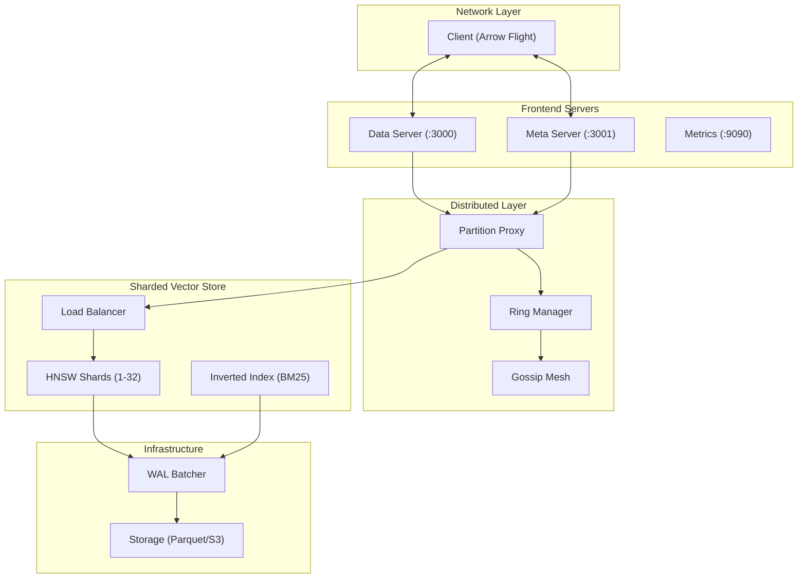

# Components

This document describes the major components and architectural features of
Longbow.

## 1. Flight Servers

Longbow implements the Apache Arrow Flight protocol via two gRPC servers:

### Data Server (Port 3000)

Handles high-throughput data operations:

- **DoGet**: Stream vector data to clients
- **DoPut**: Receive and store vector data
  - **Backpressure**: Returns `{"status": "slow_down"}` metadata if WAL queue > 80% full.
- **DoExchange**: Bidirectional streaming for mesh replication protocols (sync/fetch).

### Meta Server (Port 3001)

Handles metadata and control plane operations:

- **ListFlights**: List available collections
- **GetFlightInfo**: Collection metadata
- **DoAction**: Management commands (extensible)

> Port separation prevents heavy data transfers from blocking metadata lookups.

## 2. In-Memory Vector Store

### Arena Allocation (SlabAllocator)

Vectors are stored in off-heap "slabs" (1MB chunks) using `memory.SlabAllocator`:

- **Zero-GC Overhead**: Vectors are not scanned by Go's GC.
- **Slab Allocation**: Sequential allocation reduces fragmentation.
- **Reset Capability**: Instant reclamation of memory for index rebuilds.

### Zero-Copy Design

The HNSW graph stores only vector IDs, not data:

1. **ID Mapping**: `Location` struct maps VectorID → BatchIndex + RowIndex
2. **Direct Access**: Float32 slices accessed from Arena or Arrow buffers
3. **Memory Efficiency**: ~50% RAM reduction vs standard HNSW
4. **Product Quantization (PQ)**: Optional 64x compression for large-scale deployments.

### Leveled Compaction

Longbow implements an incremental "Leveled Compaction" strategy to maintain read performance during heavy ingestion:

- **Incremental Merge**: Merges fragmented small batches into larger, contiguous Arrow RecordBatches.
- **Index Preservation**: Unlike traditional systems, Longbow remaps HNSW locations in-place after compaction without requiring an index rebuild.
- **Tombstone Cleanup**: Merges bitset tombstones across compacted batches.

### Scratch Buffer Pool

Search operations use pooled scratch buffers via `sync.Pool`:

- Eliminates per-search allocations
- Reduces GC pressure during query spikes
- Pointer storage pattern for `sync.Pool` compliance

### Async Indexing Pipeline

1. **Immediate Write**: Data written to WAL and Arrow buffers
2. **Job Queue**: Indexing jobs pushed to buffered channel
3. **Worker Pool**: `runtime.NumCPU()` workers update HNSW graph

## 4. SIMD-Optimized Distance Functions

Vector distance calculations use CPU-specific SIMD instructions:

| Architecture | Instructions | Functions |
| :----------- | :----------- | :--------------------------------------- |
| AMD64        | AVX2         | euclideanAVX2, cosineAVX2, dotProductAVX2 |
| AMD64        | AVX-512      | euclideanAVX512, cosineAVX512, dotAVX512 |
| ARM64        | NEON         | euclideanNEON, cosineNEON, dotProductNEON |

Runtime detection via `CPUFeatures` struct selects optimal implementation.

## 5. Write-Ahead Log (WAL)

### Data Integrity

Every WAL entry is protected by a **CRC32 (IEEE)** checksum:

- **Format**: `[CRC32: 4b][NameLen: 4b][RecLen: 8b][Name][Record]`
- **Verification**: Replay fails immediately on checksum mismatch, preventing data corruption.

### Batched Writes

WAL entries are batched for improved throughput:

- Configurable batch size and flush interval
- Double-buffer swap eliminates allocation churn
- Background flush goroutine

### Double-Buffer Strategy

```go
// On flush: swap buffers instead of reallocating
batch := w.batch
w.batch = w.backBatch[:0] // Reuse capacity
w.backBatch = batch
```

### Auto-Snapshot on Size Limit

When WAL exceeds `MAX_WAL_SIZE` (default 100MB):

1. Snapshot triggered automatically
2. WAL truncated after successful snapshot
3. Prevents unbounded disk growth

## 6. Persistence Backends

### Local Disk (Default)

Parquet snapshots written to local filesystem.

### S3-Compatible Storage

Production-ready backend supporting:

- Amazon S3
- MinIO
- Cloudflare R2
- DigitalOcean Spaces

See [Persistence Documentation](persistence.md) for configuration details.

## 7. Hybrid Search

### Search Components

- **Dense Search**: HNSW index for vector similarity
- **Sparse Search**: Inverted index with TF-IDF scoring
- **Reciprocal Rank Fusion (RRF)**: Combines results without normalization

### RRF Algorithm

```text
RRF_score(doc) = Σ 1/(k + rank(doc))
```

See [Vector Search Documentation](vectorsearch.md) for details.

## 8. Memory Pooling

### PooledAllocator

Size-bucketed memory pools reduce GC pressure:

- Bucket sizes: 64B to 32MB (powers of 2)
- Per-bucket `sync.Pool` instances
- Used for Arrow buffer allocation

## 9. Graceful Shutdown

On SIGTERM/SIGINT:

1. Stop accepting new connections
2. Drain in-flight requests
3. Flush WAL to disk
4. Create final snapshot
5. Truncate WAL
6. Exit cleanly

## 10. Metrics Server

Prometheus metrics exposed on port 9090:

- Flight operation counters and histograms
- Vector store gauges
- WAL write metrics
- Snapshot duration histograms

See [Metrics Documentation](metrics.md) for full list.

## 11. Distributed Components

### Ring Manager

- **Role**: Maintains the Consistent Hashing Ring state.
- **Integration**: Subscribes to gossip events to automatically add/remove nodes from the ring.

### Partition Proxy

- **Role**: gRPC Interceptor that routes requests.
- **Logic**: Hashes request keys (`x-longbow-key`) to find owner node.
- **Action**: Forwards request if owner is remote; processes locally if owner is self.

### Request Forwarder

- **Role**: Manages connection pool to peer nodes.
- **Smart Client**: Returns `FORWARD_REQUIRED` errors with target hints to allow clients to re-route.

## Architecture Diagram


