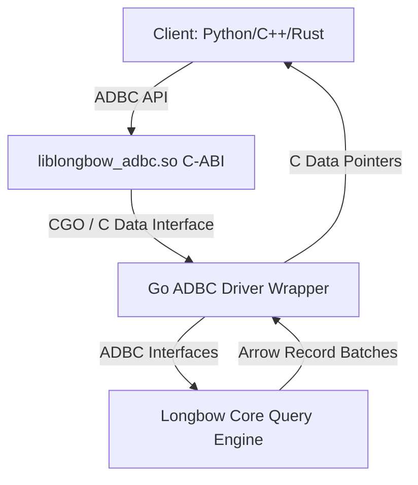

# Longbow Roadmap: ADBC & Google TPU Integration

This roadmap details the architectural design, implementation subtasks, and testing strategies for two major upcoming features in Longbow: **ADBC Driver Support** and **Google TPU Acceleration**.

---

## 1. ADBC (Arrow Database Connectivity) Driver Support

### Objective
Provide a highly performant, language-agnostic, and zero-copy interface for querying Longbow using the standard ADBC API. This will allow Python (Pandas/Polars), C++, and Rust applications to query Longbow directly with zero serialization overhead.

### Architectural Design

### Implementation Subtasks

### Implementation Subtasks

All ADBC implementation phases (Go ADBC Interface Implementation & C-API Export) have been successfully completed and verified.

### Testing Strategy

#### Unit Tests
- **Statement Execution**: Validate that standard SQL SELECT, vector searches, and metadata queries return correct schemas and rows.
- **Parametric Binding**: Test binding multiple float32/float64 vectors to statements and retrieving nearest neighbors.

#### Fuzz & Integration Tests
- **Dialect Fuzzing**: Send mutated/invalid SQL strings to the parser to ensure it gracefully returns `adbc.StatusInvalidArgument` instead of panicking.
- **Cross-Language Verification**: Write a Python script using `adbc_driver_manager` to load `liblongbow_adbc.so`, ingest vectors, execute query statements, and verify correctness.

---

## 2. Google TPU Support with SIMD Optimizations & Custom Kernels

### Objective
Leverage Google TPUs (Tensor Processing Units) for extremely high-throughput, low-latency batch vector similarity searches (L2, Cosine, Inner Product). This includes compiling custom XLA/HLO kernels and utilizing TPU Matrix Multiply Units (MXUs).

### Architectural Design

### Implementation Subtasks

#### Phase 1: TPU Runtime Integration via PJRT
- [ ] **Task 1.1: PJRT C-API Bindings**
  - Implement a Go-to-C wrapper for the **PJRT** (Pluggable Device) API, which is the standard compiler/runtime interface for Google TPUs.
  - Dynamically load Google's `libtpu.so` at runtime.
- [ ] **Task 1.2: Memory Management & Zero-Copy Transmit**
  - Implement pinned-host memory buffers to stream batch vectors directly from Go memory space to TPU Device Memory.
  - Create a ring-buffer strategy for overlapping TPU computation with next-batch Host-to-Device transfer.

#### Phase 2: Custom TPU Kernels & SIMD
- [ ] **Task 2.1: XLA HLO Compilation**
  - Write high-throughput similarity search kernels (Euclidean, Inner Product, Cosine) using JAX/XLA, and export them as compiled HLO (High-Level Optimizer) payloads.
  - Load these HLO payloads dynamically in the Go driver using PJRT executable execution.
- [ ] **Task 2.2: MXU/VPU Optimizations**
  - Structure the kernels to utilize the Matrix Multiply Unit (MXU) for large matrix-vector multiplications (representing batch query searches against index centroids).
  - Use the Vector Processing Unit (VPU) for SIMD element-wise operations (quantization steps, bias addition, activations).

#### Phase 3: CPU Fallback & Hybrid Execution
- [ ] **Task 3.1: CPU/TPU Auto-Switching**
  - Build a fallback path using local AVX-512/AMX SIMD instructions if TPU hardware is unavailable or if the batch size is too small to justify host-to-device overhead.

### Testing Strategy

#### Unit Tests
- **Fallback Verification**: Verify that the PJRT subsystem falls back to CPU execution when `libtpu.so` is absent or fails to initialize.
- **Kernel Accuracy**: Compare similarity search outputs (indices and distances) from the TPU engine with a double-precision CPU baseline.

#### Fuzz & Performance Tests
- **Dimension Fuzzing**: Run search iterations with randomized vector dimensions, batch sizes, and data distributions to catch edge cases in XLA pad/slice bounds.
- **Device-to-Host Stress Tests**: Continuously pipe millions of vectors to check for device memory leaks, synchronization deadlocks, or out-of-memory crashes on the TPU.

---

## 3. Experimental Branch: `emlgo` Fast Math Integration

### Objective
Create an experimental feature branch to integrate the `emlgo` math library (https://github.com/23skdu/emlgo) to replace standard math routines. The goal is to perform A/B testing against the `main` branch to evaluate potential performance gains and accuracy impacts during HNSW graph construction and query execution.

### Architectural Design
- **Dependency Isolation**: Introduce `emlgo` selectively in distance computation hotspots (e.g., Euclidean distance, Cosine similarity, Inner Product).
- **A/B Testing Framework**: Use build tags or feature flags to allow identical binaries to run with either standard `math` or `emlgo` routines for direct comparison.

### Implementation Subtasks

#### Phase 1: Dependency & Stub Integration
- [ ] **Task 1.1: Branch Creation & Dependency Addition**
  - Create the experimental branch `feature/emlgo-math`.
  - Add `github.com/23skdu/emlgo` to `go.mod`.
- [ ] **Task 1.2: Math Wrapper Interface**
  - Refactor direct `math.*` calls in `internal/store/index` (HNSW) and `internal/query` to use a new `mathutil` wrapper package.
  - Implement two versions of the wrapper: one using standard `math` and one using `emlgo`.

#### Phase 2: HNSW Integration & Profiling
- [ ] **Task 2.1: Distance Calculation Overrides**
  - Replace float32/float64 exponentiation, logarithms, and square roots in `ArrowHNSW` distance calculators with `emlgo` equivalents.
- [ ] **Task 2.2: Micro-Benchmarking**
  - Write specific `BenchmarkHNSWConstructionEmlgo` vs `BenchmarkHNSWConstructionStandard` test functions to measure nano-second level function overhead.

#### Phase 3: A/B Testing & Evaluation
- [ ] **Task 3.1: Construct A/B Test Harness**
  - Develop a script to ingest a standard dataset (e.g., SIFT1M) twice, once using `emlgo` and once using `math`.
  - Record and export index construction time and peak memory metrics.
- [ ] **Task 3.2: Recall & Accuracy Validation**
  - Run standard recall test suite (e.g., `RecallValidationTest`) on the `emlgo` generated index to ensure fast-math approximations do not significantly degrade the top-K graph accuracy.
