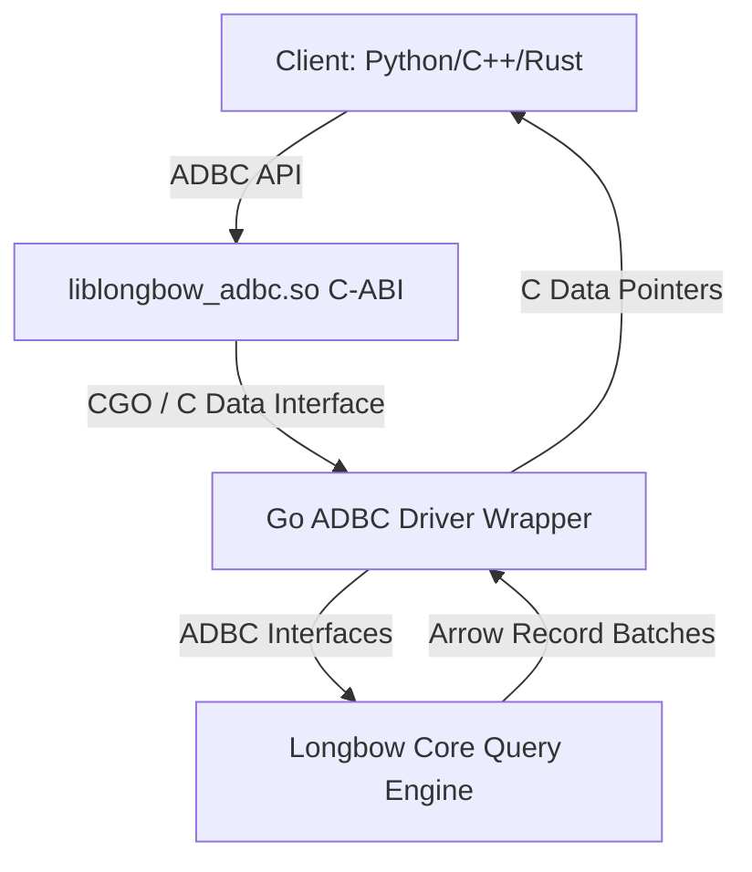
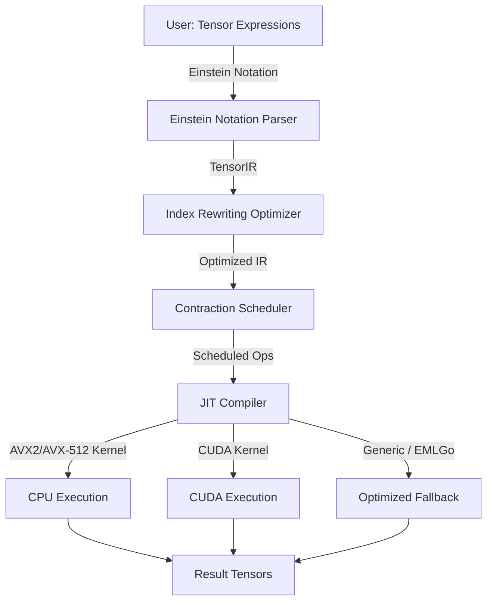
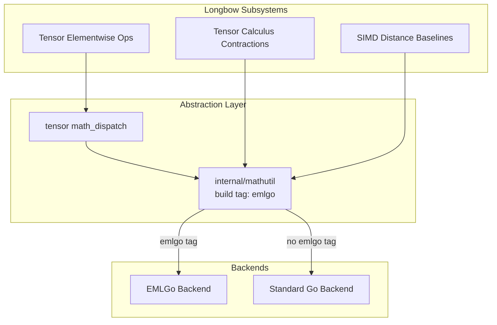

# Longbow Roadmap & Optimization Plan

This document consolidates the strategic roadmap (ADBC, Tensor Engine, EMLGo) with the ongoing performance optimization plan derived from benchmark analysis.

---

## 1. ADBC (Arrow Database Connectivity) Driver Support

**Status**: Completed

Provide a language-agnostic, zero-copy interface for querying Longbow using the standard ADBC API, enabling Python (Pandas/Polars), C++, and Rust applications.

---

## 2. Native Tensor Engine

**Status**: Completed

General-purpose tensor calculus engine for Einstein-notation contractions, index rewriting, and JIT-compiled kernels.

---

## 3. EMLGo High-Performance Math Engine

**Status**: Completed

Integrates the `emlgo` mathematical library for SIMD-accelerated batch operations and hardware-backed fast scalar kernels.

---

## 4. GPU TurboQuant Optimization

**Status**: In Progress (Parts 1-5, 7 completed; Part 3 verified)

Optimizing GPU TQ search from O(N) brute-force toward O(ef·logN) HNSW graph traversal.

| Part | Goal | Status | Impact |
|------|------|--------|--------|
| 1 | Batched TQ kernel (single launch) | Done | Eliminates per-page loop |
| 2 | `__constant__` LUT tables | Done | Replaces sincosf with table lookups |
| 3 | HNSW greedy descent kernel | Done | O(N) → O(ef·logN) traversal |
| 4 | Explicit CUDA streams | Done | Async kernel/memcpy overlap |
| 5 | 32-byte warp-aligned PackedSize | Done | Coalesced memory access |
| 6 | CPU temporal emlgo investigation | Documented | No single code fix |
| 7 | CPU float64 emlgo exclusion | Done | `LONGBOW_FLOAT64_EXCLUDE_EMLGO` env var |
| 8 | GPU complex128 dense profiling | Documented | Needs dedicated CUDA kernels |

### Benchmark Results

| Config | Before | After | Change |
|--------|--------|-------|--------|
| GPU TQ 100k dense (emlgo) | 1363 QPS | 3494 QPS | **+156%** |

---

## 5. Performance Optimization Pipeline

Derived from 2026-09-11 A/B benchmark analysis. See [performance.md](performance.md) for raw data.

### Resolved Issues

| Issue | Fix | Date |
|-------|-----|------|
| GPU TQ 100k dense (emlgo) -57% | QJL correction asymmetry bug | 2026-09-12 |
| CPU TQ dense 500k -55% | PackedSize caching | 2026-09-11 |
| CPU float32 dense 50k -63% | Dispatch overhead fix | 2026-09-11 |
| Duplicate Dockerfile | Removed | 2026-09-12 |
| Dockerfile.metal missing ENTRYPOINT | Fixed | 2026-09-12 |
| docker-compose deprecated version key | Removed | 2026-09-12 |

### Open Issues

| Priority | Issue | Impact |
|----------|-------|--------|
| P0 | CPU complex64 dense 500k | -38% regression |
| P0 | CPU complex128 dense 500k | P99 75ms tail latency |
| P0 | GPU uint8 graphrag 500k | +290% — validate with 3x runs |
| P1 | CPU emlgo temporal mode | -18-36% across all dtypes |
| P1 | GPU complex128 dense 100k | -50% regression |
| P1 | CPU float64 emlgo memory | +47% memory usage |

---

## 6. Future Work

### Benchmark Infrastructure (Part 9)

- 3x benchmark runs with mean/stdev reporting
- Memory soak test (1+ hour at 500k)
- CI integration with regression threshold alerts

### Conditional Dispatch Strategy (Part 10)

- Route emlgo selectively by type and scale
- `LONGBOW_MATH_DISPATCH` env var for manual override
- Emperical rules: emlgo for complex types + TQ above 50k; standard for int/float below 50k
