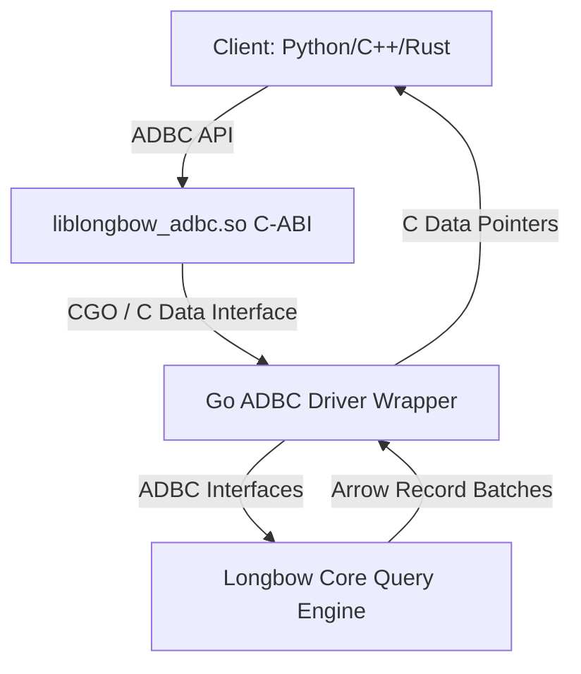
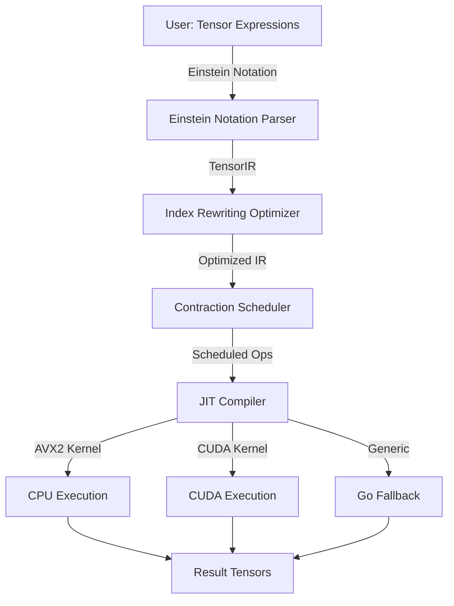

# Longbow Roadmap: ADBC & Tensor Engine Support

This roadmap details the architectural design, implementation subtasks, and testing strategies for two major upcoming features in Longbow: **ADBC Driver Support** and **Native Tensor Engine**.

---

## 1. ADBC (Arrow Database Connectivity) Driver Support

### Objective
Provide a highly performant, language-agnostic, and zero-copy interface for querying Longbow using the standard ADBC API. This will allow Python (Pandas/Polars), C++, and Rust applications to query Longbow directly with zero serialization overhead.

### Architectural Design

### Implementation Subtasks

### Implementation Subtasks

All ADBC implementation phases (Go ADBC Interface Implementation & C-API Export) have been successfully completed and verified.

### Testing Strategy

#### Unit Tests
- **Statement Execution**: Validate that standard SQL SELECT, vector searches, and metadata queries return correct schemas and rows.
- **Parametric Binding**: Test binding multiple float32/float64 vectors to statements and retrieving nearest neighbors.

#### Fuzz & Integration Tests
- **Dialect Fuzzing**: Send mutated/invalid SQL strings to the parser to ensure it gracefully returns `adbc.StatusInvalidArgument` instead of panicking.
- **Cross-Language Verification**: Write a Python script using `adbc_driver_manager` to load `liblongbow_adbc.so`, ingest vectors, execute query statements, and verify correctness.

---

## 2. Native Tensor Engine

### Objective
Extend Longbow from a vector engine into a general-purpose tensor calculus engine capable of performing operations used in theoretical physics and scientific computing. This includes Einstein-notation tensor contractions, matrix multiplication, index rewriting, and JIT-compiled kernels for CPU (AVX2) and GPU (CUDA).

### Architectural Design

### Implementation Subtasks

#### Phase 1: Tensor IR & Einstein Notation

- [ ] **Task 1.1: Core Tensor Type**
  - Define a `Tensor` type in Go with support for arbitrary ranks and strides, backing storage (contiguous Arrow buffers), and metadata (labels, dimension names).
  - Support all numeric dtypes already in Longbow: float32, float64, int8–int64, uint8–uint64, float16, complex64, complex128.

- [ ] **Task 1.2: Einstein Notation Parser**
  - Implement a parser for Einstein summation notation (e.g. `"ij,jk->ik"`, `"ab,cb->ac"`) that maps index names to tensor dimensions.
  - Support broadcasting rules, contraction, and diagonal operations.

- [ ] **Task 1.3: Tensor IR**
  - Build an IR that represents sequences of tensor operations as a DAG of nodes: `Contract`, `Transpose`, `Reshape`, `Elementwise`, `Reduce`.
  - Each node carries its index mapping, dtype, and shape constraints for downstream optimization.

#### Phase 2: Index Rewriting Optimizer

- [ ] **Task 2.1: Contraction Ordering**
  - Implement an optimizer that finds optimal pairwise contraction order using dynamic programming or greedy heuristics (analogous to `opt_einsum` in Python).
  - Model intermediate tensor sizes and choose the sequence minimizing FLOPs or peak memory.

- [ ] **Task 2.2: Shared-Subexpression Elimination**
  - Walk the DAG and detect common sub-tensors (identical subgraphs), memoize their results, and reuse them across the expression.
  - Handle cases where the same contraction appears with different index permutations.

- [ ] **Task 2.3: Algebraic Simplification**
  - Rewrite rules: transpose-of-transpose elimination, identity contraction removal, zero-tensor propagation, and constant folding.
  - Detect and lower diagonal operations (`ii->i`) and trace computations.

#### Phase 3: JIT-Compiled Kernels

- [ ] **Task 3.1: Generic Go Fallback**
  - Naive nested-loop implementations for every IR node type to serve as correctness baseline and fallback when no JIT is available.

- [ ] **Task 3.2: AVX2 Tensor Kernels**
  - Implement JIT-compiled AVX2 kernels for:
    - Matrix multiply (GEMM) via inline AVX2 FMA.
    - Element-wise operations (add, mul, exp, sin, cos, tan, log, sqrt, pow) using AVX2 math intrinsics.
    - Reduction operations (sum, max, min) along arbitrary axes.
    - Transposition and permutation on small-to-medium tensors.
  - Use the existing `internal/simd` package infrastructure for dispatch.

- [ ] **Task 3.3: CUDA Tensor Kernels**
  - Implement CUDA kernels for all operations above using cuBLAS for GEMM and custom CUDA C kernels for element-wise, reduction, and transposition.
  - Integrate with Longbow's existing CUDA path (`internal/gpu/cuda`).

- [ ] **Task 3.4: Custom Math Intrinsics for Trig & Tensor Calculus**
  - Implement low-level AVX2/CUDA intrinsics for:
    - Trigonometric: sin, cos, tan, arcsin, arccos, arctan, sinh, cosh, tanh.
    - Tensor calculus: contractions, covariant/contravariant index raising/lowering, Levi-Civita symbol applications, wedge products, and Christoffel symbol computations.
    - Exponential and logarithmic families: exp, log, log2, log10, erf, erfc, gamma, lgamma.

#### Phase 4: Hybrid Execution & Memory Management

- [ ] **Task 4.1: Auto-Scheduling**
  - Build a cost model that selects CPU or GPU execution per subgraph based on tensor size, available hardware, and transfer costs.
  - Support split execution (e.g., large contraction on GPU, small element-wise on CPU).

- [ ] **Task 4.2: Zero-Copy Tensor Slices**
  - Leverage Longbow's Arrow memory model for zero-copy tensor views: slicing, dicing, and broadcasting without data movement.
  - Integrate with Longbow's existing memory arena infrastructure for allocation.

### Testing Strategy

#### Unit Tests
- **Tensor Arithmetic**: Validate element-wise add, mul, sub, div against numpy reference across all supported dtypes.
- **Contraction Correctness**: Compare `einsum("ij,jk->ik", A, B)` against numpy for random float32/float64 matrices up to 1024×1024.
- **Optimizer Verification**: Verify that the contraction rewriter produces expressions numerically identical to the naive order.

#### Fuzz & Performance Tests
- **Index Fuzzing**: Randomly generate valid Einstein strings and verify that all execution paths (Go, AVX2, CUDA) produce bit-identical results.
- **Microbenchmarks**: Benchmark GEMM, element-wise trig, and reduction throughput on AVX2 vs CUDA across a matrix of tensor sizes (16×16 to 4096×4096).
- **Expression-Level Benchmarks**: Benchmark full physics-style expressions (e.g. Riemann curvature tensor from Christoffel symbols) against reference implementations.

---

## 3. Experimental Branch: `emlgo` Fast Math Integration

### Objective
Create an experimental feature branch to integrate the `emlgo` math library (https://github.com/23skdu/emlgo) to replace standard math routines. The goal is to perform A/B testing against the `main` branch to evaluate potential performance gains and accuracy impacts during HNSW graph construction and query execution.

### Architectural Design
- **Dependency Isolation**: Introduce `emlgo` selectively in distance computation hotspots (e.g., Euclidean distance, Cosine similarity, Inner Product).
- **A/B Testing Framework**: Use build tags or feature flags to allow identical binaries to run with either standard `math` or `emlgo` routines for direct comparison.

### Implementation Subtasks

#### Phase 1: Dependency & Stub Integration
- [ ] **Task 1.1: Branch Creation & Dependency Addition**
  - Create the experimental branch `feature/emlgo-math`.
  - Add `github.com/23skdu/emlgo` to `go.mod`.
- [ ] **Task 1.2: Math Wrapper Interface**
  - Refactor direct `math.*` calls in `internal/store/index` (HNSW) and `internal/query` to use a new `mathutil` wrapper package.
  - Implement two versions of the wrapper: one using standard `math` and one using `emlgo`.

#### Phase 2: HNSW Integration & Profiling
- [ ] **Task 2.1: Distance Calculation Overrides**
  - Replace float32/float64 exponentiation, logarithms, and square roots in `ArrowHNSW` distance calculators with `emlgo` equivalents.
- [ ] **Task 2.2: Micro-Benchmarking**
  - Write specific `BenchmarkHNSWConstructionEmlgo` vs `BenchmarkHNSWConstructionStandard` test functions to measure nano-second level function overhead.

#### Phase 3: A/B Testing & Evaluation
- [ ] **Task 3.1: Construct A/B Test Harness**
  - Develop a script to ingest a standard dataset (e.g., SIFT1M) twice, once using `emlgo` and once using `math`.
  - Record and export index construction time and peak memory metrics.
- [ ] **Task 3.2: Recall & Accuracy Validation**
  - Run standard recall test suite (e.g., `RecallValidationTest`) on the `emlgo` generated index to ensure fast-math approximations do not significantly degrade the top-K graph accuracy.
