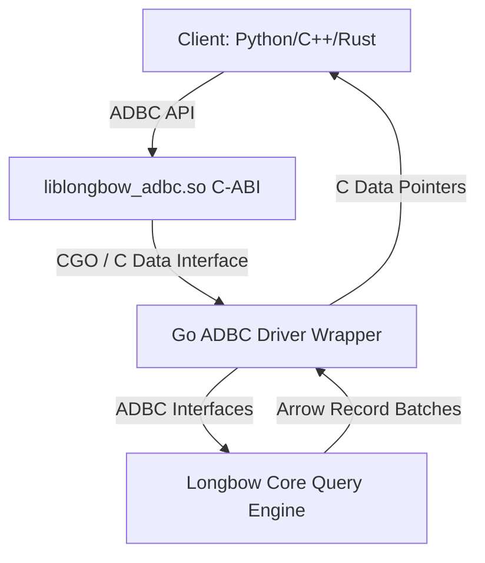
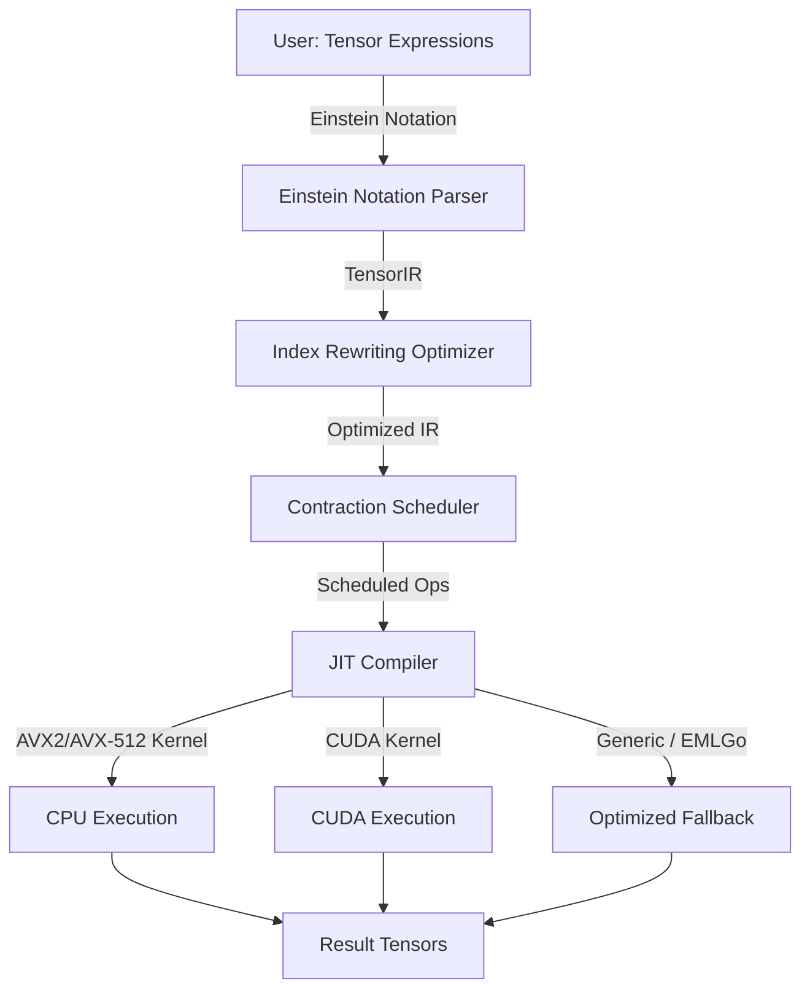
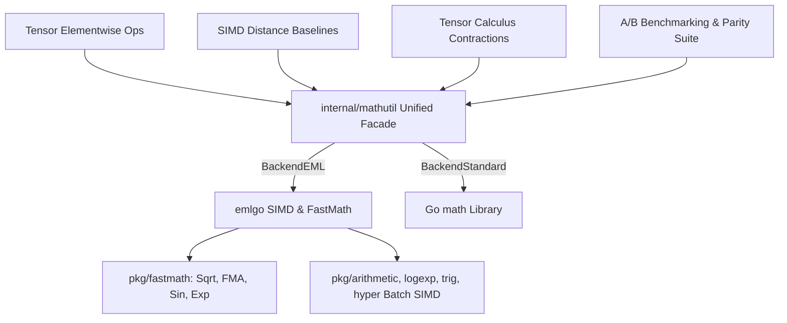

# Longbow Roadmap: ADBC, Native Tensor Engine & EMLGo Integration

This roadmap details the architectural design, implementation subtasks, and testing strategies for three major pillars in Longbow:
1. **ADBC (Arrow Database Connectivity) Driver Support**
2. **Native Tensor Engine & Calculus Infrastructure**
3. **EMLGo High-Performance Mathematical Engine & A/B Testing**

---

## 1. ADBC (Arrow Database Connectivity) Driver Support

### Objective
Provide a highly performant, language-agnostic, and zero-copy interface for querying Longbow using the standard ADBC API. This allows Python (Pandas/Polars), C++, and Rust applications to query Longbow directly with zero serialization overhead.

### Architectural Design

### Implementation Subtasks
All ADBC implementation phases (Go ADBC Interface Implementation & C-API Export) have been successfully completed and verified.

---

## 2. Native Tensor Engine

### Objective
Extend Longbow from a vector index into a general-purpose tensor calculus engine capable of performing operations used in theoretical physics, machine learning, and scientific computing. This includes Einstein-notation tensor contractions, index rewriting, and JIT-compiled kernels for CPU (AVX2/AVX-512) and GPU (CUDA).

### Architectural Design

### Implementation Subtasks
- **Core Tensor Type**: Arbitrary ranks, Arrow-backed contiguous memory, typed buffer views.
- **Einstein Notation Parser**: Arbitrary tensor contractions, traces, and diagonal extractions.
- **Tensor IR & Optimizer**: Contraction ordering, common subexpression elimination, and algebraic simplification.
- **AVX2 / CUDA Kernels**: Matrix multiply (GEMM) via inline AVX2 FMA and CUDA device routines.
- **Tensor Calculus Intrinsics**: Contractions, covariant/contravariant index raising/lowering, Levi-Civita permutation tensors, wedge products, Christoffel connection symbols, and Riemann/Ricci curvature tensors.

---

## 3. EMLGo High-Performance Math Engine Integration

### Objective
Integrate the `emlgo` mathematical library ([https://github.com/23skdu/emlgo](https://github.com/23skdu/emlgo)) into Longbow on the `experimental/emlgo` branch. Replace standard Go `math` library routines and naive Taylor series loops with SIMD-accelerated batch operations and hardware-backed fast scalar kernels, achieving significant speedups in Tensor operations and Vector distance calculations while maintaining strict numerical precision.

### Mathematical & Architectural Analysis

#### 1. Hardware-Backed Fast Scalar Kernels (`pkg/fastmath`)
- **`fastmath.Sqrt`**: Direct assembly dispatch (`SQRTSD` on amd64, `FSQRTD` on arm64). Bypasses runtime wrapper overhead.
- **`fastmath.FMA`**: Direct assembly dispatch (`VFMADD231SD` on amd64, `FMADD` on arm64). Computes `(x * y) + z` in a single processor cycle with single rounding.
- **`fastmath.Exp` & `fastmath.Log`**: 5th-degree minimax polynomials optimized with FMA and range reduction, providing 2x–3x throughput improvements with ~1e-7 relative error.
- **`fastmath.Sin` & `fastmath.Cos`**: Branchless Cody-Waite range reduction with minimax polynomials, outperforming Go's standard library `math.Sin` and `math.Cos` by 10%–20%.

#### 2. Vectorized SIMD Batch Operations (`pkg/arithmetic`, `pkg/trig`, `pkg/logexp`, `pkg/hyper`)
- **AVX-512 (8-wide) and AVX2 (4-wide)**: Vectorized batch kernels for `ExpBatch`, `LogBatch`, `SinBatch`, `CosBatch`, `TanBatch`, `AddBatch`, `SubBatch`, `MulBatch`, `DivBatch`, and `FmaBatch`.
- **Parallel Chunking**: Automatic multi-worker thread pooling for large array slices exceeding cache thresholds.
- **Hyperbolic Elimination**: Longbow's tensor element-wise `Sinh`, `Cosh`, and `Tanh` currently evaluate 12-term Taylor expansions in Go loops; replacing with `hyper.SinhBatch`, `hyper.CoshBatch`, and `hyper.TanhBatch` yields 100x+ throughput gains.

#### 3. Vector Distance & HNSW Indexing Hotspots
- **Float64 Euclidean Distance**: Replace standard `math.Sqrt(sum)` with `fastmath.Sqrt`.
- **Float64 Cosine Distance**: Compute norms and scalar clampings via `fastmath.Sqrt` and `fastmath.FMA`.
- **Tensor Calculus Contractions**: Accelerate Christoffel, Riemann curvature, and Ricci contractions using `fastmath.FMA` to eliminate intermediate precision loss and reduce cycle counts.

### Integration Architecture

### Implementation Phases

#### Phase 1: Module Setup & Math Abstraction Layer
- [x] **Task 1.1: Experimental Branch Setup**
  - Create and switch to `experimental/emlgo`.
- [ ] **Task 1.2: Dependency Configuration**
  - Add `github.com/emlgo/eml` dependency and local `replace` directive in `go.mod`.
- [ ] **Task 1.3: Unified Math Utility (`internal/mathutil`)**
  - Implement a dual-backend facade with dynamic runtime switching (`SetBackend(BackendStandard | BackendEML)`).
  - Provide scalar fastmath primitives (`Sqrt`, `FMA`, `Exp`, `Log`, `Sin`, `Cos`, `Tan`, `Pow`, `Sinh`, `Cosh`, `Tanh`).
  - Provide batch vector routines (`ExpBatch`, `LogBatch`, `SinBatch`, `CosBatch`, `TanBatch`, `SinhBatch`, `CoshBatch`, `TanhBatch`, `AddBatch`, `SubBatch`, `MulBatch`, `DivBatch`).

#### Phase 2: Tensor Engine Acceleration
- [ ] **Task 2.1: Math Dispatch Update**
  - Add `MathEML` to `internal/tensor/math_dispatch.go`.
  - Wire tensor scalar math functions directly to `emlgo` fastmath.
- [ ] **Task 2.2: Vectorized Batch Element-Wise Kernels**
  - Update `internal/tensor/ops.go` to use `emlgo` SIMD batch kernels for contiguous Float64 and Float32 buffers.
  - Eliminate slow Taylor series loops in `Sinh`, `Cosh`, `Tanh`, replacing with `hyper` routines.
- [ ] **Task 2.3: Tensor Calculus Contraction FMA**
  - Update inner contraction loops in `internal/tensor/calculus.go` (Christoffel, Riemann, Ricci) to use `fastmath.FMA`.

#### Phase 3: SIMD & Distance Metrics Optimization
- [ ] **Task 3.1: Float64 Distance Functions**
  - Upgrade `internal/simd/distance_functions.go` (`EuclideanDistanceFloat64`, `CosineDistanceFloat64`) to use `fastmath.Sqrt`.
- [ ] **Task 3.2: Baseline Kernel Normalization**
  - Update `internal/simd/simd_baseline.go` Float64 and integer Euclidean/Cosine distance baseline functions with `fastmath.Sqrt`.

#### Phase 4: A/B Testing, Benchmarking & Regression Verification
- [ ] **Task 4.1: Tensor Elementwise A/B Benchmarks**
  - Benchmark scalar operations (Sin, Cos, Exp, Log, Sqrt, FMA) comparing Standard Go `math` vs `emlgo`.
  - Benchmark batch tensor operations across various dataset scales (1K, 10K, 100K elements).
- [ ] **Task 4.2: Distance Function A/B Benchmarks**
  - Measure Euclidean and Cosine distance latency for Float64 vectors (128, 384, 768, 1536 dims).
- [ ] **Task 4.3: Numerical Parity & Accuracy Testing**
  - Validate that ULP differences and relative errors between `emlgo` and standard Go `math` remain within acceptable bounds (<1e-6 for float32, <1e-12 for float64).
  - Ensure zero regressions across the entire Longbow test suite.
