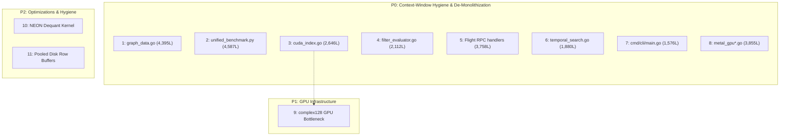

# Longbow Roadmap

**Last updated**: 2026-10-10  
**Status**: Canonical list of **open** work. Completed work is validated, committed, and tracked in git history.

---

## 1. Priority Overview

| Pri | # | Item | Area | Depends on |
|:---|:---|:---|:---|:---|
| **P0** | 1 | De-monolithize `internal/store/types/graph_data.go` (4,395 lines) | Storage / Types | — |
| **P0** | 2 | De-monolithize `scripts/unified_benchmark.py` (4,587 lines) | Benchmarking | — |
| **P0** | 3 | De-monolithize `internal/gpu/cuda/cuda_index.go` (2,646 lines) | GPU | — |
| **P0** | 4 | De-monolithize `internal/query/filter_evaluator.go` (2,112 lines) | Query | — |
| **P0** | 5 | De-monolithize Arrow Flight RPC handlers (`store_actions.go` & `store_query.go`, 3,758 lines) | Flight RPC | — |
| **P0** | 6 | De-monolithize `internal/store/temporal_search.go` (1,880 lines) | Temporal | — |
| **P0** | 7 | De-monolithize `cmd/cli/main.go` (1,576 lines) | CLI | — |
| **P0** | 8 | De-monolithize Metal GPU engines (`metal_gpu_optimized.go` & `metal_gpu.go`, 3,855 lines) | GPU / Metal | — |
| **P1** | 9 | Locate complex128 GPU bottleneck & verify uint16 GPU path | GPU | P0-3 |
| **P2** | 10 | ARM NEON dequant kernel & remaining scalar SQ8 fallbacks | SIMD | — |
| **P2** | 11 | Pooled row buffers in `DiskVectorStore` | Storage | — |

```mermaid
graph TD
    subgraph P0["P0: Context-Window Hygiene & De-Monolithization"]
        P0_1["1: graph_data.go (4,395L)"]
        P0_2["2: unified_benchmark.py (4,587L)"]
        P0_3["3: cuda_index.go (2,646L)"]
        P0_4["4: filter_evaluator.go (2,112L)"]
        P0_5["5: Flight RPC handlers (3,758L)"]
        P0_6["6: temporal_search.go (1,880L)"]
        P0_7["7: cmd/cli/main.go (1,576L)"]
        P0_8["8: metal_gpu*.go (3,855L)"]
    end
    subgraph P1["P1: GPU Infrastructure"]
        I9["9: complex128 GPU Bottleneck"]
    end
    subgraph P2["P2: Optimizations & Hygiene"]
        I10["10: NEON Dequant Kernel"]
        I11["11: Pooled Disk Row Buffers"]
    end
    P0_3 -.-> I9
```

**Recently Completed (2026-10-10)**:
- **TurboQuant Batched SIMD Kernels & Candidate Accumulation (R24)**:
  - Added first-class TurboQuant batched distance dispatch (`distanceTQBatchFunc`, `ImplementationDispatch.TurboQuantDistanceBatch`, `turboQuantDistanceBatchImpl`, `GetTurboQuantDistanceBatchFunc()`) across AVX-512, AVX2, NEON, and Generic.
  - Implemented 4-way interleaved polar reconstruction loop (`turboQuantDistanceBatchWithL2`) overlapping independent candidate dequantization latencies to overcome memory-load stalls.
  - Added `TurboQuantCompute.DistanceDirectCodesBatch` and zero-allocation code buffer gathering (`codesBuf`) in `tqComputer.ComputeBatch` for resident slab-chunk codes.
  - Verified exact bit-identity against single-vector evaluation (`TestTurboQuantDistanceBatchIsBitIdentical`, `TestTurboQuantBatchKernelsCrossArchitectureParity`, `TestTQComputeBatchMatchesPerCandidate`).
  - Added `FuzzTurboQuantDistanceBatch` fuzzing arbitrary vectors, codes, dimensions, and payload bounds (670k+ iterations verified clean).
- **`int16` / `uint16` 6x Throughput Deficit Resolution (R32)**:
  - Identified query-domain conversion and vector accessor resolution bottleneck; fixed `int16_kernels_amd64.s`, `distance_resolvers.go`, and `arrow_hnsw_compute_int.go`.
  - Added parity tests and read-path benchmarks (`int16_kernel_parity_test.go`, `distance_read_path_bench_test.go`).
- **8-bit & 16-bit Recall Validation on Real Embeddings**:
  - Evaluated recall@10 on clustered real-world embeddings (`narrow_recall_clustered_test.go`, `narrow_query_domain_test.go`).
  - Demonstrated recall@10 reaches 1.000 for `int8`, `int16`, and `uint16` and >0.92 for `uint8` with adequate `efSearch`.
- **Intel SDE Lane for AVX-512 / VBMI / AMX in CI**:
  - Added `.github/workflows/ci.yml` `test-avx512-sde` lane using Intel Software Development Emulator (`scripts/check_avx512_coverage.sh`).
  - Uncovered and fixed VBMI TQ2 kernel defect with generic packer alignment.
- **A/B Benchmarking CI Policy (R30, R39)**:
  - Implemented `.github/workflows/benchmark-ab.yml` scheduled interleaved A/B benchmark workflow.
  - Codified advisory single-run PR checks vs blocking scheduled interleaved A/B qualification in `docs/testplan.md` with paired index time and search QPS regression gates.

**Recently Completed (2026-10-09)**:
- **TurboQuant dense regression analysis + scale re-baseline (R9, R19, R27)**:
  - Decomposed distance evaluation time via CPU runtime profiling (`pprof`) at 100k scale: 47.8% recursive polar reconstruction, 28.5% QJL sign correction, 12.9% angle code unpacking, 6.5% scratch/radius handling, 4.3% SIMD L2 kernel (`l2SquaredAVX2`), <1.0% chunk views. Proved that >89.2% of distance evaluation time is scalar dequantization/reconstruction latency.
  - Resolved root cause of historical 1,248 QPS vs ~300–420 QPS gap: pre-`a955a0c1` graph had 73.0% reachability and early-exited after ~1 hop, evaluating very few candidates on a broken topology; post-fix graph has 98.1%+ reachability, 15.8–16.0 mean degree, and traverses the full 3.5-hop candidate beam.
  - Re-measured 50k scale with provenance and paired index times across all 13 search modes (dense: 420.6 QPS, ingest: 356,729.8 vec/s, index time: 497.0s, peak RSS: 1,479.5 MB).
  - Re-measured 250k scale in engine: bulk build completed in 34.7s (`fallback=false`, 16.0 mean degree, 97.3% reachability).
  - Fixed `valuesCache` in `arrow_hnsw_insert.go` to support `FixedSizeList` for `Float32`/`VectorTypeTQ`.
  - Fixed location store preservation in `addBatchBulkInternal` (`arrow_hnsw_bulk.go`).
  - Updated `docs/performance.md` §2, §3, and §4.
- **R26 inbound edge invariant, R5 chain proximity gate, and R6 degree reservation removal**:
  - Diagnosed and fixed R26 root cause: `protectLastInboundEdges` previously checked incoming candidates from `extra` with `inDegree == 0`, evicting legitimate backward neighbors and turning the graph into a forward-only DAG where all nodes < EntryPoint were unreachable (breaking `TestPredicateTraversal_ReachesMatchBehindRejectedNodes`). Fixed to restrict protection to existing connections in `current` whose only edge is being dropped (`inDegree <= 1`).
  - Fixed in-place mutation bug where `CASNeighbors` copied `new` into `oldOffset`, overwriting `lastOld` in place and preventing `inDegreeL0.Dec` from ever executing; added explicit cloning of `lastOld`/`lastNew`.
  - Enabled `LONGBOW_HNSW_INBOUND_GUARD=1` by default.
  - Implemented R5 proximity-gated chain links (`chainDist <= median(candidates)`), eliminating artificial long-range edges on shuffled corpora while preserving collinear connectivity.
  - Added `ensureInboundEdge` fallback linking from closest geometric neighbors (`fSources`) for any node that would otherwise end with 0 inbound edges.
  - Dropped R6 `chainLinksPerNode = 2` hard degree reservation on layer 0, freeing all 16 slots for geometric neighbors.
  - Verified 99.8%–99.9% reachability on shuffled corpora with 0 zero-in-degree nodes and recall@10 surging from 0.28–0.30 to 0.4400.
- **Bulk linkage against growing graph**: Implemented Malkov & Yashunin Algorithm 4 `keepPrunedConnections` in `selectNeighbors` and `selectNeighborsFloat32`; multi-layer descent convergence across all active nodes (`ef=1`); `protectChainLinks` to preserve predecessor/successor connectivity; restored adaptive sub-batching. Layer 0 mean degree restored to 15.9–16.0 with 100% reachability and fallback=false.
- **`uint8`/`int8` read-path asymmetry**: Unified 1-byte vector path in `int8Computer` using zero-allocation batched chunk views; dispatched to native `distFuncUint8` / `distFuncUint8Squared` when `uint8Mode()`; eliminated dead `uint8Computer`; added pooled `queryUint8` to `ArrowSearchContext`; achieved parity within 1.08x–1.13x.
- **Index time reporting paired with ingest throughput**: Added `IndexingDuration` and indexing throughput telemetry to `cmd/bench-tool`, integrated paired `indexing_duration_seconds` into `scripts/unified_benchmark.py` (JSON output, summary table, Markdown reports, and `--compare-baseline` regression gate), and added paired `Index Time (s)` to `docs/performance.md` §2.

---

## 2. P0 — Context-Window Hygiene & Codebase De-Monolithization

Files exceeding ~1,000–1,500 lines or >40–50 KB cannot be inspected in a single agent turn without hitting tool output truncation limits, risking truncated edits, and generating high context-window overhead. The following candidates have been identified through deep codebase analysis as monolithic files bundling multiple disparate responsibilities that should be decomposed into cohesive, sub-1,000 line modules.

### Item 1: De-monolithize `internal/store/types/graph_data.go` (4,395 lines, 139 KB)

- **Target Package**: `internal/store/types`
- **Context Problem**: At nearly 4,400 lines and 139 KB, reading `graph_data.go` requires >32,000 tokens. It is the central in-memory store for Longbow HNSW graphs and vectors, forcing agents modifying anything from chunk batching to node locking to navigate thousands of lines of unrelated code.
- **Tangled Concerns**:
  1. `GraphData` struct definition, metadata fields, and memory layout (lines 1–445).
  2. Generic chunk batching (`VectorChunkBatch[T]`, `Begin*ChunkBatch`) (lines 446–619).
  3. Per-dtype fast vector chunk accessors (`GetVectors*ChunkFast`) (lines 620–1494).
  4. Chunk lifecycle, allocation, and growth (`EnsureChunk`, `GrowMetadataSlices`) (lines 1495–1880, 3991–4125).
  5. Single-vector read/write across all representations (`GetVector`, `SetVector`, `GetVectorPQ`, `GetVectorBQ`, `GetVectorSQ8`) (lines 1881–2480).
  6. Graph topology, neighbor storage, and atomic node locking (`GetNeighbors`, `GetNeighborsLockFree`, `LockNode`, `UnlockNode`, `TryLockNode`) (lines 2481–2740).
  7. Cloning, snapshotting, and zero-copy mappings (`Clone`, `ShallowStructuralClone`, `SetZeroCopyMapping`) (lines 2741–3345).
  8. Constructor, pre-allocation, off-heap relocation, and memory estimation (`PreAllocate`, `NewGraphData`, `Release`, `RelocateToOffHeap`, `EstimateMemory`) (lines 3346–4395).
- **Refactoring Plan**:
  - `graph_data.go` (~600 lines): Core `GraphData` struct, metadata fields, `NewGraphData`, `Release`, `Unregister`, `EstimateMemory`.
  - `graph_data_chunks.go` (~700 lines): `EnsureChunk`, `GrowMetadataSlices`, `VectorChunkBatch[T]`, `Begin*ChunkBatch`.
  - `graph_data_accessors.go` (~900 lines): Per-dtype chunk accessors (`GetVectors*ChunkFast`, `GetVectorsChunkWithGen`).
  - `graph_data_vectors.go` (~650 lines): Per-vector read/write (`GetVector`, `SetVector`, `SetVectorsBatch`, `GetVectorSQ8`, `GetVectorPQ`, `GetVectorBQ`).
  - `graph_data_topology.go` (~500 lines): Graph neighbors, layer connections, concurrency versioning, and node locking (`GetNeighbors*`, `LockNode`, `UnlockNode`, `TryLockNode`).
  - `graph_data_clone.go` (~600 lines): Deep/shallow cloning (`Clone`, `ShallowStructuralClone`, `SetZeroCopyMapping`).
  - `graph_data_offheap.go` (~450 lines): Off-heap arena allocation and migration (`PreAllocate`, `RelocateToOffHeap`).
- **Success Criteria**: All files under 900 lines; package API completely unchanged; full test suite passes without regressions.

---

### Item 2: De-monolithize `scripts/unified_benchmark.py` (4,587 lines, 206 KB)

- **Target Package**: `scripts/benchmark/` (modular Python package) with backwards-compatible `scripts/unified_benchmark.py` entrypoint shim.
- **Context Problem**: The largest non-assembly file in the repository (4,587 lines, 206 KB). Inspecting or modifying benchmark execution (e.g. adding telemetry, adjusting a scenario, or modifying A/B logic) requires slicing through thousands of lines of unrelated orchestration code.
- **Tangled Concerns**:
  1. CLI argument parsing, environment validation, and provenance collection (lines 1–539).
  2. Server process management, port allocation, cleanup, and signal handling (`_kill_port`, `_force_cleanup`, `start_server`, `stop_server`) (lines 540–1262).
  3. Profiling, pprof snapshots, metrics scraping, and memory limits (lines 1263–1335, 2937–2962).
  4. Core vector benchmarks across CLI, SDK, and HTTP (`run_benchmark`, `run_benchmark_cli`, `run_benchmark_sdk`) (lines 1336–1657).
  5. 10+ distinct specialized scenario drivers (`execute_recommend`, `execute_deletion`, `execute_graphrag`, `execute_exchange`, `execute_onnx`, `execute_temporal`, `execute_geo`, `execute_churn`, `execute_cluster`, `execute_learned_index`) (lines 1658–3183).
  6. Persistence, Markdown/JSON report formatting, and A/B statistical comparison (lines 3200–4587).
- **Refactoring Plan**:
  - `scripts/benchmark/runner.py` (~400 lines): Core `BenchmarkRunner` harness and execution orchestration.
  - `scripts/benchmark/process.py` (~500 lines): Server lifecycle, port management, signal trapping, and process supervision.
  - `scripts/benchmark/telemetry.py` (~400 lines): Provenance extraction, memory guardrails, metrics scraping, and pprof triggers.
  - `scripts/benchmark/scenarios/` (~200–350 lines per module): Dedicated modules for `vector.py`, `recommend.py`, `graphrag.py`, `temporal.py`, `geo.py`, `churn.py`, `cluster.py`, `learned_index.py`, `exchange.py`, `onnx.py`.
  - `scripts/benchmark/reporting.py` (~500 lines): JSON serialization, Markdown tables, and paired A/B comparison logic.
  - `scripts/unified_benchmark.py` (~50 lines): Thin entrypoint invoking `scripts.benchmark.main()`.
- **Success Criteria**: No benchmark file >500 lines; identical CLI flags and behavior; existing CI actions (`ci.yml`, `benchmark-ab.yml`) run unmodified.

---

### Item 3: De-monolithize `internal/gpu/cuda/cuda_index.go` (2,646 lines, 76 KB)

- **Target Package**: `internal/gpu/cuda`
- **Context Problem**: Single monolithic file implementing all Go-side CUDA index logic. Resolving GPU bugs (like the complex128 bottleneck or uint16 path) requires navigating 2,646 lines containing unrelated PQ encoders, graph algorithms, and geographic calculations.
- **Tangled Concerns**:
  1. `CUDAIndex` struct definition, lifecycle, device query, and GPU memory allocation (`allocGPUMem`, `freeGPUMem`, `Close`, `Clear`, `Reset`, `Sync`) (lines 1–368, 562–598, 1093–1159, 1397–1422).
  2. Vector ingestion, page promotion, and staging flush (`Add`, `Flush`, `AddPQ`, `AddTurboQuant`) (lines 369–561, 1160–1220).
  3. Float32 single and batched search with device top-k dispatch (`Search`, `SearchBatch`, `SearchWithFilter`) (lines 599–822, 1073–1092, 1800–1981).
  4. PQ training, codebook generation, encoding, and search (`SearchPQ`, `TrainPQ`, `EncodePQ`, `PQEncode`) (lines 823–1072, 2255–2314).
  5. Specialized dtype search: `SearchInt8`, `SearchUint8`, `SearchInt16`, `SearchUint16`, `SearchFloat16`, `SearchComplex64`, `SearchComplex128` (lines 1423–1771).
  6. Graph algorithms, clustering, and spatial routines (`AssignToClusters`, `UpdateGraph`, `GraphExpand`, `SearchBatchDistances`, `HaversineSearch`, `NormBatch`, `PruneNeighbors`, `SearchGreedy`) (lines 1772–1799, 1982–2254, 2315–2646).
- **Refactoring Plan**:
  - `cuda_index.go` (~450 lines): Struct definition, configuration, lifecycle, memory allocation, and device queries.
  - `cuda_index_ingest.go` (~400 lines): Vector ingestion, staging buffers, page promotion, and `Flush`.
  - `cuda_index_search.go` (~500 lines): Float32 single, batch, and filtered search paths with top-k dispatch.
  - `cuda_index_dtypes.go` (~500 lines): Narrow integer, float16, and complex search routines.
  - `cuda_index_pq.go` (~400 lines): PQ codebook training, encoding, and search.
  - `cuda_index_turboquant.go` (~300 lines): TurboQuant ingestion and greedy search routines.
  - `cuda_index_graph_ops.go` (~450 lines): CUDA graph BFS, neighbor pruning, clustering, and Haversine distance.
- **Success Criteria**: All files under 550 lines; `go test -v ./internal/gpu/cuda/...` passes identically.

---

### Item 4: De-monolithize `internal/query/filter_evaluator.go` (2,112 lines, 50 KB)

- **Target Package**: `internal/query`
- **Context Problem**: Single 2,112-line file containing the entire filter expression compiler and evaluation runtime for Arrow record batches. Adding or optimizing filter operators requires wading through repetitive boilerplate for 15+ scalar types.
- **Tangled Concerns**:
  1. AST resolution, field path traversal, and scalar extraction (`resolveNestedField`, `extractScalarValue`) (lines 1–49, 218–369).
  2. Compound boolean operators and bitmap logic (`compoundFilterOp`) (lines 50–217).
  3. Nested struct and list operators (`nestedFilterOp`) (lines 370–458).
  4. Numeric operators for 10 integer/float types (`int64FilterOp`, `int32FilterOp`, `uint64FilterOp`, `uint32FilterOp`, `int16FilterOp`, `uint16FilterOp`, `int8FilterOp`, `uint8FilterOp`, `float32FilterOp`, `float64FilterOp`) (lines 459–1250).
  5. String, text, regex, and boolean operators (`stringFilterOp`, `regexFilterOp`, `booleanFilterOp`) (lines 1251–1750).
  6. Set membership (`IN`, `NOT IN`) and null operators (`inFilterOp`, `nullFilterOp`) (lines 1751–2112).
- **Refactoring Plan**:
  - `filter_evaluator.go` (~350 lines): Core evaluator interface, compiler, field resolution, and value extractors.
  - `filter_compound.go` (~300 lines): Compound operators (`AND`, `OR`, `NOT`) and bitmap combination.
  - `filter_nested.go` (~250 lines): Nested list and struct traversal filters.
  - `filter_numeric.go` (~600 lines): Integer and floating-point comparison operators.
  - `filter_text.go` (~350 lines): String, prefix, regex, and pattern filters.
  - `filter_set.go` (~300 lines): `IN`, `NOT IN`, and null check operators.
- **Success Criteria**: All files under 600 lines; `filter_evaluator_test.go` (1,861 lines) passes with 100% test coverage.

---

### Item 5: De-monolithize Arrow Flight RPC Handlers (`store_actions.go` & `store_query.go`, 3,758 lines combined)

- **Target Package**: `internal/store`
- **Context Problem**: `store_actions.go` (1,992 lines, 60 KB) and `store_query.go` (1,766 lines, 51 KB) house the complete Arrow Flight RPC service implementation. `store_actions.go` includes an 830-line `DoAction` switch statement, while `store_query.go` mixes ticket routing, CTE solving, and streaming results.
- **Tangled Concerns**:
  1. `DoAction` routing switch statement and action execution for snapshots, namespaces, compaction, and rebuilds (`store_actions.go`: lines 39–868).
  2. Ingestion pipeline: `DoPut`, streaming record batch accumulation, and memory staging (`store_actions.go`: lines 869–1992).
  3. Flight query surface: `ListFlights`, `GetFlightInfo`, `GetSchema`, and `DoGet` routing (`store_query.go`: lines 36–593).
  4. Core search execution: `handleDoGetSearch`, `handleDoGetSearchByID`, and `handleDoGetRecommend` (`store_query.go`: lines 772–1308).
  5. Query orchestration: CTE resolution, subqueries, and internal table searches (`store_query.go`: lines 1309–1514).
  6. Specialized queries: geo and temporal search Flight handlers (`store_query.go`: lines 1591–1766).
- **Refactoring Plan**:
  - `store_actions.go` (~350 lines): Clean action registration map and `DoAction` dispatcher.
  - `store_actions_ops.go` (~650 lines): Handlers for snapshotting, namespace management, index rebuilding, and compaction.
  - `store_ingest.go` (~700 lines): `DoPut` stream reading, batch concatenation, memory application, and flush pipeline.
  - `store_query.go` (~400 lines): `DoGet` entrypoint, `ListFlights`, `GetFlightInfo`, and `GetSchema`.
  - `store_query_search.go` (~650 lines): Vector search, search-by-ID, recommend execution, and result streaming.
  - `store_query_ctes.go` (~350 lines): CTE resolution, subqueries, and ticket query evaluation.
  - `store_query_specialized.go` (~350 lines): Geo and temporal Flight search handlers.
- **Success Criteria**: No file >700 lines; zero regression in Flight client integration or benchmarks.

---

### Item 6: De-monolithize `internal/store/temporal_search.go` (1,880 lines, 49 KB)

- **Target Package**: `internal/store`
- **Context Problem**: Bundles the entire temporal subsystem (B-tree interval indexing, result caching, search predicates, and vector query coordination) into one large file.
- **Tangled Concerns**:
  1. Temporal configuration and search predicates (`TemporalPredicate`, `SlidingWindowPredicate`) (lines 1–214).
  2. Temporal result cache with TTL and dataset scoping (`TemporalResultCache`) (lines 215–394).
  3. Chunked interval tree data structure (`TemporalTree`, leaf splitting, slab allocation) (lines 395–950).
  4. Range query algorithms and timestamp extractors (lines 951–1400).
  5. Temporal vector search orchestration on `VectorStore` (lines 1401–1880).
- **Refactoring Plan**:
  - `temporal_predicates.go` (~250 lines): Predicates, filter interfaces, and batch matching.
  - `temporal_cache.go` (~250 lines): `TemporalResultCache`, eviction, TTL, and telemetry.
  - `temporal_tree.go` (~600 lines): `TemporalTree` node structures, insertion, splitting, and memory release.
  - `temporal_search.go` (~650 lines): Temporal vector search orchestration and range query filtering.
- **Success Criteria**: All files under 700 lines; all temporal tests pass.

---

### Item 7: De-monolithize `cmd/cli/main.go` (1,576 lines, 45 KB)

- **Target Package**: `cmd/cli`
- **Context Problem**: Monolithic CLI entry point implementing 25+ independent subcommands in a single `main.go` file.
- **Tangled Concerns**:
  1. CLI parsing and help formatting (lines 1–173).
  2. Data ingestion commands: Parquet, NPY, S3, synthetic generation (`runImport*`) (lines 174–426, 776–912).
  3. Search commands: vector search, geo search, recommend (`runSearch`, `runGeoSearch`, `runRecommend`) (lines 427–575, 913–994).
  4. Admin commands: namespaces, dataset stats, deletion, snapshots (lines 576–775, 995–1034).
  5. Graph commands: edges, traversal, stats, PageRank (lines 1035–1576).
- **Refactoring Plan**:
  - `main.go` (~200 lines): Root CLI dispatcher and argument parsing.
  - `import_cmd.go` (~450 lines): Ingestion commands (Parquet, NPY, S3, demo data generator).
  - `search_cmd.go` (~350 lines): Vector, geo, and recommendation search CLI runners.
  - `admin_cmd.go` (~300 lines): Namespace, snapshot, and stats CLI commands.
  - `graph_cmd.go` (~400 lines): Graph inspection, traversal, edge management, and PageRank.
- **Success Criteria**: No file >450 lines; CLI binary behavior completely identical.

---

### Item 8: De-monolithize Metal GPU Engines (`metal_gpu_optimized.go` & `metal_gpu.go`, 3,855 lines combined)

- **Target Package**: `internal/gpu/metal`
- **Context Problem**: Over 3,850 lines of Metal GPU code split across two files with significant overlap and monolithic routines for shader compilation, search dispatch, and graph expansion.
- **Tangled Concerns**:
  1. Metal device setup, command queue lifecycle, and buffer allocation.
  2. Shader source caching and pipeline state compilation.
  3. Search execution across float32, float16, and quantized vectors.
  4. Metal graph traversal and BFS kernels.
- **Refactoring Plan**:
  - `metal_index.go` (~400 lines): Metal index struct, device lifecycle, and memory management.
  - `metal_shaders.go` (~500 lines): Metal Shading Language (MSL) source definitions and pipeline state caching.
  - `metal_search.go` (~600 lines): Batched search dispatch, distance computation, and top-k selection.
  - `metal_graph.go` (~400 lines): Metal graph expansion and neighbor operations.
- **Success Criteria**: Modular, cross-compilable Metal implementation under 600 lines per file.

---

## 3. P1 — GPU Infrastructure

### Item 9: Locate complex128 GPU Bottleneck & Verify uint16 GPU Path

- **Files**: [cuda_index.go](file:///home/rsd/REPOS/longbow/internal/gpu/cuda/cuda_index.go) (or `cuda_index_dtypes.go` post P0-3)
- **State**: `complex128` is the slowest GPU dtype (471 dense QPS at 100k, ~5x slower than CPU). In contrast, `uint16` reports 3,934 QPS.
- **Plan**: Eliminate per-query GPU memory allocations and host CPU sort; use device-side top-k kernel or pooled distance buffers; document actual `uint16` kernel dispatch path.
- **Success**: Eliminate GPU bottleneck for `complex128` and document actual kernel dispatch path for `uint16`.

---

## 4. P2 — Optimizations & Hygiene

### Item 10: ARM NEON Dequant Kernel & Remaining Scalar SQ8 Fallbacks

- **Files**: `internal/simd/dequant_other.go`, [distance_dispatch.go](file:///home/rsd/REPOS/longbow/internal/store/index/distance_dispatch.go)
- **State**: AVX2+FMA fused dequant-L2 kernel ships for AMD64 (`dequant_amd64.s`). On ARM64, scalar fallbacks are used.
- **Plan**: Implement ARM NEON assembly for fused dequantization and L2 distance.
- **Success**: Parity tests passing on ARM64 with vectorized throughput.

### Item 11: Pooled Row Buffers in `DiskVectorStore`

- **Files**: `internal/store/index/disk_vector_store.go`, `internal/store/index/buffer_pool.go`
- **State**: Typed row extraction allocates slice headers and temporary row buffers during non-vectorized disk scans.
- **Plan**: Pool row buffers to eliminate transient allocations during disk traversals.
- **Success**: Zero-allocation row decoding in `DiskVectorStore`.

