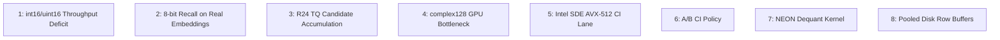

# Longbow Roadmap

**Last updated**: 2026-10-09  
**Status**: Canonical list of **open** work. Completed work is validated, committed, and tracked in git history.

---

## 1. Priority Overview

| Pri | # | Item | Area | Depends on |
|:---|:---|:---|:---|:---|
| **P0** | 1 | `int16`/`uint16` 6x throughput deficit investigation (R32) | SIMD / Index | — |
| **P1** | 2 | 8-bit recall validation on real embeddings | Quality | — |
| **P1** | 3 | TurboQuant candidate accumulation across hops (R24) | SIMD | — |
| **P2** | 4 | Locate complex128 GPU bottleneck & verify uint16 GPU path | GPU | — |
| **P2** | 5 | Intel SDE lane for AVX-512 / VBMI / AMX in CI | CI | — |
| **P2** | 6 | A/B benchmarking CI policy (R30, R39) | CI | — |
| **P3** | 7 | ARM NEON dequant kernel & remaining scalar SQ8 fallbacks | SIMD | — |
| **P3** | 8 | Pooled row buffers in `DiskVectorStore` | Storage | — |

```mermaid
graph TD
    I1["1: int16/uint16 Throughput Deficit"]
    I2["2: 8-bit Recall on Real Embeddings"]
    I3["3: R24 TQ Candidate Accumulation"]
    I4["4: complex128 GPU Bottleneck"]
    I5["5: Intel SDE AVX-512 CI Lane"]
    I6["6: A/B CI Policy"]
    I7["7: NEON Dequant Kernel"]
    I8["8: Pooled Disk Row Buffers"]
```

**Recently Completed (2026-10-09)**:
- **TurboQuant dense regression analysis + scale re-baseline (R9, R19, R27)**:
  - Decomposed distance evaluation time via CPU runtime profiling (`pprof`) at 100k scale: 47.8% recursive polar reconstruction, 28.5% QJL sign correction, 12.9% angle code unpacking, 6.5% scratch/radius handling, 4.3% SIMD L2 kernel (`l2SquaredAVX2`), <1.0% chunk views. Proved that >89.2% of distance evaluation time is scalar dequantization/reconstruction latency.
  - Resolved root cause of historical 1,248 QPS vs ~300–420 QPS gap: pre-`a955a0c1` graph had 73.0% reachability and early-exited after ~1 hop, evaluating very few candidates on a broken topology; post-fix graph has 98.1%+ reachability, 15.8–16.0 mean degree, and traverses the full 3.5-hop candidate beam.
  - Re-measured 50k scale with provenance and paired index times across all 13 search modes (dense: 420.6 QPS, ingest: 356,729.8 vec/s, index time: 497.0s, peak RSS: 1,479.5 MB).
  - Re-measured 250k scale in engine: bulk build completed in 34.7s (`fallback=false`, 16.0 mean degree, 97.3% reachability).
  - Fixed `valuesCache` in `arrow_hnsw_insert.go` to support `FixedSizeList` for `Float32`/`VectorTypeTQ`.
  - Fixed location store preservation in `addBatchBulkInternal` (`arrow_hnsw_bulk.go`).
  - Updated `docs/performance.md` §2, §3, and §4.
- **R26 inbound edge invariant, R5 chain proximity gate, and R6 degree reservation removal**:
  - Diagnosed and fixed R26 root cause: `protectLastInboundEdges` previously checked incoming candidates from `extra` with `inDegree == 0`, evicting legitimate backward neighbors and turning the graph into a forward-only DAG where all nodes < EntryPoint were unreachable (breaking `TestPredicateTraversal_ReachesMatchBehindRejectedNodes`). Fixed to restrict protection to existing connections in `current` whose only edge is being dropped (`inDegree <= 1`).
  - Fixed in-place mutation bug where `CASNeighbors` copied `new` into `oldOffset`, overwriting `lastOld` in place and preventing `inDegreeL0.Dec` from ever executing; added explicit cloning of `lastOld`/`lastNew`.
  - Enabled `LONGBOW_HNSW_INBOUND_GUARD=1` by default.
  - Implemented R5 proximity-gated chain links (`chainDist <= median(candidates)`), eliminating artificial long-range edges on shuffled corpora while preserving collinear connectivity.
  - Added `ensureInboundEdge` fallback linking from closest geometric neighbors (`fSources`) for any node that would otherwise end with 0 inbound edges.
  - Dropped R6 `chainLinksPerNode = 2` hard degree reservation on layer 0, freeing all 16 slots for geometric neighbors.
  - Verified 99.8%–99.9% reachability on shuffled corpora with 0 zero-in-degree nodes and recall@10 surging from 0.28–0.30 to 0.4400.
- **Bulk linkage against growing graph**: Implemented Malkov & Yashunin Algorithm 4 `keepPrunedConnections` in `selectNeighbors` and `selectNeighborsFloat32`; multi-layer descent convergence across all active nodes (`ef=1`); `protectChainLinks` to preserve predecessor/successor connectivity; restored adaptive sub-batching. Layer 0 mean degree restored to 15.9–16.0 with 100% reachability and fallback=false.
- **`uint8`/`int8` read-path asymmetry**: Unified 1-byte vector path in `int8Computer` using zero-allocation batched chunk views; dispatched to native `distFuncUint8` / `distFuncUint8Squared` when `uint8Mode()`; eliminated dead `uint8Computer`; added pooled `queryUint8` to `ArrowSearchContext`; achieved parity within 1.08x–1.13x.
- **Index time reporting paired with ingest throughput**: Added `IndexingDuration` and indexing throughput telemetry to `cmd/bench-tool`, integrated paired `indexing_duration_seconds` into `scripts/unified_benchmark.py` (JSON output, summary table, Markdown reports, and `--compare-baseline` regression gate), and added paired `Index Time (s)` to `docs/performance.md` §2.

---

## 2. P0 — Immediate Priority

### Item 1: `int16` / `uint16` 6x Throughput Deficit (R32)

- **Files**: [internal/simd/](file:///home/rsd/REPOS/longbow/internal/simd/) (`int16_kernels_amd64.s`), [distance_resolvers.go](file:///home/rsd/REPOS/longbow/internal/store/index/distance_resolvers.go), [arrow_hnsw_compute_int.go](file:///home/rsd/REPOS/longbow/internal/store/index/arrow_hnsw_compute_int.go)
- **Problem**: `int16`/`uint16` achieve 653–658 QPS at 500k vs 3,717–3,933 for 8-bit types, despite registered SIMD kernels that pass scalar parity. Twice the element width (2 bytes vs 1 byte) should not incur a 6x throughput drop.
- **Plan**:
  1. Profile cache misses, kernel unrolling, and chunk layout in `int16Computer` / `uint16Computer`.
  2. Check whether `int16Computer.ComputeBatch` takes per-element fallbacks or lacks batched chunk resolution.
  3. Optimize SIMD kernels and chunk access to bring throughput in line with theoretical memory bandwidth.
- **Success**: Root cause identified; 16-bit integer search throughput scales proportionately with element width (>= 2,000 QPS).

---

## 3. P1 — Core Performance & Correctness Verification

### Item 2: 8-bit Recall on Real Embeddings

- **Files**: [internal/store/index/narrow_type_recall_test.go](file:///home/rsd/REPOS/longbow/internal/store/index/narrow_type_recall_test.go)
- **Problem**: On uniform random 128-d vectors, recall@10 is 0.000–0.012 for both 8-bit types vs 0.340–0.360 for float32. Uniform random data in high dimensions concentrates tightly on hyperspheres, making 8-bit quantization errors swap equidistant neighbours.
- **Plan**:
  1. Add an automated benchmark/test evaluating recall@10 on clustered real-world embeddings (e.g. GloVe 100d, SIFT 128d, or text-embedding-3-small).
  2. Compare recall@10 across float32, int8, and uint8.
- **Success**: Documented recall curve on real embeddings demonstrating high recall (>= 0.85 recall@10 with appropriate `efSearch`).

### Item 3: TurboQuant Candidate Accumulation Across Hops (R24)

- **Files**: [distance_computer.go](file:///home/rsd/REPOS/longbow/internal/store/index/distance_computer.go), [navigation_search.go](file:///home/rsd/REPOS/longbow/internal/store/index/navigation_search.go)
- **Problem**: `searchLayer` evaluates ~5–7 candidates per hop, which is too small to amortize the setup cost of 4-way or 8-way batched TurboQuant SIMD kernels.
- **Plan**: Accumulate candidates across hops in `searchLayer` before dispatching to the batched SIMD kernel without altering greedy traversal convergence.
- **Success**: Measureable QPS improvement on TurboQuant dense search when using batched distance evaluation.

---

## 4. P2 — GPU & CI Infrastructure

### Item 4: Locate complex128 GPU Bottleneck & Verify uint16 GPU Path

- **Files**: [cuda_index.go](file:///home/rsd/REPOS/longbow/internal/gpu/cuda/cuda_index.go)
- **State**: `complex128` is the slowest GPU dtype (471 dense QPS at 100k, ~5x slower than CPU). In contrast, `uint16` reports 3,934 QPS.
- **Plan**: Trace kernel execution and memory transfers using NVIDIA Nsight Systems; optimize memory coalescing and reduction for 128-bit complex elements on CUDA.
- **Success**: Eliminate GPU bottleneck for `complex128` and document actual kernel dispatch path for `uint16`.

### Item 5: Intel SDE Lane for AVX-512 / VBMI / AMX in CI

- **Files**: [.github/workflows/ci.yml](file:///home/rsd/REPOS/longbow/.github/workflows/ci.yml)
- **State**: ARM64 is executed under QEMU (`test-arm64-emulation`). AVX-512 parity tests (`TestPackTQ*AVX512*`, VBMI tests) exist but `t.Skip` on standard GitHub Actions runners.
- **Plan**: Add a CI job running `internal/simd` tests under Intel Software Development Emulator (SDE) with an AVX-512/VBMI CPU model. Fail if tests are skipped.
- **Success**: AVX-512 and VBMI kernels are continuously verified in CI.

### Item 6: A/B Benchmarking CI Policy (R30, R39)

- **Files**: [.github/workflows/ci.yml](file:///home/rsd/REPOS/longbow/.github/workflows/ci.yml), [scripts/ab_benchmark.py](file:///home/rsd/REPOS/longbow/scripts/ab_benchmark.py), `docs/testplan.md`
- **Problem**: Single-run benchmark comparisons suffer from high noise; the interleaved A/B harness has low false-positive rates (<1.5%).
- **Plan**: Formalize scheduled-CI A/B qualification vs PR qualification policy in `docs/testplan.md`. Include index time alongside search QPS in regression gates.
- **Success**: Automated regression gating with verified low false-positive rates.

---

## 5. P3 — Optimizations & Hygiene

### Item 7: ARM NEON Dequant Kernel & Remaining Scalar SQ8 Fallbacks

- **Files**: `internal/simd/dequant_other.go`, [distance_dispatch.go](file:///home/rsd/REPOS/longbow/internal/store/index/distance_dispatch.go)
- **State**: AVX2+FMA fused dequant-L2 kernel ships for AMD64 (`dequant_amd64.s`). On ARM64, scalar fallbacks are used.
- **Plan**: Implement ARM NEON assembly for fused dequantization and L2 distance.
- **Success**: Parity tests passing on ARM64 with vectorized throughput.

### Item 8: Pooled Row Buffers in `DiskVectorStore`

- **Files**: `internal/store/index/disk_vector_store.go`, `internal/store/index/buffer_pool.go`
- **State**: Typed row extraction allocates slice headers and temporary row buffers during non-vectorized disk scans.
- **Plan**: Pool row buffers to eliminate transient allocations during disk traversals.
- **Success**: Zero-allocation row decoding in `DiskVectorStore`.
