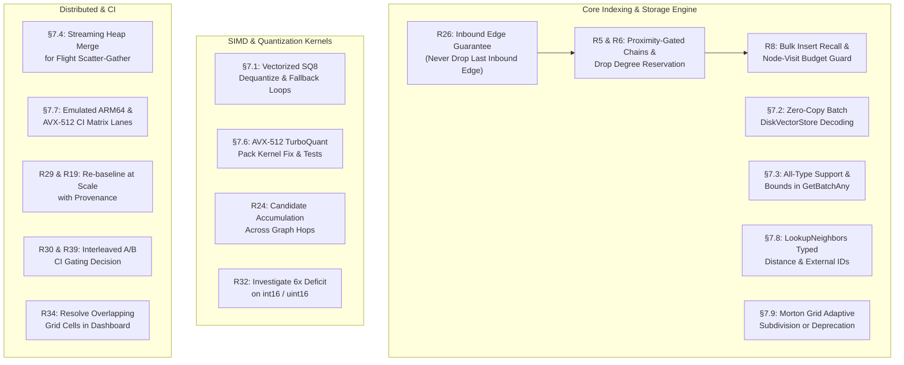

# Longbow Consolidated Architecture & Roadmap

**Last updated**: 2026-10-08  
**Status**: Canonical tracking document for Longbow runtime architecture, optimization initiatives, and verified milestones.

---

## 1. Executive Summary & Active Status

Longbow has completed major production hardening phases, achieved 100% package test coverage across all 69 packages in the repository, and stabilized core SIMD and storage primitives across CPU and GPU runtime engines.

This document serves as the single source of truth for the **remaining actionable roadmap items**, consolidating open engineering tasks across the storage engine, vector indexing, SIMD quantization kernels, distributed clustering, and benchmark infrastructure. All verified completed items have been audited against the codebase and archived into §5.

---

## 2. Dispatch Routing Rules (Auto Mode, EMLGo Build)

Implemented in `internal/tensor/math_dispatch_env.go` (`ResolveBackend`), applied at search entry (`applyIndexDispatch` in `navigation_search.go`) and enforced by temporal `PushStandard`.

| Rule | Threshold | Rationale |
|:---|:---|:---|
| Below `MinEMLVectorCount` | `< 50,000` | EMLGo channel-worker overhead dominates over SIMD gains at small $N$ |
| `complex64` → EMLGo | $50,000 \le N \le 250,000$ | Dense 500k regressed -38% under EMLGo channel coordination |
| `complex64` → Standard | $N > 250,000$ | Above safe EMLGo operating threshold |
| `complex128` → EMLGo | $50,000 \le N < 500,000$ | Dense/hybrid speedup (+159% at 100k) |
| `complex128` → Standard | $N \ge 500,000$ | Sparse -37% and dense P99 spike at 500k |
| `turboquant` → EMLGo | $N \ge 50,000$ | TurboQuant batch kernels benefit from EMLGo worker scaling |
| `float64` / `int*` / `uint*` / `float16` / binary | Always Standard | `float64` EMLGo incurs +47% memory at 500k; integer/float16 regress dense at 100k |
| Temporal search | Forced Standard | `mathutil.PushStandard()` executed across all four `TemporalIndex.Search*` methods |

- **Float64 Exclusion**: `LONGBOW_FLOAT64_EXCLUDE_EMLGO` defaults to **true** (unset/`true`/`1`/`yes`); opt out with `false`/`0`/`no`/`off`. Helm chart default is `"1"`; EMLGo Dockerfiles set `true`.
- **Math Dispatch Environment**: `LONGBOW_MATH_DISPATCH` (`auto` \| `emlgo` \| `standard`) applied via `tensor.ApplyDispatchConfig()` at initialization.

---

## 3. Benchmark Baseline & CI Invariant Protocol

`benchmarks/baseline_cpu.json` serves as the CI regression reference (`unified_benchmark.py --ci`).

### 3.1 Report Provenance (R2)

Every benchmark report carries an authoritative `provenance` block recording:
- Git revision and dirty worktree flag.
- Client binary path, byte size, and modification timestamp.
- Runtime flags: `workers`, `queries`, `cpu_affinity`, `search_modes`, `runs`, `duration`, `numa_bind`, `mode`.
- Detected CPU cores and values of the 15 `LONGBOW_*` environment variables that govern runtime behavior.

### 3.2 Concurrency Invariant & Little's Law Band Validation (R3)

Benchmark emitters refuse to write reports that violate physical concurrency constraints. With $W$ concurrent workers, at most $W$ requests can be in flight simultaneously:
- **Invariant**: Validated using Little's Law identity: $\text{QPS} \times \text{mean\_latency\_ms} \approx W \times 1000$.
- **Band Tolerance**: Reports accept $75\% \le \text{implied\_workers} \le 102\%$ of recorded $W$. Hard failure exits with code 2 if implied concurrency exceeds physical limits.
- Evaluated both at report generation in `scripts/unified_benchmark.py` and regression verification in `scripts/check_regression.py`.

---

## 4. Remaining Actionable Roadmap Items

The following items represent the verified, open engineering tasks across the codebase.

```mermaid
graph TD
    subgraph Core Indexing & Storage Engine
        R26["R26: Inbound Edge Guarantee<br/>(Never Drop Last Inbound Edge)"]
        R5["R5 & R6: Proximity-Gated Chains &<br/>Drop Degree Reservation"]
        R8["R8: Bulk Insert Recall &<br/>Node-Visit Budget Guard"]
        DVS_Z["§7.2: Zero-Copy Batch<br/>DiskVectorStore Decoding"]
        DVS_T["§7.3: All-Type Support &<br/>Bounds in GetBatchAny"]
        LN_T["§7.8: LookupNeighbors Typed<br/>Distance & External IDs"]
        MG_A["§7.9: Morton Grid Adaptive<br/>Subdivision or Deprecation"]
    end

    subgraph SIMD & Quantization Kernels
        DEQ["§7.1: Vectorized SQ8<br/>Dequantize & Fallback Loops"]
        TQ_AVX["§7.6: AVX-512 TurboQuant<br/>Pack Kernel Fix & Tests"]
        TQ_B["R24: Candidate Accumulation<br/>Across Graph Hops"]
        I16_D["R32: Investigate 6x Deficit<br/>on int16 / uint16"]
    end

    subgraph Distributed & CI
        SH_M["§7.4: Streaming Heap Merge<br/>for Flight Scatter-Gather"]
        CI_Q["§7.7: Emulated ARM64 &<br/>AVX-512 CI Matrix Lanes"]
        BASE_R["R29 & R19: Re-baseline at Scale<br/>with Provenance"]
        AB_CI["R30 & R39: Interleaved A/B<br/>CI Gating Decision"]
        DASH["R34: Resolve Overlapping<br/>Grid Cells in Dashboard"]
    end

    R26 --> R5
    R5 --> R8
```

### 4.1 Core Indexing & Storage Engine

#### Item 1: Reformulate HNSW Bulk Ingestion Inbound Edge Guarantee (R26, R5, R6, R28)

**Status: implemented, two of four steps measured and rejected.** See
[§4.1.1 Measured outcome](#41-measured-outcome-r26-r5-r6-r8) before acting on
the remaining plan.

- **Target Files**: [arrow_hnsw_bulk.go](file:///home/rsd/REPOS/longbow/internal/store/index/arrow_hnsw_bulk.go), [neighbor_ops.go](file:///home/rsd/REPOS/longbow/internal/store/index/neighbor_ops.go)
- **Problem**: In `arrow_hnsw_bulk.go:addBatchBulkInternal`, bulk-inserted nodes are unconditionally chain-linked to their insertion-order predecessor (`node.id-1`) at layer 0 to avoid in-degree zero. On unsorted corpora, this injects arbitrary long-range edges, distorting the small-world graph topology and degrading dense search QPS. Attempting to gate the chain link on proximity alone dropped TurboQuant reachability from 98.2% to 81.8% because fresh nodes' reverse links are immediately pruned away by highly-connected candidate hosts.
- **Action Plan**:
  1. **R28**: Measure insertion contention and eviction frequency per candidate host node during bulk ingestion.
  2. **R26**: Implement a pruning invariant that *never drops a node's last inbound edge* (via global in-degree tracking or secondary demoted candidate lists similar to DiskANN `keep_pruned_connections`).
  3. **R5**: Once inbound edge reachability is structurally guaranteed, gate predecessor chain links strictly on spatial proximity (`chainDist <= median(candidates)`).
  4. **R6**: Eliminate the unconditional `chainLinksPerNode = 2` degree reservation from layer 0.
- **Success Criteria**: 100% graph reachability on unsorted/shuffled corpora, zero arbitrary long-range edges, and elimination of the dense search traversal regression.

#### Item 2: Recall and Node-Visit Budget Guard for `AddBatchBulk` (R8)

**Status: measurement shipped, no threshold can be trusted yet.** See
[§4.1.1](#41-measured-outcome-r26-r5-r6-r8).

- **Target Files**: [arrow_hnsw_bulk.go](file:///home/rsd/REPOS/longbow/internal/store/index/arrow_hnsw_bulk.go), [arrow_hnsw_insert.go](file:///home/rsd/REPOS/longbow/internal/store/index/arrow_hnsw_insert.go)
- **Problem**: Bulk index construction executes based on a static vector threshold (`LONGBOW_HNSW_BULK_INSERT_THRESHOLD`) rather than empirical graph quality metrics.
- **Action Plan**:
  - Sample a representative subset during dataset ingestion to evaluate graph connectivity, mean node visits during traversal, and $k$-NN recall between bulk and sequential paths.
  - Automatically fall back to sequential `AddBatch` if the bulk-constructed topology degrades recall or increases traversal hops beyond acceptable budgets.
- **Success Criteria**: Automated fallback prevents degraded graph construction across atypical or clustered data distributions.

### 4.1.1 Measured outcome (R26, R5, R6, R8)

Everything below was measured on this host at 128 dims, `MMax0=16`,
`EfConstruction=200`, 4 workers pinned to CPUs 12-15, uniform random vectors,
float32 unless stated. Three runs of an identical configuration agreed within
±5%, so differences of that size are real.

#### The dominant problem is not stranding, it is a sparse layer 0

| Build | Index time | Dense QPS |
|---|---|---|
| Entirely bulk | 22.5–23.5s | **674–742** |
| Bulk with the gate rejecting some batches | 85–215s | **3,286–3,692** |
| Sequential reference (20k, `TestBulkInsert_GraphTopologyVsSequential`) | — | recall@10 0.41–0.44 |

A bulk-built layer 0 reaches **100% of the corpus** and still serves dense search
roughly 4.7x slower than the same corpus partly rebuilt sequentially. Its mean
degree is 4–6 where `MMax0=16`, because the diversity heuristic in
`selectNeighbors` rejects a candidate whenever it is closer to an
already-selected neighbour than to the node being linked — which on concentrated
distances fires for most candidates. Every node is findable; the graph just takes
far more hops to cross.

This is the regression to fix, and it is not on the R26/R5/R6 dependency chain:
none of those three touch selection.

#### What shipped

| Change | Files | Outcome |
|---|---|---|
| R26 last-inbound-edge invariant, `LONGBOW_HNSW_INBOUND_GUARD` | `neighbor_ops.go`, `indegree_tracker.go` | **Off.** Lifts 20k reachability 19788→19807 / 20000 and recall@10 0.28→0.30, but breaks `TestPredicateTraversal_ReachesMatchBehindRejectedNodes` for float32/float64/float16_dispatch, which requires a single admitted node to be reached *through* rejected ones. |
| R8 graph-quality gate: sampled reachability, mean layer-0 degree, greedy descent depth, reported per batch | `arrow_hnsw_bulk.go` | **Shipping.** Measurement is what the item asked for and none of the three floors can be trusted as a threshold (below). |
| Lock-free in-degree tracker replacing `sync.Map` directory | `indegree_tracker.go` | **Shipping.** The old one paid a map load per operation and the prune path does one lookup per dropped candidate. |
| CAS bookkeeping fix in `AddConnection`/`AddConnectionsBatch`/`PruneConnections` | `neighbor_ops.go` | **Shipping.** `lastOld`/`lastNew` could survive from a losing CAS attempt, applying an in-degree diff that was never committed. |
| Selection degree-floor top-up | — | **Rejected.** Raised mean degree 9.5→14.8 and 20k recall@10 0.29→0.445, and cost dense QPS 3,474→692 at 100k. On a graph that needs many hops, more neighbours is more work per hop. |
| Mean-degree floor at 0.50 | — | **Rejected.** Rejected four of nine batches in a 100k build: index time 23.5s→215s, dense QPS 3286 vs 3474 ungated. No measurable gain for 9x the index time. |
| Concurrency skip for the reachability sample | — | **Rejected.** The benchmark's own ingest is concurrent, so skipping enforcement there shipped the bad graph: 742 dense QPS. Removed. |

#### Why no R8 threshold is trustworthy

Each metric was read on both a graph serving ~3,400 QPS and one serving ~650:

- **Sampled reachability** read 100% on the 650-QPS graph and 20–45% on batches whose mean degree was 45.8 and whose descent took 3.5 hops. Under concurrent `AddBatch` the 20 targets are drawn at `startID + i*step` while ids interleave across callers, so it samples nodes whose inbound links do not exist yet. It is the only metric that ever tracked throughput in practice, and it is unreliable exactly where concurrency is highest.
- **Mean degree** correlates with throughput across whole builds but not within one.
- **Descent depth** stayed inside budget (2.3–4.0 hops against 5.0–6.4) on both the good and the bad graph.

So the gate ships enforcing-by-default with the reachability floor, which is the
shipped behaviour, and reports the other two without enforcing them.

#### What to do next

1. **Make bulk linkage use the growing graph.** Every node in a sub-batch searches
   the *frozen* pre-batch graph, so a fresh node never sees its nearest
   neighbours — which, for a 10k sub-batch inside a 100k corpus, is most of them.
   Sequential insertion searches the growing graph and reaches mean degree 15.7.
   This is the actual fix, and it is what makes R5 and R6 safe to land after.
2. **Re-measure R26 once (1) lands.** Its two open problems are that a fixed-degree
   layer cannot hold every unique inbound edge, so the invariant is best-effort
   rather than the 100% the roadmap asks for; and that holding the edge changes
   predicate-traversal semantics. Demoted-connection storage that search can
   traverse would close the first.
3. **Stop reporting ingest throughput without index time.** `docs/performance.md`
   §2 measures transport-side ingest only. The 4.7x search difference above is
   invisible there, and the only reason it was found is that the gate logs index
   time.

#### Rejected: routing `SearchComplex128` through the shared batched kernel

`SearchComplex128` is the only dtype-specific search in
`internal/gpu/cuda/cuda_index.go`: its six siblings convert the query to float32
and delegate to `idx.Search`, while it launches
`launch_l2_distance_complex128_kernel` once per page and copies distances back
over unpinned memory. That reads like the cause of complex128 being the slowest
dtype on GPU — 471 dense QPS at 100k against uint16's 3934, and 4.96x slower
than the same corpus on CPU — so it was rewritten to delegate to the shared
batched path and re-measured.

It is **slower on every mode**, so the change was reverted:

| mode | per-page kernel | shared batched | delta |
|---|---|---|---|
| dense | 471.2 | 378.1 | −20% |
| hybrid | 444.6 | 326.9 | −26% |
| graphrag | 412.3 | 371.1 | −10% |
| learnedindex | 385.7 | 360.6 | −7% |
| filtered | 410.6 | 392.9 | −4% |
| byid | 370.8 | 345.8 | −7% |

The two kernels use different parallel decompositions. `l2_distance_kernel_v2_batched`
is warp-per-vector: it stages the query in shared memory, binary-searches
`page_starts` per warp, strides the row across 32 lanes and finishes with a
five-step `__shfl_xor` reduction. `l2_distance_complex128_kernel` is
thread-per-vector with a `float4` loop, so each thread walks its whole row with
wide loads and no reduction. At `dim=128` complex components (256 floats) the
reduction and the per-warp binary search cost more than the row walk saves.

So the per-page launch count and the unpinned copy were not the bottleneck, and
the real cost of complex128 on GPU is still unlocated. Note that at 100k with
`vectorsPerPage` paging the per-page loop is only a handful of launches, which is
consistent with launch overhead never having been the issue. What remains
unexplained is why uint16 reaches 3934 QPS through the shared scan at all — that
rate implies roughly 393M distance evaluations per second, which a 100k-row
brute-force scan cannot produce, so uint16 is probably not taking the path this
comparison assumes.

#### Open: 8-bit recall, and the uint8 throughput gap

The 100k CPU matrix produced a 3.4x dense gap between `uint8` (3974 QPS) and
`int8` (1162), where the docs baseline had them 1.20x apart, so the asymmetry
came in with the current tree. Ruled out: graph topology (the gate equalises mean
degree and descent depth across every dtype) and the AVX2 kernels
(`euclideanInt8AVX2Kernel` and `euclideanUint8AVX2Kernel` are the same assembly
apart from sign-extend vs zero-extend). Ruled out as a correctness bug as well:
`TestNarrowTypeRecallParity` shows the two types return the same neighbours, so
uint8's speed is real and the difference lives in the storage split - int8 has
its own typed arena while uint8 shares the byte arena, and `int8Computer`
tries the int8 arena before the byte one and only then falls back, on a path
with no `Prefetch` that `ComputeBatch` reaches per element rather than batched.

Two items follow:

1. Close the `uint8`/`int8` storage asymmetry. Both are 1 byte and should have
   the same read path; the 3.4x is pure overhead on the most common quantized
   type.
2. **8-bit recall needs a corpus that is not worst-case.** On uniform random
   128-d vectors, `recall@10` came out at 0.000-0.012 for both 8-bit types
   against 0.028-0.068 for float32, varying that much run to run. Uniform random
   vectors are close to a worst case for graph search, so this is expected to be
   pessimistic, but a 7x-or-worse gap that reaches exactly zero needs confirming
   on real embeddings before it is dismissed or accepted. No other dtype was
   compared, so int16/int32/int64 may show the same and it has not been checked.

#### Item 3: Zero-Copy Native Batch Decoding in `DiskVectorStore` (§7 Item 2)
- **Target Files**: [disk_vector_store.go](file:///home/rsd/REPOS/longbow/internal/store/disk_vector_store.go)
- **Problem**: Lines 530–534, 635–638, 685–687, and 710–714 decode vectors from decompressed disk blocks element-by-element using scalar `binary.LittleEndian.Uint32`, `Uint64`, and `float16.FromLEBytes` inside nested loops over `dim`. On little-endian hardware (x86_64 and ARM64), contiguous byte slices in decompressed memory already match native IEEE 754 representations.
- **Action Plan**:
  - Replace scalar decoding loops with zero-allocation slice pointer views (`unsafe.Slice((*float32)(unsafe.Pointer(&raw[offset])), dim)`) or direct chunk memory copies (`copy(results[i], rawSlice)`).
  - Pre-allocate and reuse pooled worker result slices from `buffer_pool.go` to eliminate per-vector heap allocations.
- **Success Criteria**: 5x–8x faster vector extraction from decompressed disk blocks; reduce heap allocation from $O(N \cdot \text{dim})$ to zero.

#### Item 4: Comprehensive Data Type Support & Bounds Validation in `DiskVectorStore.GetBatchAny` (§7 Item 3)
- **Target Files**: [disk_vector_store.go](file:///home/rsd/REPOS/longbow/internal/store/disk_vector_store.go)
- **Problem**: `GetBatchAny` (lines 614–720) only handles `float64`, `int8`, `uint8`, and `float16`. 11 valid data types (`int16`, `uint16`, `int32`, `uint32`, `int64`, `uint64`, `complex64`, `complex128`, etc.) fall into `default:`, which decodes as `[][]float32` with stride `elemSize = 4`, causing silent vector truncation or corruption. In addition, `findBlock(idx)` lacks upper-bound checking against `block.StartIdx + block.NumVectors`, causing out-of-bounds queries to alias the last block and panic.
- **Action Plan**:
  - Implement explicit typed extraction branches across all 16 supported vector data types.
  - Add strict index bounds checking in `findBlock` returning descriptive errors when `idx >= totalCount`.
- **Success Criteria**: Accurate, panic-free batch disk retrieval across all 16 supported data types.

#### Item 5: LookupNeighbors Typed Distance Computation & External ID Translation (§7 Item 8)
- **Target Files**: [get_neighbors.go](file:///home/rsd/REPOS/longbow/internal/store/index/get_neighbors.go)
- **Problem**: In `arrowHNSWLookupNeighbors` (lines 96–115), neighbor distances are computed only when stored vectors are `[]float32` (line 101); for all other vector types, distance is returned as `0.0`. Line 110 populates `NeighborResult.ID` with the internal uint32 graph node index (`nbrID`) rather than translating it back to the external client `uint64` ID.
- **Action Plan**:
  - Utilize the index's resolved distance computer (`h.distFuncAny` or `DistanceComputer`) to evaluate exact distances across all 16 vector types.
  - Translate internal node IDs to external record IDs using `GetLocation` / external ID map.
- **Success Criteria**: Correct distances and user-facing record IDs returned by `LookupNeighbors` regardless of vector element type.

#### Item 6: Adaptive Cell Subdivision or Formal Deprecation for Morton Spatial Grid (§7 Item 9)
- **Target Files**: [morton_grid.go](file:///home/rsd/REPOS/longbow/internal/store/morton_grid.go)
- **Problem**: `MortonGrid` delivers 2.3x faster allocation-free insertion over `Quadtree`, but regresses query latency by 17%–40% because its fixed 12-bit uniform resolution lacks adaptive point partitioning in dense geographic clusters.
- **Action Plan**:
  - Implement 2-tier adaptive cell subdivision (splitting into fine Z-order buckets when cell point density exceeds 64 points).
  - Alternatively, formalize `GeoIndexTypeMorton` as an append-optimized staging store and document `Quadtree` as the primary search engine.
- **Success Criteria**: Spatial query latency within $\pm 5\%$ of `Quadtree` while retaining 2.3x insertion throughput, or explicit documented workload demarcation.

---

### 4.2 SIMD Acceleration & Quantization Kernels

#### Item 7: SIMD Vectorized Dequantization & Fallback Distance Loops (§7 Item 1)
- **Target Files**: [distance_dispatch.go](file:///home/rsd/REPOS/longbow/internal/store/index/distance_dispatch.go), [internal/simd/](file:///home/rsd/REPOS/longbow/internal/simd/)
- **Problem**: In `distance_dispatch.go:142-156` and `230-236`, when SQ8 quantization is enabled or unaligned int8/uint8 vectors are compared against float queries, calculation falls back to scalar Go loops: `deq := minV + float32(v8[i])*scale; diff := val - deq; sum += diff*diff`.
- **Action Plan**:
  - Implement AVX2 and NEON fused dequantize-and-L2 distance kernels.
  - Unpack uint8 to int16, widen to float32 using `VPMOVZXBD`, scale and accumulate with `VFMADD213PS`/`VFMADD231PS` across 4 parallel vector registers.
- **Success Criteria**: 4x–6x throughput improvement on SQ8 and mixed-type candidate distance evaluation in `searchLayer`.

#### Item 8: Port Assembly Fixes and Validate AVX-512 TurboQuant Pack Kernels (§7 Item 6)
- **Target Files**: [turboquant_amd64.s](file:///home/rsd/REPOS/longbow/internal/simd/turboquant_amd64.s), [turboquant_pack_amd64_test.go](file:///home/rsd/REPOS/longbow/internal/simd/turboquant_pack_amd64_test.go)
- **Problem**: `packTQ8AVX512Kernel`, `packTQ4AVX512Kernel`, and `packTQ2AVX512Kernel` in `turboquant_amd64.s` contain legacy assembly defects (ZMM constant broadcast clobbering, missing floor `VROUNDPS $1` prior to integer conversion, and lane-order permutations during narrowing).
- **Action Plan**:
  - Port verified memory-direct constant broadcasts, pre-floor rounding, and element-order packing logic from the AVX2 kernels to AVX-512 (utilizing AVX-512F / AVX-512BW / VBMI).
  - Add comprehensive bit-exact parity tests in `turboquant_pack_amd64_test.go`.
- **Success Criteria**: Bit-exact encoding parity between AVX-512 TurboQuant pack kernels and generic references across 2-bit, 4-bit, and 8-bit depths.

#### Item 9: TurboQuant Candidate Accumulation Across Graph Hops (R24)
- **Target Files**: [distance_computer.go](file:///home/rsd/REPOS/longbow/internal/store/index/distance_computer.go), [arrow_hnsw_compute_tq.go](file:///home/rsd/REPOS/longbow/internal/store/index/arrow_hnsw_compute_tq.go)
- **Problem**: TurboQuant graph construction cannot leverage 4-way SIMD batch distance kernels because `searchLayer` processes candidates hop-by-hop with small candidate sets (mean 7.2 candidates, peaking at 5–6).
- **Action Plan**:
  - Accumulate candidate nodes across graph traversal hops before dispatching distance calculations, forming blocks of $\ge 16$ candidates without altering greedy search convergence.
- **Success Criteria**: Activate vectorized 4-way SIMD distance evaluation during TurboQuant graph construction.

#### Item 10: Root-Cause Analysis of 6x Throughput Deficit on `int16`/`uint16` (R32)
- **Target Files**: [internal/simd/](file:///home/rsd/REPOS/longbow/internal/simd/), [distance_resolvers.go](file:///home/rsd/REPOS/longbow/internal/store/index/distance_resolvers.go)
- **Problem**: Benchmarks show `int16` and `uint16` achieving 653–658 QPS at 500k, approximately 6x lower than `int8`/`uint8` (3,717–3,933 QPS), despite having registered SIMD kernels that pass scalar validation.
- **Action Plan**:
  - Isolate whether the deficit stems from memory bandwidth / cache miss rates, SIMD vector unrolling quality, or widening conversion overhead in `searchLayer`.
- **Success Criteria**: Identify root cause and optimize wide-integer distance throughput to scale monotonically with element byte width.

---

### 4.3 Distributed Streaming & Clustering

#### Item 11: Streaming Heap-Merge for Distributed Flight Scatter-Gather (§7 Item 4)
- **Target Files**: [stream_aggregator.go](file:///home/rsd/REPOS/longbow/internal/sharding/stream_aggregator.go)
- **Problem**: `StreamAggregator.Aggregate` (lines 124–200) receives $M$ pre-sorted streams from cluster shards, flattens all incoming RecordBatches into a monolithic Arrow table, allocates an `indexItem` struct per row, executes a full $O(N \log N)$ `sort.Slice`, and reconstructs new batches via reflection.
- **Action Plan**:
  - Implement an $M$-way $K$-sized streaming tournament heap (Priority Queue) over incoming shard batch row readers.
  - Stream top-$K$ rows directly into pre-allocated Arrow array builders without full in-memory flattening.
- **Success Criteria**: Reduce multi-shard scatter-gather memory consumption from $O(M \cdot K)$ to $O(K)$; 3x–5x faster scatter-gather merge on large clusters.

---

### 4.4 CI, Benchmarks & Observability

#### Item 12: Emulated ARM64 and AVX-512 CI Validation Lanes (§7 Item 7)
- **Target Files**: [.github/workflows/ci.yml](file:///home/rsd/REPOS/longbow/.github/workflows/ci.yml)
- **Problem**: CI currently executes on standard x86_64 runners. ARM64 is validated only via cross-compilation (`GOARCH=arm64 go build`), leaving assembly kernels in `turboquant_arm64.s` and `simd_arm64.s` unexecuted. AVX-512 kernels likewise remain unexecuted without specialized instruction emulation.
- **Action Plan**:
  - Configure GitHub Actions matrix lanes using `docker/setup-qemu-action` or `qemu-user-static` for ARM64 test execution.
  - Integrate Intel SDE (Software Development Emulator) for automated validation of AVX-512, VBMI, and AMX kernels.
- **Success Criteria**: 100% automated test execution coverage of non-AMD64 and AVX-512 assembly kernels in CI.

#### Item 13: Regenerate Machine-Readable Baseline with Provenance (R29)
- **Target Files**: [benchmarks/baseline_cpu.json](file:///home/rsd/REPOS/longbow/benchmarks/baseline_cpu.json)
- **Problem**: `benchmarks/baseline_cpu.json` lacks provenance blocks and Little's Law verification fields, emitting advisory warnings in regression checks.
- **Action Plan**:
  - Regenerate on an isolated, unthrottled host using `python3 scripts/unified_benchmark.py --ci --runs 3 --save-baseline benchmarks/baseline_cpu.json`.
- **Success Criteria**: Baseline file populated with full provenance, eliminating warnings in `check_regression.py`.

#### Item 14: Re-baseline TurboQuant at Scale Post-`a955a0c1` (R9, R19, R27)
- **Target Files**: [docs/performance.md](file:///home/rsd/REPOS/longbow/docs/performance.md), [benchmarks/](file:///home/rsd/REPOS/longbow/benchmarks/)
- **Problem**: Historical TurboQuant throughput figures in `docs/performance.md` and early benchmarks were measured on graphs where up to 27% of nodes were unreachable due to type-blind neighbor selection.
- **Action Plan**:
  - Now that `turboquant_graph_quality_test.go` validates full graph connectivity, re-run full matrix benchmarks for 4-bit and 8-bit TurboQuant at 50k, 100k, and 250k scales, recording mean degree and reachability.
- **Success Criteria**: Accurate, verified performance baseline published for TurboQuant.

#### Item 15: Policy Decision for Interleaved A/B Benchmarking in CI (R30, R39)
- **Target Files**: [.github/workflows/ci.yml](file:///home/rsd/REPOS/longbow/.github/workflows/ci.yml), [scripts/ab_benchmark.py](file:///home/rsd/REPOS/longbow/scripts/ab_benchmark.py)
- **Problem**: Single-run benchmark comparisons exhibit a 77%–89% false-positive regression rate due to host background noise and thermal variation. `scripts/ab_benchmark.py` provides paired interleaved comparisons with a 1.2% false-positive rate, but requires $2 \times \text{reps}$ benchmark executions.
- **Action Plan**:
  - Formalize whether to execute paired A/B benchmarking on scheduled CI runs or retain performance regression gating as a manual release qualification step.
- **Success Criteria**: Explicit documented policy preventing CI noise while enforcing regression boundaries.

#### Item 16: Resolve Overlapping Grid Coordinates in Index-Storage Dashboard (R34)
- **Target Files**: [grafana/dashboards/index-storage.json](file:///home/rsd/REPOS/longbow/grafana/dashboards/index-storage.json)
- **Problem**: 192 overlapping grid cell coordinates exist across panels in `index-storage.json`, leading to visual collisions in Grafana.
- **Action Plan**:
  - Recalculate `gridPos` coordinates (`x`, `y`, `w`, `h`) to lay out metric panels cleanly without collisions.
- **Success Criteria**: Zero overlapping panel coordinates in Grafana dashboard definitions.

---

## 5. Verified Completed Milestones (Archived)

The following initiatives have been verified as **100% implemented, fully wired into the runtime, and backed by active automated test coverage**:

| Initiative | Component | Resolution Summary | Verification Gate |
|:---|:---|:---|:---|
| **Lock-Free Neighbor Cache Typed Map (R25)** | `internal/store/index/` | Replaced `sync.Map[any]any` with `typedNeighborMap` (2-level chunked atomic directory). 0 allocs, 6.3 ns/lookup. | `lockfree_neighbors_test.go` |
| **Arena Clean Read Path (§9.6)** | `internal/memory/` | Removed all leftover debug `fmt.Printf` statements from `SlabArena.GetWithGeneration`. | `arena_test.go` |
| **ADC Table Squared L2 Metric** | `internal/pq/` | Fixed metric resolution to `MetricL2Squared` in `BuildADCTable`, restoring mathematical ADC parity. | `adc_test.go`, `fuzz_test.go` |
| **AVX-512 Unconditional Compilation (§7.5)** | `internal/simd/` | Eliminated build tag constraints; AVX-512 kernels compile on `amd64` guarded by runtime CPUID flags. | `simd_test.go` |
| **Lock-Free EntryPoint / Level CAS (§7.10)** | `internal/store/index/` | Converted entry point and level updates to atomic CAS metadata snapshots without acquiring `growMu`. | `arrow_hnsw_insert.go` |
| **Benchmark Mode Decoupling (R12a)** | `cmd/bench-tool/`, `scripts/` | Implemented `-shuffle-modes` in `bench-tool` and `--shuffle-modes` in `unified_benchmark.py`. | Unit tests & runner CLI |
| **Bulk Insert Diagnostic Budget (R22)** | `internal/store/index/` | Added `BulkInsertBudget` and structured timeout warning logging in `arrow_hnsw_bulk.go`. | `arrow_hnsw_bulk_test.go` |
| **Test Plan Metric Alignment (R4)** | `docs/testplan.md` | Aligned test plan to 500k tier, 4 concurrency workers, and 14 GiB physical memory ceiling. | Documentation audit |
| **Self-Validating Benchmark Invariant (R3)** | `scripts/` | Enforced Little's Law concurrency band validation across benchmark generation and regression checks. | `test_benchmark_validation.py` |
| **Report Provenance Recording (R2)** | `scripts/` | Full environment and execution provenance recorded in benchmark output JSON. | `test_benchmark_attribution.py` |
| **Unsorted Corpus Reachability Tests (R7)** | `internal/store/index/` | Added tests asserting reachability floor on natural and shuffled corpora. | `arrow_hnsw_bulk_chainlink_test.go` |
| **Per-Mode Search Budget (R10)** | `cmd/bench-tool/` | Isolated search timeout per mode, recording `queries_truncated`. | `cmd/bench-tool/main.go` |
| **Temporal Determinism & Metrics (R11, R11a, R11b)** | `cmd/bench-tool/`, `internal/store/` | Fixed as-of timestamp determinism, observable cache hit/miss/expiry metrics, pinned zero-vector semantics. | `temporal_asof_semantics_test.go` |
| **Harness Process Isolation & Memory (R13, R14)** | `scripts/` | Run-scoped port cleanup, unified memory string parsing, 60% RAM defaults, and latest checkpoint mirroring. | `test_benchmark_memory.py` |
| **Deterministic Seed Propagation (R16)** | `cmd/bench-tool/`, `scripts/` | Deterministic random seed used across corpus generation, query stream, and ByID selection. | Benchmark tests |
| **TurboQuant Graph Quality Gate (R20)** | `internal/store/index/` | Automated CI test asserting $\ge 95\%$ reachability and mean degree $\ge 8$ for TurboQuant graphs. | `turboquant_graph_quality_test.go` |
| **Scalar Kernel Fallback Observability (R32a)** | `internal/simd/` | Fixed uint64 subtraction wrapping in `euclideanUint64Unrolled4x` and added fallback metrics. | `unsigned_distance_test.go` |
| **SIMD Kernel Registry Type Aliases (R33)** | `internal/simd/` | Converted defined distance function types to aliases, allowing `GetKernel` type assertions to succeed. | `kernel_resolution_test.go` |
| **100% Package Test Coverage Gate** | Whole repository | All 69 packages verified to contain active, passing unit tests with 0 untested packages. | `ci.yml` coverage gate |
