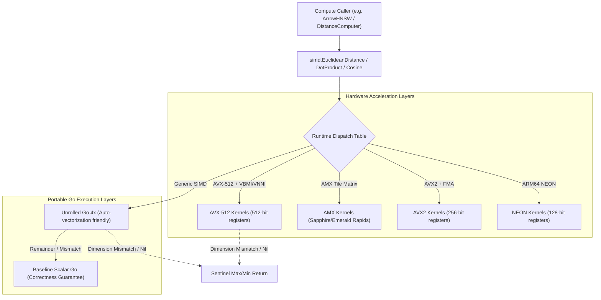
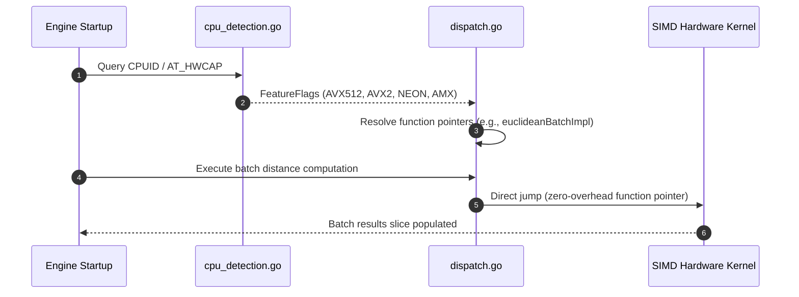
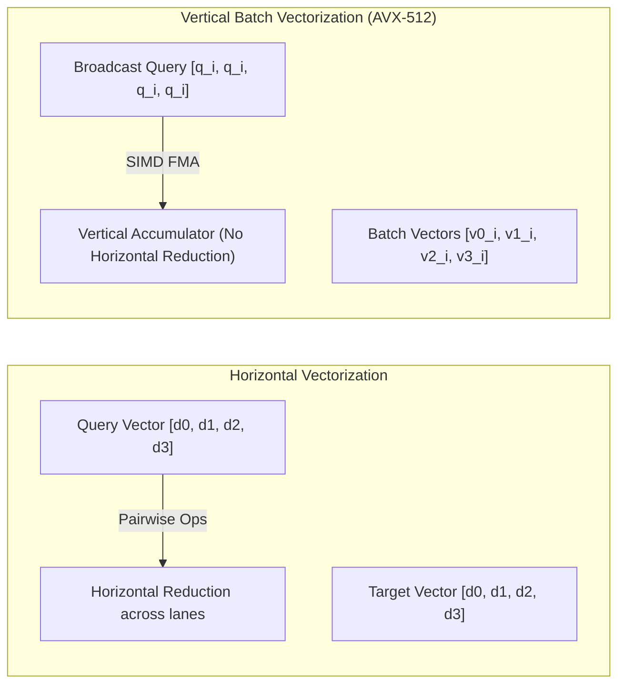

# SIMD Architecture & Dispatch System

Longbow utilizes a layered, multi-tier SIMD acceleration system to deliver maximum floating-point and integer vector throughput across diverse CPU architectures.

---

## Architecture Overview

---

## 1. Runtime Dispatch System

Function pointers are dynamically resolved at package initialization (`dispatch.go`) based on runtime CPU feature flags.

### Supported Hardware Tiers:
- **AVX-512 (x86_64)**: 512-bit vector processing (`ZMM` registers) with support for AVX512F, AVX512DQ, AVX512BW, and VNNI/VBMI extensions.
- **AMX (x86_64)**: Intel Advanced Matrix Extensions tile registers on modern Xeon processors for massive GEMM and quantized dot products.
- **AVX2 / FMA (x86_64)**: 256-bit vector operations (`YMM` registers) utilizing fused multiply-add.
- **NEON (ARM64)**: 128-bit vector operations with optional dot-product extensions (`FEAT_DotProd`).
- **Unrolled Go (Portable)**: 4x loop-unrolled implementations providing auto-vectorization friendly loops across non-SIMD environments.

---

## 2. Horizontal vs. Vertical Vectorization

Longbow employs both horizontal and vertical batching layouts depending on data type and instruction set:

- **Horizontal**: Individual vector pairs are loaded into SIMD lanes and horizontally reduced at the end of each vector.
- **Vertical (`avx512.go`)**: The query dimension $q_k$ is broadcast across 16 lanes, computing partial products against 16 distinct vectors simultaneously. This completely removes horizontal add overhead in inner loops.

---

## 3. Fallback & Robustness Strategy

Every distance kernel follows a strict three-tier degradation path:
1. **Hardware Kernel (Native Assembly)**: Maximum performance via Avo-generated assembly.
2. **Unrolled Go Batch (4x)**: High-speed portable implementation that tests for dimension parity and `nil` slices.
3. **Scalar Fallback**: Guaranteed byte-for-byte correctness across all platforms.

If vector dimensions mismatch or a `nil` row is encountered in a batch, the kernels write sentinel distances (`math.MaxFloat32` for Euclidean/Cosine, `-math.MaxFloat32` for Dot Product) to prevent indexing halts while continuing valid computations.
