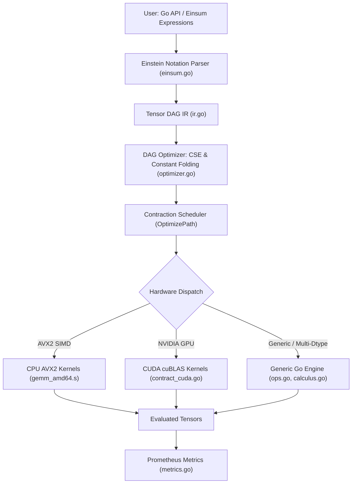

# Longbow Native Tensor Calculus Engine

The Longbow Native Tensor Calculus Engine extends Longbow from a high-performance vector database into a general-purpose mathematical tensor calculus engine. Designed for theoretical physics, scientific computing, differential geometry, and machine learning, it supports Einstein summation notation (`einsum`), tensor contractions across arbitrary ranks and dtypes, DAG optimization, and hardware acceleration across AVX2 CPU and NVIDIA CUDA GPUs.

---

## 1. Architecture



The tensor engine operates in three main layers:
1. **Front-End & Expression Parsing**: Parses string expressions in Einstein summation notation (`"ij,jk->ik"`, `"ii->i"`, `"ii->"`) or programmatically constructs computational DAGs (`IRNode`).
2. **Optimization Pipeline**: Evaluates common subexpression elimination (CSE), folds constant subgraphs, simplifies algebraic identities ($A \cdot 0 = 0$, $A + 0 = A$, $-(-A) = A$, $T(T(A)) = A$), and computes optimal contraction orders minimizing total FLOPs.
3. **Execution & Hardware Dispatch**: Dynamically routes tensor operations to AVX2 SIMD kernels, CUDA GPU hardware acceleration, or optimized multi-dtype generic Go engines.

---

## 2. Supported Data Types & Memory Model

The engine operates over contiguous row-major memory buffers wrapped in Arrow-compatible structures:

| Dtype | Go Primitive | Size | Supported Kernels |
|---|---|:---:|---|
| `DtypeFloat32` | `float32` | 4 bytes | Generic, AVX2 SIMD, CUDA cuBLAS (`cublasSgemm`) |
| `DtypeFloat64` | `float64` | 8 bytes | Generic, CUDA cuBLAS (`cublasDgemm`) |
| `DtypeComplex64` | `complex64` | 8 bytes | Generic (real/imaginary decomposition) |
| `DtypeComplex128` | `complex128` | 16 bytes | Generic |
| `DtypeInt64` | `int64` | 8 bytes | Generic |
| `DtypeInt32` | `int32` | 4 bytes | Generic |
| `DtypeInt8` / `Uint8` | `int8` / `uint8` | 1 byte | Byte storage, slicing |

### Tensor Type
```go
type Tensor struct {
    dtype  Dtype
    shape  Shape     // []int (axis dimensions)
    data   []byte    // backing contiguous byte buffer
    labels []string  // optional Einstein index labels
    offset int       // byte offset for zero-copy views
}
```

---

## 3. Einstein Summation (`Einsum`)

Longbow provides a top-level `Einsum` function with NumPy-compatible syntax:

```go
import "github.com/23skdu/longbow/internal/tensor"

res, err := tensor.Einsum("ij,jk->ik", matrixA, matrixB)
```

### Supported Einstein Notation Patterns

| Pattern | Operation | Example | Output Shape |
|---|---|---|---|
| `"ij,jk->ik"` | Matrix Multiplication | `A[2,3], B[3,4]` | `[2, 4]` |
| `"i,i->"` | Vector Dot Product | `A[4], B[4]` | `[1]` (scalar) |
| `"i,j->ij"` | Vector Outer Product | `A[2], B[3]` | `[2, 3]` |
| `"bij,bjk->bik"` | Batch Matrix Multiplication | `A[10, 4, 8], B[10, 8, 4]` | `[10, 4, 4]` |
| `"ij->ji"` | Matrix Transposition | `A[3, 5]` | `[5, 3]` |
| `"ii->i"` | Diagonal Extraction | `A[4, 4]` | `[4]` |
| `"ii->"` | Matrix Trace | `A[4, 4]` | `[1]` (scalar) |
| `"ij,jk,kl->il"` | Contraction Chain | `A[2,3], B[3,4], C[4,2]` | `[2, 2]` |

---

## 4. Relativistic & Differential Geometry Calculus

The tensor engine includes dedicated primitives for theoretical physics, general relativity, and differential geometry in [`internal/tensor/calculus.go`](file:///home/rsd/REPOS/longbow/internal/tensor/calculus.go):

### 4.1 Levi-Civita Permutation Symbol ($\epsilon_{i_1 \dots i_n}$)
Generates the completely antisymmetric Levi-Civita tensor of rank $D$:
$$\epsilon_{i_1 i_2 \dots i_D} = \begin{cases} +1 & \text{even permutation of } (0, \dots, D-1) \\ -1 & \text{odd permutation} \\ 0 & \text{repeated index} \end{cases}$$

```go
// 3D Euclidean cross-product permutation tensor
eps3D, err := tensor.LeviCivita(3, tensor.DtypeFloat64)

// 4D Relativistic Minkowski Levi-Civita symbol (epsilon_mu_nu_rho_sigma)
eps4D, err := tensor.LeviCivita(4, tensor.DtypeFloat64)
```

### 4.2 Covariant & Contravariant Index Raising / Lowering
Given a tensor $T$ and a rank-2 metric tensor $g_{\mu\nu}$ or its inverse $g^{\mu\nu}$:
$$T^{\dots\nu\dots} = T_{\dots\mu\dots} g^{\mu\nu}, \quad T_{\dots\nu\dots} = T^{\dots\mu\dots} g_{\mu\nu}$$

```go
// Lower index 0 on 4-velocity vector V^mu using Minkowski metric eta_mu_nu
vDown, err := tensor.MetricLower(vUp, eta, 0)

// Invert metric g_ab -> g^ab using partial-pivoted Gauss-Jordan elimination
etaInv, err := tensor.InvertMetric2D(eta)

// Raise index 0 on covariant vector V_mu using inverse metric eta^mu_nu
vRaised, err := tensor.MetricRaise(vDown, etaInv, 0)
```

### 4.3 Christoffel Symbols of the Second Kind ($\Gamma^\sigma_{\mu\nu}$)
Computes the torsion-free Levi-Civita connection coefficients from a metric tensor $g_{\mu\nu}$ and its coordinate partial derivatives $\partial_\rho g_{\mu\nu}$:
$$\Gamma^\sigma_{\mu\nu} = \frac{1}{2} g^{\sigma\rho} \left( \partial_\mu g_{\nu\rho} + \partial_\nu g_{\mu\rho} - \partial_\rho g_{\mu\nu} \right)$$

```go
// metric: [D, D], metricDeriv: [D, D, D] (axis 0: derivative coord rho)
gamma, err := tensor.ChristoffelSymbols(metric, metricDeriv)
// gamma shape: [D, D, D] (sigma, mu, nu)
```

### 4.4 Riemann Curvature Tensor ($R^\rho_{\sigma\mu\nu}$)
Computes spacetime curvature from Christoffel symbols $\Gamma^\rho_{\mu\nu}$ and their coordinate derivatives $\partial_\lambda \Gamma^\rho_{\mu\nu}$:
$$R^\rho_{\sigma\mu\nu} = \partial_\mu \Gamma^\rho_{\nu\sigma} - \partial_\nu \Gamma^\rho_{\mu\sigma} + \Gamma^\rho_{\mu\lambda}\Gamma^\lambda_{\nu\sigma} - \Gamma^\rho_{\nu\lambda}\Gamma^\lambda_{\mu\sigma}$$

```go
riemann, err := tensor.RiemannCurvature(gamma, gammaDeriv)
// riemann shape: [D, D, D, D] (rho, sigma, mu, nu)
```

### 4.5 Ricci Curvature Tensor ($R_{\sigma\nu}$) and Ricci Scalar ($R$)
Contracts the Riemann tensor to evaluate Ricci curvature:
$$R_{\sigma\nu} = R^\mu_{\sigma\mu\nu}, \quad R = g^{\sigma\nu} R_{\sigma\nu}$$

```go
ricci, err := tensor.RicciTensor(riemann)           // shape: [D, D]
ricciScalar, err := tensor.RicciScalar(ricci, etaInv) // shape: [1] (scalar)
```

### 4.6 Exterior Differential Forms & Wedge Product ($A \wedge B$)
Computes the exterior wedge product of differential forms ($p$-form $\wedge$ $q$-form $\to$ $(p+q)$-form), enforcing total antisymmetry:
$$(A \wedge B)_{i_1 \dots i_{p+q}} = \frac{1}{p! q!} \sum_{\sigma \in S_{p+q}} \text{sgn}(\sigma) A_{\sigma(1)\dots\sigma(p)} B_{\sigma(p+1)\dots\sigma(p+q)}$$

```go
// Exterior product of two 1-forms A and B of dimension 3:
// (A ^ B)_ij = A_i B_j - A_j B_i
wedge, err := tensor.WedgeProduct(formA, formB)
// Satisfies anticommutativity: A ^ B = - (B ^ A), and A ^ A = 0
```

---

## 5. DAG Optimization Pipeline

Longbow provides an optimizing compiler for tensor computational graphs:

```go
opt := tensor.NewOptimizer()
optimizedGraph := opt.Optimize(originalGraph)
```

Active optimization passes:
1. **Common Subexpression Elimination (CSE)**: Identifies identical subgraphs in the DAG and points multiple consumers to a single evaluated node, preventing duplicate matrix computations.
2. **Constant Folding**: Evaluates constant subtrees (`OpElementwise`, `OpTranspose`, `OpReshape`) at compilation time.
3. **Algebraic Rewrite Rules**:
   - $A \times 0 \to 0$ (`RuleMulByZero`)
   - $A + 0 \to A$ (`RuleAddZero`)
   - $-(-A) \to A$ (`RuleDoubleNeg`)
   - $T(T(A)) \to A$ (`RuleTransposeOfTranspose`)
4. **Contraction Path Optimization**: Dynamically determines pairwise contraction orders (`OptimizePath`) minimizing intermediate memory footprint and FLOP counts.

---

## 6. Telemetry & Prometheus Metrics

The tensor calculus engine exports Prometheus metrics in real time:

| Metric Name | Type | Labels | Description |
|---|---|---|---|
| `longbow_tensor_operations_total` | Counter | `op`, `device`, `dtype` | Total tensor calculus operations executed. |
| `longbow_tensor_operation_duration_seconds` | Histogram | `op`, `device` | Latency distribution of tensor operations. |
| `longbow_tensor_bytes_processed_total` | Counter | `op` | Cumulative volume of tensor bytes processed. |
| `longbow_tensor_optimizer_passes_total` | Counter | `rule` | Number of DAG rewrite optimizations applied. |
| `longbow_tensor_optimizer_flops_saved_total` | Counter | — | Estimated floating-point operations saved by DAG optimization. |

---

## 7. Working Code Examples

### Example 1: Basic Matrix Contraction & Slicing
```go
package main

import (
	"fmt"
	"github.com/23skdu/longbow/internal/tensor"
)

func main() {
	// Create a 2x3 float64 matrix
	a := tensor.New(tensor.DtypeFloat64, tensor.Shape{2, 3})
	copy(a.Float64s(), []float64{1, 2, 3, 4, 5, 6})

	// Create a 3x2 float64 matrix
	b := tensor.New(tensor.DtypeFloat64, tensor.Shape{3, 2})
	copy(b.Float64s(), []float64{1, 2, 3, 4, 5, 6})

	// Matrix multiplication via Einsum
	c, err := tensor.Einsum("ij,jk->ik", a, b)
	if err != nil {
		panic(err)
	}

	fmt.Printf("Result shape: %v, data: %v\n", c.Shape(), c.Float64s())
	// Output: Result shape: [2 2], data: [22 28 49 64]
}
```

### Example 2: Matrix Diagonal Extraction & Trace
```go
package main

import (
	"fmt"
	"github.com/23skdu/longbow/internal/tensor"
)

func main() {
	// 3x3 square matrix
	m := tensor.New(tensor.DtypeFloat64, tensor.Shape{3, 3})
	copy(m.Float64s(), []float64{
		1, 2, 3,
		4, 5, 6,
		7, 8, 9,
	})

	// Extract diagonal: "ii->i"
	diag, _ := tensor.Einsum("ii->i", m)
	fmt.Printf("Diagonal: %v\n", diag.Float64s()) // [1, 5, 9]

	// Compute matrix trace: "ii->"
	trace, _ := tensor.Einsum("ii->", m)
	fmt.Printf("Trace: %f\n", trace.Float64s()[0]) // 15.000000
}
```

### Example 3: General Relativity Spacetime Curvature
```go
package main

import (
	"fmt"
	"github.com/23skdu/longbow/internal/tensor"
)

func main() {
	// 4D Minkowski spacetime metric eta_mu_nu = diag(-1, 1, 1, 1)
	eta := tensor.New(tensor.DtypeFloat64, tensor.Shape{4, 4})
	eta.Float64s()[0] = -1.0
	eta.Float64s()[5] = 1.0
	eta.Float64s()[10] = 1.0
	eta.Float64s()[15] = 1.0

	// In Minkowski flat spacetime, metric partial derivatives vanish
	dEta := tensor.New(tensor.DtypeFloat64, tensor.Shape{4, 4, 4})

	// 1. Compute Christoffel symbols Gamma^sigma_mu_nu
	gamma, err := tensor.ChristoffelSymbols(eta, dEta)
	if err != nil {
		panic(err)
	}

	// 2. Compute Riemann curvature tensor R^rho_sigma_mu_nu
	dGamma := tensor.New(tensor.DtypeFloat64, tensor.Shape{4, 4, 4, 4})
	riemann, err := tensor.RiemannCurvature(gamma, dGamma)
	if err != nil {
		panic(err)
	}

	// 3. Compute Ricci tensor R_sigma_nu and Ricci scalar R
	ricci, _ := tensor.RicciTensor(riemann)
	etaInv, _ := tensor.InvertMetric2D(eta)
	ricciScalar, _ := tensor.RicciScalar(ricci, etaInv)

	fmt.Printf("Flat spacetime Ricci scalar R = %f (expected 0.0)\n", ricciScalar.Float64s()[0])
}
```

### Example 4: Exterior Differential Form Wedge Product
```go
package main

import (
	"fmt"
	"github.com/23skdu/longbow/internal/tensor"
)

func main() {
	// Differential 1-forms A and B in 3D
	formA := tensor.New(tensor.DtypeFloat64, tensor.Shape{3})
	copy(formA.Float64s(), []float64{1.0, 2.0, 3.0})

	formB := tensor.New(tensor.DtypeFloat64, tensor.Shape{3})
	copy(formB.Float64s(), []float64{4.0, 5.0, 6.0})

	// Exterior wedge product: (A ^ B)_ij = A_i B_j - A_j B_i
	wedgeAB, _ := tensor.WedgeProduct(formA, formB)
	wedgeBA, _ := tensor.WedgeProduct(formB, formA)

	// Verify antisymmetry: (A ^ B) == - (B ^ A)
	valAB := wedgeAB.Float64s()[1] // (A ^ B)_01 = 1*5 - 2*4 = -3
	valBA := wedgeBA.Float64s()[1] // (B ^ A)_01 = 4*2 - 5*1 = +3

	fmt.Printf("(A ^ B)_01 = %f, (B ^ A)_01 = %f\n", valAB, valBA)
}
```
