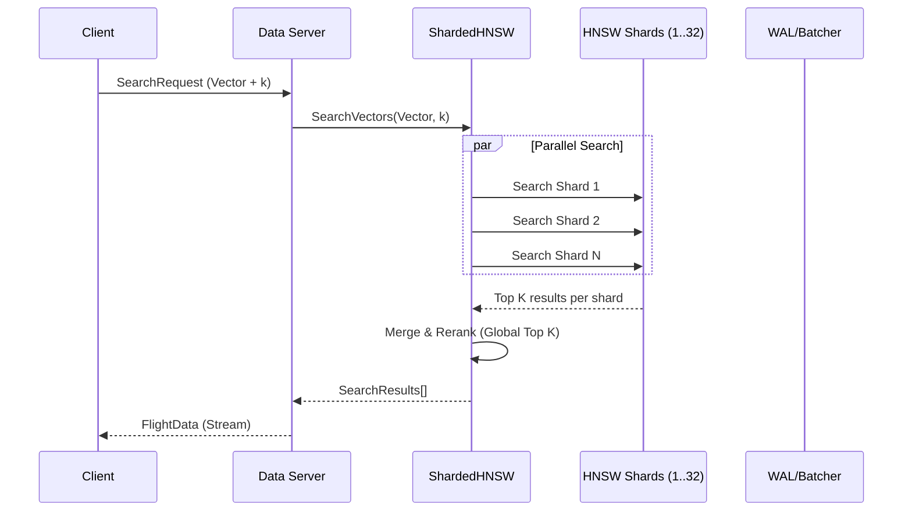

# Vector Search in Longbow

This document describes the vector search capabilities in Longbow, including the
zero-copy HNSW implementation, hybrid search, and result fusion algorithms.

## Architecture Overview

Longbow provides three search modes:

1. **Dense Search** - Vector similarity using HNSW index
2. **Sparse Search** - Keyword matching using inverted index
3. **Hybrid Search** - Combines dense + sparse with Reciprocal Rank Fusion (RRF)
4. **Filtered Search** - Vector similarity with metadata predicate filtering

## Filtered Search

Longbow supports metadata filtering during vector search and data scans.

### Implementation: Post-Filtering

Currently, Longbow uses a robust **Post-Filtering** strategy integrated with the HNSW graph traversal:

1. **Oversampling**: The index retrieves a larger set of candidates (`k * oversample_factor`).
2. **Deterministic Mapping**: Internal `VectorID`s are mapped to metadata row locations using a high-density mapping table.
3. **Predicate Application**: Each candidate is checked against the provided filter criteria (e.g., `id > 100`, `category == 'news'`) using the `MatchesFilters` engine.
4. **Result Selection**: The first `k` matching candidates that satisfy all predicates are returned to the client.

This approach maintains the system's **zero-copy architecture** by accessing metadata directly from Arrow memory during the filtering phase.

## Query Flow Architecture



### Zero-Copy HNSW Implementation

We utilize the [coder/hnsw](https://github.com/coder/hnsw) library to manage the
graph structure. The graph stores **only** `VectorID` identifiers, not vector data.

### Product Quantization (PQ) Compression

Longbow stores vectors in compressed format using Product Quantization (PQ) to reduce memory usage by up to **64x**.

* **Encoding**: Vectors are split into `M` sub-vectors and quantized to 256 centroids (1 byte each).
* **Storage**: A 1536-dim vector (6KB) is compressed to 96 bytes (PQ96) or 24 bytes (PQ24).
* **Search**: Uses Symmetric Distance Computation (SDC) lookup tables for fast distance approximation.

### SIMD Acceleration

Distance calculations are optimized using platform-specific SIMD instructions:

1. **ARM64 (NEON)**: Hand-optimized assembly for dot-product and L2 distance (2.5x speedup over Go compiler).
2. **AMD64 (AVX2/AVX512)**: Hardware-accelerated vector operations.
3. **Fallback**: Pure Go implementation for other architectures.

### Zero-Copy Lookup

The distance function accesses vector data directly from Apache Arrow buffers:

1. **ID Mapping**: `Location` struct maps `VectorID` to `BatchIndex` and `RowIndex`
2. **Direct Access**: Float32 slices accessed directly from Arrow `FixedSizeList` arrays
3. **SIMD Optimization**: Distance calculations use AVX2/AVX512 (AMD64) or NEON (ARM64)

### Async Indexing Pipeline

1. **Immediate Write**: Data written to WAL and Arrow buffers
2. **Job Queue**: Indexing jobs pushed to buffered channel
3. **Worker Pool**: Background workers (`runtime.NumCPU()`) update HNSW graph

## Hybrid Search (Dense + Sparse)

### Why Hybrid Search?

Semantic (vector) search excels at finding conceptually similar content but can miss:

* Exact keyword matches (error codes, product IDs)
* Rare technical terms
* Specific names or identifiers

Hybrid search combines the best of both approaches.

### Components

#### InvertedIndex

Lightweight keyword index using TF-IDF scoring:

```go
idx := store.NewInvertedIndex()

// Index documents
idx.Add(VectorID(0), "error code 500 internal server error")
idx.Add(VectorID(1), "warning timeout exceeded")
idx.Add(VectorID(2), "error code 404 not found")

// Search
results := idx.Search("error code", 10)
// Returns docs 0,2 ranked higher (both terms match)
```

Features:

* **Tokenization**: Lowercase, alphanumeric splitting
* **TF-IDF Scoring**: `score = TF * (1 + IDF)` where `TF = 1 + log(count)`
* **Multi-term queries**: Scores aggregated across all query terms
* **Deletion support**: Documents can be removed from index

#### HybridSearcher

Combines HNSW graph with inverted index:

```go
hs := store.NewHybridSearcher()

// Add vectors with text
hs.Add(VectorID(0), []float32{1.0, 0.0, 0.0}, "error code 500")
hs.Add(VectorID(1), []float32{0.0, 1.0, 0.0}, "success message")

// Dense-only search
denseResults := hs.SearchDense(queryVector, 10)

// Sparse-only search  
sparseResults := hs.SearchSparse("error", 10)

// Hybrid search with RRF
hybridResults := hs.SearchHybrid(queryVector, "error", 10, 0.5, 60)

// Weighted hybrid (alpha: 1.0=dense only, 0.0=sparse only)
weightedResults := hs.SearchHybridWeighted(queryVector, "error", 10, 0.7, 60)
```

### Reciprocal Rank Fusion (RRF)

RRF combines ranked lists without requiring score normalization:

```text
RRF_score(doc) = Σ 1/(k + rank(doc))
```

Where:

* `k` is a constant (default: 60) that controls rank importance
* `rank(doc)` is the 1-based position in each result list

**Example:**

```text
Dense results:  [A, B, C, D]  (A is rank 1)
Sparse results: [C, A, E, B]  (C is rank 1)

RRF scores (k=60):
- A: 1/(60+1) + 1/(60+2) = 0.0325  ← highest
- C: 1/(60+3) + 1/(60+1) = 0.0323
- B: 1/(60+2) + 1/(60+4) = 0.0317
- D: 1/(60+4) = 0.0156
- E: 1/(60+3) = 0.0159

Fused result: [A, C, B, E, D]
```

RRF advantages:

* No score normalization needed
* Robust to different scoring scales
* Simple and effective in practice

## Supported Distance Metrics

| Metric | Description | Status |
|--------|-------------|--------|
| Euclidean (L2) | Straight-line distance | ✅ Implemented |
| Cosine Similarity | Angle-based similarity | ✅ Implemented |
| Dot Product | Inner product | ✅ Implemented |

## Performance

### Memory Efficiency

* **Zero-copy design**: ~50% RAM reduction vs. standard HNSW
* **Size-bucketed pools**: Reduced GC pressure via `PooledAllocator`

### Search Latency

| Operation | Typical Latency | Notes |
|-----------|-----------------|-------|
| Dense search (1K vectors) | < 1ms | SIMD-optimized |
| Sparse search (10K docs) | < 1ms | In-memory index |
| Hybrid search | < 2ms | Combined |
| RRF fusion | < 100μs | O(n) merge |

### Benchmarks

```go
BenchmarkInvertedIndex_Add-8       500000    2341 ns/op
BenchmarkInvertedIndex_Search-8    100000   11234 ns/op  
BenchmarkRRF-8                    1000000    1089 ns/op
```

## Usage Examples

### Basic Hybrid Search

```go
package main

import "github.com/23skdu/longbow/internal/store"

func main() {
    hs := store.NewHybridSearcher()
    
    // Index your data
    hs.Add(store.VectorID(0), embedding, "document text")
    
    // Search
    results := hs.SearchHybrid(
        queryEmbedding,  // dense query
        "search terms",  // sparse query
        10,              // top-k
        0.5,             // alpha (unused in RRF mode)
        60,              // RRF k parameter
    )
    
    for _, r := range results {
        fmt.Printf("ID: %d, Score: %.4f\n", r.ID, r.Score)
    }
}
```

### Weighted Combination

```go
// Favor vector similarity (alpha=0.8)
results := hs.SearchHybridWeighted(query, "keywords", 10, 0.8, 60)

// Favor keyword matching (alpha=0.2)  
results := hs.SearchHybridWeighted(query, "keywords", 10, 0.2, 60)
```

## API Reference

### SearchResult

```go
type SearchResult struct {
    ID    VectorID  // Document identifier
    Score float32   // Relevance score (higher = better)
}
```

### InvertedIndex Methods

| Method | Description |
|--------|-------------|
| `NewInvertedIndex()` | Create new index |
| `Add(id, text)` | Index document |
| `Delete(id)` | Remove document |
| `Search(query, limit)` | Keyword search |

### HybridSearcher Methods

| Method | Description |
|--------|-------------|
| `NewHybridSearcher()` | Create searcher |
| `Add(id, vector, text)` | Add to both indexes |
| `Delete(id)` | Remove from both |
| `SearchDense(query, k)` | Vector-only search |
| `SearchSparse(query, k)` | Keyword-only search |
| `SearchHybrid(vec, text, k, α, rrfK)` | RRF hybrid search |
| `SearchHybridWeighted(vec, text, k, α, rrfK)` | Weighted hybrid |

### ReciprocalRankFusion

```go
func ReciprocalRankFusion(
    denseResults, sparseResults []SearchResult,
    k int,     // RRF constant (default: 60)
    limit int, // Max results
) []SearchResult
```
