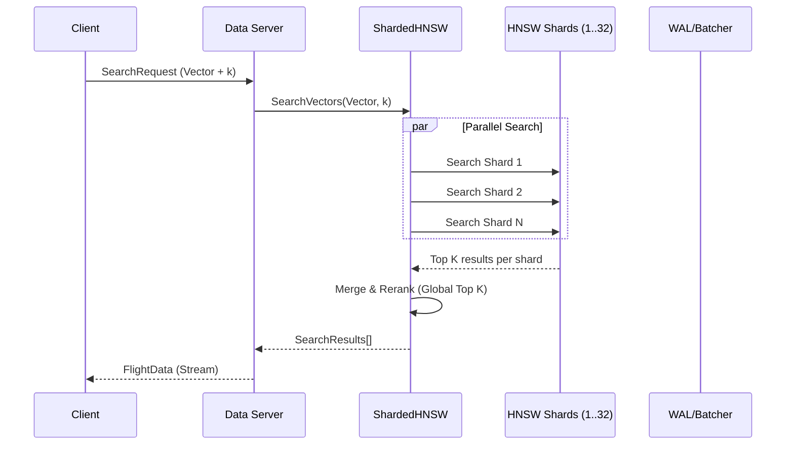

# Vector Search in Longbow

This document describes the vector search capabilities in Longbow, including the
zero-copy HNSW implementation, hybrid search, and result fusion algorithms.

## Architecture Overview

Longbow provides four search modes:

1. **Dense Search** - Vector similarity using HNSW index
2. **Sparse Search** - Keyword matching using inverted index
3. **Filtered Search** - Exact match pre-filtering using Column Inverted Index
4. **Hybrid Search** - Combines dense + sparse with Reciprocal Rank Fusion (RRF)
5. **Re-ranking** - Cross-Encoder refinement of fused results

## Resilience & Stability

Longbow implements a **Circuit Breaker** pattern to prevent cascading failures during high load or partial system outages.

### Circuit Breaker

* **Protection**: Wraps `DoGet` and `VectorSearch` operations.
* **Threshold**: Trips after 10 consecutive failures.
* **Cooldown**: 30-second reset timeout.
* **Behavior**: Fast-fails requests with `Unavailable` status when open, allowing the system to recover.

## Filtered Search

Longbow supports metadata filtering during vector search and data scans.

### Implementation: Post-Filtering

Currently, Longbow uses a robust **Post-Filtering** strategy integrated with the HNSW graph traversal:

1. **Oversampling**: The index retrieves a larger set of candidates (`k * oversample_factor`).
2. **Deterministic Mapping**: Internal `VectorID`s are mapped to metadata row locations using a high-density mapping table.
3. **Predicate Application**: Each candidate is checked against the provided filter criteria
   (e.g., `id > 100`, `category == 'news'`) using the `MatchesFilters` engine.
4. **Result Selection**: The first `k` matching candidates that satisfy all predicates are returned to the client.

This approach maintains the system's **zero-copy architecture** by accessing metadata directly from Arrow
memory during the filtering phase.

## Query Flow Architecture



### Zero-Copy HNSW2 Implementation (Internal)

We utilize a custom, zero-allocation, Arrow-native implementation of HNSW (`hnsw2`) designed specifically for Longbow's
workload.
Unlike standard libraries, this implementation operates directly on Arrow buffers without object overhead.

#### Key Features

* **Zero-Allocation**: Eliminates allocation churn through object pooling and pre-allocated buffers.
* **Arrow-Native**: Direct integration with Arrow record batches for zero-copy vector access.
* **Concurrent Scale**: Multi-core graph building and search using fine-grained locking (`shardedLocks`).
* **Hardware Acceleration**: SIMD-optimized distance calculations (AVX2/NEON) and Product Quantization (ADC).

#### Concurrent Graph Building

* **Locking Strategy**: Uses a hybrid approach with a global `resizeMu` for graph resizing and fine-grained `shardedLocks`
  ([1024]Mutex) for individual node updates.
* **Throughput**: Scales linearly with cores. Thread safety is verified via `TestConcurrentInsert` and specific data race
  regression tests (lazy allocation fixes).

### Product Quantization (PQ) Compression

Longbow stores vectors in compressed format using Product Quantization (PQ) to reduce memory usage by up to **64x**.

* **Encoding**: Vectors are split into `M` sub-vectors and quantized to 256 centroids (1 byte each).
* **Storage**: A 1536-dim vector (6KB) is compressed to 96 bytes (PQ96) or 24 bytes (PQ24).
* **Storage**: A 1536-dim vector (6KB) is compressed to 96 bytes (PQ96) or 24 bytes (PQ24).
* **Search**: Uses Symmetric Distance Computation (SDC) lookup tables for fast distance approximation.

### Dynamic Sharding & Migration

Longbow dynamically optimizes index structures based on dataset size:

* **Small Datasets**: Uses standard `HNSWIndex` for low-overhead access.
* **Large Datasets**: Automatically migrates to `ShardedHNSW` to enable parallel lock-striping.
* **Seamless Transition**: The `AutoShardingIndex` handles this upgrade transparently, utilizing an "Interim Sharding"
  strategy to maintain high availability and consistency during the background migration process.

### SIMD Acceleration

Distance calculations are optimized using platform-specific SIMD instructions:

1. **ARM64 (NEON)**: Hand-optimized assembly for dot-product and L2 distance (2.5x speedup over Go compiler).
2. **AMD64 (AVX2/AVX512)**: Hardware-accelerated vector operations.
3. **Fallback**: Pure Go implementation for other architectures.

### Zero-Copy Lookup

The distance function accesses vector data directly from Apache Arrow buffers:

1. **ID Mapping**: `Location` struct maps `VectorID` to `BatchIndex` and `RowIndex`
2. **Direct Access**: Float32 slices accessed directly from Arrow `FixedSizeList` arrays
3. **SIMD Optimization**: Distance calculations use AVX2/AVX512 (AMD64) or NEON (ARM64)

### Async Indexing Pipeline

1. **Immediate Write**: Data written to WAL and Arrow buffers
2. **Job Queue**: Indexing jobs pushed to buffered channel
3. **Worker Pool**: Background workers (`runtime.NumCPU()`) update HNSW graph

### FP16 Vector Storage

Longbow supports native **Float16 (Half-Precision)** vector storage to reduce memory bandwidth requirements and improve cache locality.

* **Storage Ratio**: 2 bytes per dimension vs 4 bytes (FP32). 50% memory reduction for raw vectors.
* **Performance**:
  * **Search**: ~1.4x higher QPS significantly lower latency (p99) due to reduced memory usage.
  * **Ingestion**: ~20% slower due to conversion overhead (Float32 -> Float16).
* **Accuracy**: Negligible loss in recall for most embedding models (e.g., OpenAI, Cohere).
* **Enabling**: Set `HNSW_FLOAT16_ENABLED=true`.

## Hybrid Search Pipeline

The `HybridSearchPipeline` orchestrates the entire search flow, integrating filtering, retrieval, fusion, and re-ranking.

### Pipeline Stages

1. **Exact Filtering** (Optional): Prunes the search space using `ColumnInvertedIndex` for O(1) attribute lookups.
2. **Retrieval**:
   * **Dense**: Parallel HNSW search.
   * **Sparse**: Parallel BM25 inverted index search.
3. **Fusion**: Combines results using Reciprocal Rank Fusion (RRF) or Linear Weights.
4. **Re-ranking** (Optional): Refines the top candidates using a Cross-Encoder model.
5. **Limit**: Truncates to final `k`.

```mermaid
graph TD
    A[Query] --> B{Exact Filters?}
    B -- Yes --> C[Column Index Lookup]
    B -- No --> D
    C --> D[Candidate Set]
    D --> E{Retrieval}
    E --> F[HNSW Vector Search]
    E --> G[BM25 Keyword Search]
    F --> H[Dense Results]
    G --> I[Sparse Results]
    H --> J[Fusion (RRF/Linear)]
    I --> J
    J --> K{Re-ranker?}
    K -- Yes --> L[Cross-Encoder]
    K -- No --> M[Final Results]
    L --> M
```

### Exact Match Filtering

Longbow uses a `ColumnInvertedIndex` to support efficient pre-filtering for exact matches (e.g., `category="electronics"`).
This index maps attribute values directly to physical `RowPosition`s, which are then mapped to internal `VectorID`s.
This approach avoids scanning the entire dataset for metadata predicates.

### Re-ranking Interface

A second-stage re-ranker can be attached to the pipeline to improve precision.

```go
type Reranker interface {
    Rerank(ctx context.Context, query string, results []SearchResult) ([]SearchResult, error)
}
```

Longbow provides a `CrossEncoderReranker` (currently a stub) to integrate deep learning models that score query-document pairs.

## Hybrid Search (Legacy Concepts)

### Why Hybrid Search?

Semantic (vector) search excels at finding conceptually similar content but can miss:

* Exact keyword matches (error codes, product IDs)
* Rare technical terms
* Specific names or identifiers

Hybrid search combines the best of both approaches.

### Components

#### InvertedIndex

Lightweight keyword index using TF-IDF scoring:

```go
idx := store.NewInvertedIndex()

// Index documents
idx.Add(VectorID(0), "error code 500 internal server error")
idx.Add(VectorID(1), "warning timeout exceeded")
idx.Add(VectorID(2), "error code 404 not found")

// Search
results := idx.Search("error code", 10)
// Returns docs 0,2 ranked higher (both terms match)
```

Features:

* **Tokenization**: Lowercase, alphanumeric splitting
* **TF-IDF Scoring**: `score = TF * (1 + IDF)` where `TF = 1 + log(count)`
* **Multi-term queries**: Scores aggregated across all query terms
* **Deletion support**: Documents can be removed from index

## GraphRAG (Retrieval Augmented Generation with Graphs)

Longbow supports Knowledge Graph integration for GraphRAG workflows, where entities and relationships are stored alongside
vectors.

### Functionality

The `GraphStore` component maintains an adjacency list of relationships between entities (`VectorID`s). This allows for:

* **Multi-hop Reasoning**: Retrieving related entities (neighbors) of search results.
* **Relationship Filtering**: Filtering search results based on graph topology.
* **Knowledge Retrieval**: Fetching structured relationship data to augment LLM context.

### API

```go
gs := store.NewGraphStore()

// Add edges (relationships)
// Node 0 "authored" Node 1
gs.AddEdge(VectorID(0), VectorID(1), "authored", 1.0)
gs.AddEdge(VectorID(1), VectorID(2), "contains_topic", 0.8)

// Retrieval
// Get 1-hop neighbors of Node 0
edges := gs.GetEdges(VectorID(0))
// Returns [{Target: 1, Type: "authored", Weight: 1.0}]

### Graph-Biased Ranking (Spreading Activation)

Longbow implements a **Rank-Based Spreading Activation** algorithm to re-rank search results based on graph topology.

1.  **Initialization**: Initial vector search results are assigned a mass based on their rank (`1/rank`).
2.  **Expansion**: Mass "spreads" to connected neighbors via weighted edges.
3.  **Decay**: Mass decays with each hop (`1/(depth+1)`) to prioritize immediate connections.
4.  **Combination**: Final scores are a weighted blend of Vector Relevance and Graph Centrality.

```go
// Re-rank results using graph topology (alpha=0.5) with 2-hop expansion
results := dataset.Graph.RankWithGraph(initialResults, 0.5, 2)
```

```go

#### HybridSearcher

```go
hs := store.NewHybridSearcher()

// Add vectors with text
hs.Add(VectorID(0), []float32{1.0, 0.0, 0.0}, "error code 500")
hs.Add(VectorID(1), []float32{0.0, 1.0, 0.0}, "success message")

// Dense-only search
denseResults := hs.SearchDense(queryVector, 10)

// Sparse-only search  
sparseResults := hs.SearchSparse("error", 10)

// Hybrid search with RRF and Graph Re-ranking
// alpha=0.5 (Dense/Sparse balance), rrfK=60
// graphAlpha=0.3 (Graph influence), graphDepth=2 (2-hop expansion)
hybridResults := hs.SearchHybrid(queryVector, "error", 10, 0.5, 60, 0.3, 2)
```

```text

### Reciprocal Rank Fusion (RRF)

RRF combines ranked lists without requiring score normalization:

```text
RRF_score(doc) = Σ 1/(k + rank(doc))
```

Where:

* `k` is a constant (default: 60) that controls rank importance
* `rank(doc)` is the 1-based position in each result list

**Example:**

```text
Dense results:  [A, B, C, D]  (A is rank 1)
Sparse results: [C, A, E, B]  (C is rank 1)

RRF scores (k=60):
- A: 1/(60+1) + 1/(60+2) = 0.0325  ← highest
- C: 1/(60+3) + 1/(60+1) = 0.0323
- B: 1/(60+2) + 1/(60+4) = 0.0317
- D: 1/(60+4) = 0.0156
- E: 1/(60+3) = 0.0159

Fused result: [A, C, B, E, D]
```

RRF advantages:

* No score normalization needed
* Robust to different scoring scales
* Simple and effective in practice

## Supported Distance Metrics

| Metric | Description | Status |
|--------|-------------|--------|
| Euclidean (L2) | Straight-line distance | ✅ Implemented |
| Cosine Similarity | Angle-based similarity | ✅ Implemented |
| Dot Product | Inner product | ✅ Implemented |

## Performance

### Memory Efficiency

* **Zero-copy design**: ~50% RAM reduction vs. standard HNSW
* **Size-bucketed pools**: Reduced GC pressure via `PooledAllocator`

### Search Latency

| Operation | Typical Latency | Notes |
|-----------|-----------------|-------|
| Dense search (1K vectors) | < 1ms | SIMD-optimized |
| Sparse search (10K docs) | < 1ms | In-memory index |
| Hybrid search | < 2ms | Combined |
| RRF fusion | < 100μs | O(n) merge |

### Benchmarks

```go
BenchmarkInvertedIndex_Add-8       500000    2341 ns/op
BenchmarkInvertedIndex_Search-8    100000   11234 ns/op  
BenchmarkRRF-8                    1000000    1089 ns/op
```

## Usage Examples

### Basic Hybrid Search

```go
package main

import "github.com/23skdu/longbow/internal/store"

func main() {
    hs := store.NewHybridSearcher()
    
    // Index your data
    hs.Add(store.VectorID(0), embedding, "document text")
    
    // Search
    results := hs.SearchHybrid(
        queryEmbedding,  // dense query
        "search terms",  // sparse query
        10,              // top-k
        0.5,             // alpha (unused in RRF mode)
        60,              // RRF k parameter
    )
    
    for _, r := range results {
        fmt.Printf("ID: %d, Score: %.4f\n", r.ID, r.Score)
    }
}
```

### Weighted Combination

```go
// Favor vector similarity (alpha=0.8)
results := hs.SearchHybridWeighted(query, "keywords", 10, 0.8, 60)

// Favor keyword matching (alpha=0.2)  
results := hs.SearchHybridWeighted(query, "keywords", 10, 0.2, 60)

### Adaptive Combination

Automatically estimate alpha based on query length (keyword vs. natural language).

```go
// Auto-detect alpha (alpha=-1.0)
// "short query" -> alpha=0.3 (Sparse bias)
// "this is a long natural language query" -> alpha=0.8 (Dense bias)
results := hs.SearchHybridWeighted(query, "short query", 10, -1.0, 60)
```

```text

## API Reference

### SearchResult

```go
type SearchResult struct {
    ID    VectorID  // Document identifier
    Score float32   // Relevance score (higher = better)
}
```

### InvertedIndex Methods

| Method | Description |
|--------|-------------|
| `NewInvertedIndex()` | Create new index |
| `Add(id, text)` | Index document |
| `Delete(id)` | Remove document |
| `Search(query, limit)` | Keyword search |

### HybridSearcher Methods

| Method | Description |
|--------|-------------|
| `NewHybridSearcher()` | Create searcher |
| `Add(id, vector, text)` | Add to both indexes |
| `Delete(id)` | Remove from both |
| `SearchDense(query, k)` | Vector-only search |
| `SearchSparse(query, k)` | Keyword-only search |
| `SearchHybrid(vec, text, k, α, rrfK, gα, gDepth)` | Graph-enhanced RRF hybrid search |

### ReciprocalRankFusion

```go
func ReciprocalRankFusion(
    denseResults, sparseResults []SearchResult,
    k int,     // RRF constant (default: 60)
    limit int, // Max results
) []SearchResult
```
