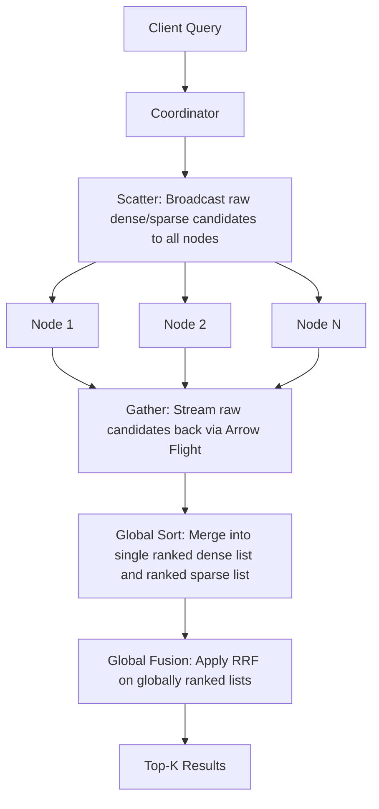

# Unified Search & Discovery Guide

**Last Updated**: 2026-04-28

Longbow provides an integrated suite of search capabilities, from low-latency vector similarity to complex relational filtering and graph-based retrieval.

## Search Modes Overview

| Mode | Description | Python SDK |
|------|------------|-----------|
| **Dense** | HNSW-based vector similarity | `client.search()` |
| **Sparse** | BM25/Keyword matching | Built-in |
| **Filtered** | Metadata filtering | `filters=` parameter |
| **Hybrid** | RRF-fused dense + sparse | `client.search(alpha=0.5)` |
| **ByID** | Instant specific vector retrieval | `client.search_by_id()` |
| **Temporal** | Versioned time-travel queries | `client.temporal_search()` |
| **Geo-Spatial** | Radius/bounding box search | `client.geo_search()` |
| **GraphRAG** | Knowledge graph spreading | `client.recommend()` |
| **Learned Index** | Automatic index selection | Auto-enabled |
| **TurboQuant** | Compressed vector search | `vector_type="turboquant"` |

---

## 1. Dense Search (Vector Similarity)

HNSW-based vector similarity with sub-millisecond latency.

### Python SDK

```python
from longbow import LongbowClient

client = LongbowClient(uri="grpc://localhost:3000")
client.connect()

# Basic vector search
results = client.search(
    dataset="documents",
    vector=[0.1, 0.2, 0.3, ...],  # Query vector
    k=10  # Return top 10
)
# Returns DataFrame with: id, text, distance columns
```

### Supported Metrics

| Metric | Formula | Best For |
| :--- | :--- | :--- |
| **Euclidean (L2)** | `√(Σ(a[i] - b[i])²)` | Image search |
| **Cosine Distance** | `1.0 - (dot(a,b) / (\|\|a\|\|*\|\|b\|\|))` | Text embeddings |
| **Dot Product** | `-(Σ(a[i] * b[i]))` | MIPS, recommendations |

### IVF-OPQ Composite Index

For billion-scale datasets:

```python
client.create_namespace(
    name="billion_scale",
    dims=768,
    data_type="opq",      # Optimized Product Quantization
    nlist=1024,          # IVF clusters
    nprobe=64            # Clusters to search
)
```

---

## 2. Sparse Search (BM25)

Traditional full-text retrieval using inverted index.

**Algorithm**: BM25 with configurable $k_1$ and $b$ parameters.

**Use Case**: Exact keyword matching where semantic embeddings might be too "fuzzy".

---

## 3. Hybrid Search (RRF & Alpha Blending)

Combines Dense and Sparse retrieval via Reciprocal Rank Fusion or weighted alpha blending.

### Reciprocal Rank Fusion (RRF)

RRF is a rank aggregation algorithm that combines multiple ranked result lists into a single unified relevance ranking without requiring score normalization. Because dense vector similarity scores (e.g., Cosine, L2) and sparse scores (e.g., BM25) operate on completely different numerical scales, direct score-based merging is unstable. RRF solves this by ignoring raw scores entirely and focusing purely on the relative rank positions of documents.

The RRF score for a document $d$ is calculated as:

$$RRF\_Score(d) = \sum_{m \in M} \frac{1}{RRF\_Constant + Rank_m(d)}$$

Where:

- $M$: The set of input ranking models (e.g., dense and sparse).
- $Rank_m(d)$: The 1-based index position of document $d$ in the output of model $m$. If a document does not appear in a list, its rank score for that model is 0.
- $RRF\_Constant$: A smoothing constant (traditionally denoted as $k$, defaulting to `60` in Longbow) that prevents highly-ranked documents from completely dominating while smoothing the penalization of lower ranks.

### Alpha Blending

```python
results = client.search(
    dataset="documents",
    vector=[0.1, 0.2, ...],
    text_query="search terms",  # Combine with BM25
    alpha=0.7,  # 1.0 = dense, 0.0 = sparse
    k=10
)
```

### WASM / ONNX Integration Pipeline

Longbow's Unified ML Inference Engine allows developers to embed lightweight transformer models (e.g., embedding and sparse keyword generators) directly into the database nodes via pure-Go WebAssembly (`wazero`).

#### In-Process Ingestion and Search Pipeline

1. **WASM Embedding**: Download a model (e.g., `all-MiniLM-L6-v2`) to a database node using the administrative command:

   ```bash
   longbow-cli download-model -repo sentence-transformers/all-MiniLM-L6-v2 -dest models/all-mini
   ```

2. **Dense and Sparse Inference**: The in-process WASM/ONNX runtime executes the model to generate:

   - A **Dense vector** (e.g., 384-dimensional float array).
   - A **Sparse bag-of-words vector** (e.g., SPLADE token allocations or BM25 query terms).

3. **Execution**: Both vectors are submitted to `hybrid_search.go`, performing HNSW graph traversal and inverted index block-max WAND matching simultaneously.

4. **RRF Aggregation**: The results are instantly fused using `ReciprocalRankFusion` before being returned to the client.

### CLI Usage

Perform hybrid search using RRF by choosing `hybrid` search mode. Use `-alpha` to configure how heavily dense or sparse should influence candidates, and `-text` for the textual query:

```bash
longbow-cli search \
  -uri grpc://127.0.0.1:3000 \
  -dataset product-catalog \
  -mode hybrid \
  -text "wireless noise cancelling headphones" \
  -alpha 0.5 \
  -k 10
```

### Python SDK Usage

The Python SDK handles zero-copy Arrow-backed retrieval and maps the request to the distributed RRF fusion coordinator:

```python
from longbow import LongbowClient

client = LongbowClient("grpc://127.0.0.1:3000")

results_df = client.search(
    dataset="product-catalog",
    vector=[0.12, 0.43, -0.05, ...],  # Dense vector
    text="wireless noise cancelling headphones",  # Sparse text query
    mode="hybrid",
    alpha=0.5,  # Balance parameter
    k=10
)

# results_df is a Pandas DataFrame ordered by fused RRF scores
print(results_df[["id", "score"]])
```

### Use Cases

- **E-Commerce Search**: Combines exact product name matching (sparse keyword) with semantic user intent (dense vector), ensuring exact-phrase matches (e.g., SKU numbers) do not get lost in semantic clustering.
- **Enterprise Q&A (RAG)**: Integrates exact acronyms, department names, or code functions (sparse) with natural language questions (dense) to supply highly relevant context to LLM prompts.
- **Cross-Lingual Search**: Uses dense joint spaces for semantic translation alignment alongside sparse dictionary indices to boost exact terms that match across languages.

---

## 4. Filtered Search

Metadata filtering using post-filtering.

```python
results = client.search(
    dataset="documents",
    vector=[0.1, 0.2, ...],
    filters=[
        {"field": "category", "op": "eq", "value": "tech"},
        {"field": "priority", "op": "gte", "value": 5},
    ],
    k=10
)
```

**Operators**: `eq`, `neq`, `gt`, `gte`, `lt`, `lte`, `in`, `like`

---

## 5. ByID Search

O(1) instant retrieval of specific vectors.

```python
# Find neighbors of known vector
results = client.search_by_id(
    dataset="documents",
    id=12345,
    k=10  # Get 10 nearest neighbors
)

# Get single vector
vector = client.get_vector(
    dataset="documents",
    id=12345
)
```

---

## 6. Temporal Search (Time-Travel)

Versioned discovery via snapshots.

```python
# As-Of search (state at specific time)
results = client.temporal_search(
    dataset="documents",
    search_type="as_of",
    timestamp=1700050000000000000,  # Unix nanoseconds
    k=10
)

# Range search (time window)
results = client.temporal_search(
    dataset="documents",
    search_type="range",
    start_time=1700000000000000000,
    end_time=1700100000000000000,
    k=10
)

# Sliding window (last N items)
results = client.temporal_search(
    dataset="documents",
    search_type="sliding_window",
    window_size=100,
    k=10
)

# Sliding window by duration
results = client.temporal_search(
    dataset="documents",
    search_type="sliding_window_time",
    duration="1h",  # "30m", "2h", "1d"
    k=10
)

# Version history
versions = client.temporal_version_history(
    dataset="documents",
    vector_id=12345
)
```

---

## 7. Geo-Spatial Search

Location-aware search using Quadtree index.

```python
# Radius search (Haversine distance)
results = client.geo_search(
    dataset="locations",
    center={"lat": 37.7749, "lon": -122.4194},
    radius_km=10,
    search_type="radius",
    k=10
)

# Bounding box search
results = client.geo_search(
    dataset="locations",
    box={"min_lat": 37.7, "max_lat": 37.8, "min_lon": -122.5, "max_lon": -122.4},
    search_type="box",
    k=10
)

# Hybrid (vector + geo)
results = client.geo_search(
    dataset="locations",
    center={"lat": 37.7749, "lon": -122.4194},
    radius_km=5,
    vector=[0.1, 0.2, ...],  # Combine with semantic search
    search_type="hybrid",
    k=10
)
```

---

## 8. GraphRAG (Knowledge Graph)

Dual-path: Spreading Activation + Knowledge Graph triples.

### Spreading Activation

```python
# Hybrid search with graph re-ranking
results = client.search(
    dataset="documents",
    vector=[0.1, 0.2, ...],
    alpha=0.7,  # Graph weight (1.0 = full graph, 0.0 = pure vector)
    depth=2,    # Graph traversal depth
    k=10
)
```

### Knowledge Graph

```python
# Add edges
client.add_edge(
    dataset="knowledge",
    subject=1,
    predicate="knows",
    object=2,
    weight=1.0
)

# Recommend (hybrid vector-graph)
results = client.recommend(
    dataset="documents",
    seed_ids=["doc_1", "doc_2"],
    alpha=0.5,  # Balance vector vs graph
    max_hops=2,
    k=10
)

# Traverse graph
results = client.traverse(
    dataset="knowledge",
    start=1,
    max_hops=2,
    decay=0.5
)

# PageRank centrality
scores = client.calculate_pagerank(dataset="knowledge")

# Community detection
communities = client.detect_communities(dataset="knowledge")
```

---

## 9. TurboQuant Search (Compressed)

Two-stage vector compression achieving 4-64x storage reduction.

### Usage

```python
# Create TurboQuant dataset
client.create_namespace(
    name="compressed",
    dims=768,
    data_type="turboquant",  # or "tq"
    turboquant_bits=4       # 2, 4, or 8 bits
)

# Search works the same
results = client.search(
    dataset="compressed",
    vector=[0.1, 0.2, ...],
    k=10
)
```

### Compression Ratios

| Bits | Compression | Typical Use |
|------|-------------|-------------|
| 2-bit | 16x | Archival |
| 4-bit | 8x | Standard |
| 8-bit | 4x | High recall |

---

## 10. Learned Index (Adaptive)

Automatic index selection using k-NN classifier.

### Feature Vector

11-dimensional features including:

- `DatasetSize` (Most discriminating)
- `QueryComplexity`
- `AvgVectorNorm`
- `IsFiltered` / `IsHybrid`

### Auto-Dispatch

System learns optimal weights over time via Fisher Linear Discriminant (LDA).

---

## 11. Global Distributed Search (Cluster-Wide)

Scatter-gather search across multiple Longbow nodes.

### Distributed Global Reciprocal Rank Fusion

In a distributed, sharded search architecture, traditional RRF exhibits a major regression: **local rank skew**. If each cluster node executes dense and sparse searches on its own local shard and applies RRF locally, the local ranks are highly distorted because the node only has visibility into a fraction of the corpus. When the coordinator attempts to merge these pre-fused lists, the aggregate rank is mathematically incorrect.

Longbow solves this by implementing **Global Reciprocal Rank Fusion** inside `global_search.go`:

1. **Raw Scatter**: The coordinator scatters the hybrid search request to all cluster nodes, requesting un-fused raw dense and sparse candidates.
2. **Global Gather**: All raw candidate lists are streamed back to the coordinator using zero-copy Arrow Flight streams.
3. **Global Sort**: The coordinator aggregates all dense candidates into a single global dense list, and all sparse candidates into a single global sparse list, sorting each by score to establish a true global rank.
4. **Global Fusion**: The coordinator executes the RRF calculation on these globally ranked lists.

   ```go
   finalResults = ReciprocalRankFusion(req.Dataset, allDense, allSparse, 60, req.K, nil)
   ```

### Distributed RRF Flow


```mermaid
flowchart TD
    A[Client Query] --> B[Coordinator]
    B --> C[Scatter: Broadcast raw dense/sparse candidates to all nodes]
    C --> D[Node 1]
    C --> E[Node 2]
    C --> F[Node N]
    D --> G[Gather: Stream raw candidates back via Arrow Flight]
    E --> G
    F --> G
    G --> H[Global Sort: Merge into single ranked dense list and ranked sparse list]
    H --> I[Global Fusion: Apply RRF on globally ranked lists]
    I --> J[Top-K Results]
```

### Python SDK

```python
# Automatic global search when peer nodes available
results = client.search(
    dataset="documents",
    vector=[0.1, 0.2, ...],
    k=10
    # If cluster peers exist, automatically scatter-gathers
)
```

### Global IDs

Each vector has a global ID across the cluster:

- **GlobalID**: Unique across all nodes (node_id << 32 | local_id)
- **LocalID**: Unique within single node

### Request Options

```python
# Force local-only search (skip scatter-gather)
results = client.search(
    dataset="documents",
    vector=[0.1, 0.2, ...],
    k=10,
    local_only=True  # Skip cluster peers
)

# Specify specific nodes
results = client.search(
    dataset="documents",
    vector=[0.1, 0.2, ...],
    k=10,
    nodes=["node-1", "node-2"]  # Specific peers only
)
```

### Cluster Metrics (Prometheus)

| Metric | Description |
|--------|-------------|
| `longbow_global_search_fanout_size` | Peers contacted per search |
| `longbow_global_search_partial_failures` | Failed peer queries |
| `longbow_global_search_duration_seconds` | Scatter-gather latency |
| `longbow_gossip_active_members` | Healthy cluster nodes |
| `longbow_global_rrf_latency_seconds` | Latency of global reciprocal rank fusion |
| `longbow_global_rrf_payload_bytes` | Payload elements passed to global RRF |

### CLI Benchmark

```bash
# Benchmark distributed search
python3 scripts/unified_benchmark.py \
    --mode cluster \
    --dims 768 \
    --counts 10000 \
    --peers 3
```

---

## 12. Resilience & Observability

### Circuit Breaker

- **Trip Conditions**: 10 consecutive failures
- **Cooldown**: 30-second reset

### Prometheus Metrics (Port 9090)

| Metric | Description |
|--------|-------------|
| `longbow_search_ops_total` | Throughput per mode |
| `longbow_search_duration_seconds` | Latency P50/P95/P99 |
| `longbow_vector_search_latency_seconds` | Search latency histogram |
| `longbow_turboquant_search_total` | TurboQuant search count |
| `longbow_learned_index_adaptations_total` | Adaptive index switches |

### Benchmark

```bash
# Run benchmark suite
python3 scripts/unified_benchmark.py \
    --mode dense,hybrid,filtered,byid,temporal,geo,graphrag,turboquant \
    --dims 768 \
    --counts 10000
```

> [!NOTE]
> For complete GraphRAG documentation, see [graphrag.md](graphrag.md).
